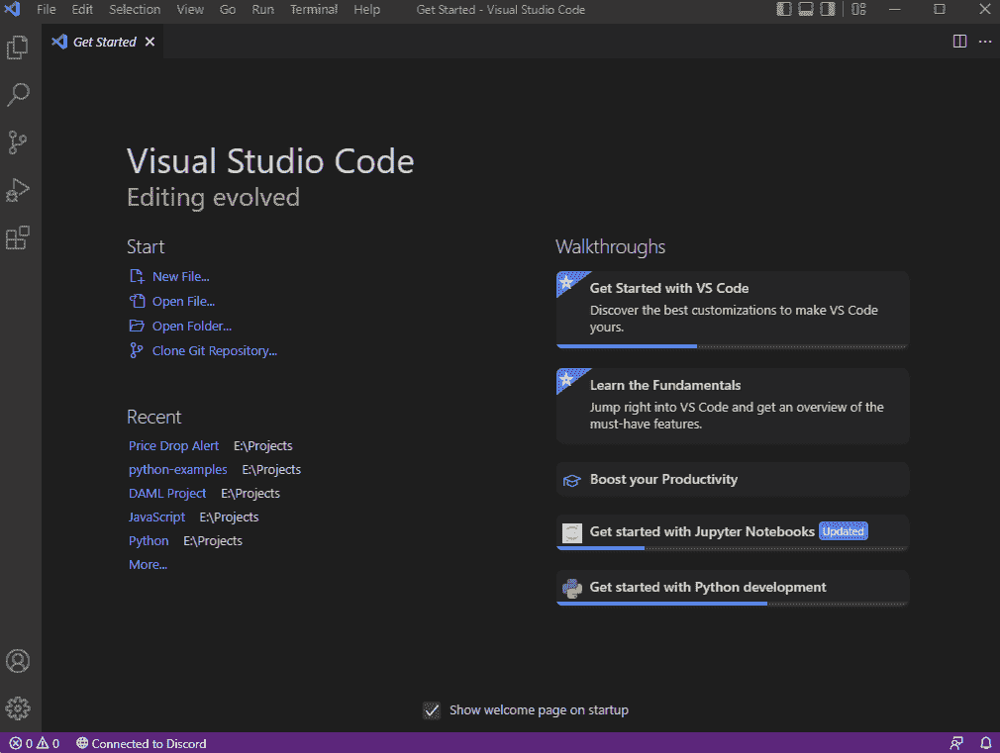
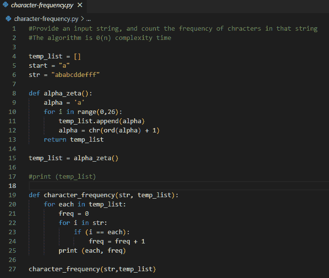

# 什么是 IDE？开发人员的必备工具

> 原文：<https://simpleprogrammer.com/what-is-an-ide/>

像其他工作一样，开发人员也需要工具来编写应用程序和服务。集成开发环境(IDE)是开发人员必备的工具之一。它是一个软件应用程序，处理用于管理、调试和开发应用程序的端到端开发流程。

在本文中，我们将探讨什么是 IDE，以及它如何帮助您进行更快的开发。

## 什么是 IDE？

集成开发环境(IDE)是一个工具箱(软件套件)，它为开发人员提供了编写、调试和测试代码的工具，为开发人员节省了大量时间。

典型的 IDE 由三个主要功能组成:源代码编辑器、本地构建自动化和调试器。

这意味着在处理项目时，您不必离开 IDE 环境。在 IDE 的核心，你得到一个编译器，它将代码转换成特定于平台的机器指令来编译和构建可执行文件。

其他 IDE 特性包括代码完成、语法突出显示、重构和版本控制。

为了方便编写、编辑和测试代码，IDE 提供了图形用户界面(GUI)。此外，大多数 ide 支持主要的编程语言，包括 C++、Python、JavaScript 等。

然而，有一些特定的语言 ide 只支持单一的编程语言。比如 Pycharm 支持 Python，IntelliJ IDEA 支持 Java。

IDE 在开发人员中很受欢迎，因为它使编程变得容易。

在这里，您不必在调试、测试或部署代码的工具之间转换。

此外，ide 非常灵活且可定制，并支持插件，使开发人员能够动态添加更多功能。

### IDE 的历史

早期程序员使用流程图、穿孔卡、编译器等多种工具编写程序。

这需要仔细的计划和执行，因为这很费时间，如果程序员出错，甚至需要更长的时间。

IDE 第一次使用是在达特茅斯基本编程语言的创建过程中，它是达特茅斯分时系统的一部分。

他们使用控制台/终端，因为在那个时期没有花哨的图形用户界面。然而，它确实利用了文件管理、集成编辑、调试、编译和执行 IDE 的核心功能。

对于软件开发，Maestro 是第一个集成开发环境。第一个支持插件的 IDE 是 Softbench。

### IDE 和文本编辑器有什么区别？

文本编辑器是 IDE 的一个极简版本。

它有一些共同的功能，如语法突出显示或自动完成，但与 IDE 相比，它没有提供广泛的功能集。

这意味着文本编辑器最适合做一些小任务，比如写一个脚本或者修改一个网站的现有代码。

### IDE 和命令行工具有什么区别？

命令行就像 IDE 一样是一个强大的工具。然而，它缺乏一个图形用户界面。

使用命令行，程序员可以直接与系统交互，在底层工作，需要良好的经验和专业知识。

## IDE 的核心特性是什么？

集成开发环境发展迅速，提供了许多现成的特性。然后，一些 ide 支持插件，允许开发人员加载特性。

要理解 IDE，我们需要了解它的核心特性。

在本节中，我们将使用 Visual Studio 代码作为示例。

### 代码编辑器

您的 IDE 之旅从代码编辑器开始。这是你写代码、调试和测试的地方。

在代码编辑器中，您还可以看到其他重要的 IDE 特性，包括语法突出显示、自动完成等。

让我们看看 Visual Studio 代码的运行情况。

当您打开 Visual Studio 代码时，它以欢迎页面开始。

正如您所注意到的，创建新文件、打开文件或打开文件夹都有快捷方式。您还可以执行高级任务，包括克隆 Git 存储库。

当您打开新项目或文件时，界面会变成这样:

我们在左边有资源管理器，在那里你可以看到项目文件。代码编辑器在右边，Python 代码在这里直观地展示出来，并遵循适当的代码格式。

此外，您还可以使用快捷方式轻松导航或编辑代码。如果你是季节性程序员，你可以使用 Vim 和 Emacs 组合键。

### 编译程序

ide 带有一个编译器，可以将源代码转换成机器码。它将生产力提高到了一个新的水平，因为您不必打开一个独立的或单独的编译器来调试或优化性能。

### 测试和调试

使用 IDE，您还可以进行调试和测试。当您点击 compile 时，调试开始。IDE 提供了需要修复的代码错误的详细列表。

此外，如果您的代码在运行时遇到障碍，它还会通知任何运行时错误。现代 IDE 的调试工具包括断点、自动化调试等等。ide 还支持测试工具，包括分析器和测试终端。

### 图形用户界面

现代的 ide 提供了图形用户界面。GUI 由导航快捷方式组成，以简化编程并节省时间。大多数现代 IDE 都支持 GUI 定制，您可以根据自己的喜好进行更改，从而提高工作效率。

例如，Visual Studio 代码用户界面是可自定义的。

在这里，左边是浏览器，右边是代码编辑器。另一个基本布局包括侧边栏、状态栏、活动栏和面板。

至于定制，您可以根据需要打开任意多个编辑器进行并排编辑，或者尝试 Zen 模式，该模式隐藏除编辑器之外的所有 UI 元素。

如果您有兴趣了解更多关于 Visual Studio 代码 UI 及其定制的信息，请查看这里: [Visual Studio 代码用户界面](https://code.visualstudio.com/docs/getstarted/userinterface)。

GUI 是必要的，因为它意味着可以方便地访问基本功能。如果你是守旧派，你可能不觉得 GUI 有用，想使用命令行界面。

例如，IntelliJ IDEA 支持命令行。

### 语法高亮显示

使用 syntax highlighter，您的编程变得简单，因为它突出显示了不同的编程语言元素。例如，Visual Studio Code(VSC) Python 代码如下所示。

在这里，VSC 用彩色编码系统突出显示了代码的不同部分，使浏览代码变得容易，并改善您的编程体验。

语法高亮显示是 Python 特有的，如果您用不同的编程语言编写代码，您将看到不同的语法高亮显示。

### 重构

ide 具有重构特性，允许您对代码进行批量更改，比如更改变量名。

例如， [IntelliJ IDEA](https://www.jetbrains.com/help/idea/refactoring-source-code.html#refactoring_settings) 提供了很棒的重构特性，包括调用重构、检查重构更改、解决冲突和配置重构设置。

类似地，您可以在 Visual Studio 代码中使用提取方法、提取变量、重命名符号、代码操作的键绑定等功能来重构代码。

您也可以选择将重构插件安装到您的 IDE 中。

### 版本控制

版本控制系统允许您跟踪代码随时间的变化，并使远程团队能够在一个项目上协同工作。大多数 ide 都有版本控制支持(源代码控制管理)。

如果没有，你可以通过插件安装它。例如，Visual Studio 代码通过其插件生态系统支持版本控制。

### 代码完成

代码就像诗歌，但是把所有的代码都打出来就变得单调了。

这就是 IDE 的代码完成特性的用武之地。当您以合理的准确度编码时，它会建议一些常见的代码片段。您可以快速选择建议并节省时间，而无需自己编写代码。

除此之外，您还可以获得其他信息，包括快速信息、参数信息和成员列表。代码完成也称为智能感知、内容辅助和代码提示。

Visual Studio 代码支持现成的智能感知。由于不同的编程语言有不同的 IntelliSense，您可能需要安装语言扩展。

## ide 的类型有哪些？

市场上有不同用途的 IDEs。最常见的 IDE 类型是支持多种编程语言的多语言 IDE。

接下来是专门为特定编程语言提供开发环境的特定语言 ide。

还有专门针对微软和苹果生态系统的 ide。而且，如果你是一个旅行者并且做远程工作，那么有云 ide。

如果您正在寻找一种更通用的编程方法，那么多语言 ide 最适合您。这个细分领域有很多流行的 ide，包括 [Visual Studio Code](https://code.visualstudio.com/) 、 [Komodo](https://www.activestate.com/products/komodo-ide/) 、 [Eclipse](https://www.eclipse.org/) 、 [NetBeans](https://netbeans.apache.org/) 和 [Geany](https://www.geany.org/) 。

但是，如果您正在寻找特定语言的 IDE，那么您可以看看:

*   Pycharm，IDLE，Spyder，PyDev for Python
*   IntelliJ，JCreator，Jikes for Java
*   RubyMine，RadRails，Redcar for Ruby/Rails
*   C-Free，Dev-C++，代码::C/C++的块

接下来是基于网络/云的 ide，你可以在任何地方使用它来编码。其中包括 [Cloud9](https://aws.amazon.com/cloud9/) 和 [CodeTasty](https://codetasty.com/) 。两者都很优秀，支持多语言。

此外，如果你对移动开发感兴趣，你需要查看用于开发苹果产品的 [Xcode](https://developer.apple.com/xcode/) 和用于使用 Kotlin 和 Java 创建基于 Android 的应用的 [Android Studio](https://developer.android.com/studio) 。

您可以尝试的其他值得注意的 ide 有:

*   PhpStorm
*   同步融合
*   朱庇特笔记本

## 作为开发人员使用 IDE 的好处

与普遍的看法相反，编程不需要有压力。作为一名开发人员，您需要工具来简化您的工作流程并提高工作效率。

集成开发环境为开发人员提供了必要的基础设施和工具集，使他们能够专注于具有简化产品开发的工具的项目。通过使用 IDE，他们可以以更高的效率和输出更快地编码。

开发人员应该使用 IDE 的另一个原因是项目意识。IDE 提供了一个集中的地方，将您的资产和代码放在一起，准备发布。

此外，您还可以看到项目结构、相关的库和其他重要的项目细节，如果您不使用 ide，这些细节可能会被忽略。对于无法进行手动搜索的大型项目，搜索功能也很方便。

总的来说，IDE 简化了项目管理，并为您提供了代码、库和相关文件的鹰眼视图。

工具在那里帮助你。从代码完成到代码突出显示，您在编写代码的过程中都会得到可视化的帮助。它几乎立即或者在您调试或运行程序时显示代码错误。

这样，您可以快速修复错误并继续开发。因此，我们可以说 ide 在开发过程中提供了巨大的价值。

简而言之，IDE 的优势包括:

*   伟大的项目和环保意识
*   单一环境方法
*   重构能力
*   代码完成和代码自动化
*   提高发展满意度
*   提高生产力和效率

## 使用 IDE 的优点和缺点

### IDE 的优势

你应该知道 ide 的优点。它们是:

*   您可以更快、更自信、更高效地编码。
*   IDE 支持协作功能，可以帮助您管理大型项目。
*   IDE 的快捷方式可以让你减少做琐碎事情所需的时间，提高工作效率。
*   您可以根据自己的需求定制工作空间，从而改进工作流程。
*   许多 ide 支持插件，您可以使用插件来添加更多的特性。
*   借助版本控制支持，轻松跟踪代码变更。
*   使用超级搜索快速找到您要找的内容。

### IDE 的缺点

ide 确实有一些缺点。它们是:

*   ide 对初学者来说可能很难掌握
*   ide 是不断更新的，需要开发者不断学习。
*   ide 需要良好的系统资源才能顺利运行。
*   为不同的编程语言学习不同的 ide 是非常耗时的。
*   使用 IDE 的初学者可以通过使用代码完成、调试等功能来减缓学习过程。

## 在一个好的 IDE 中寻找什么

最大的挑战之一，尤其是对于初学者来说，是为他们的项目找到一个好的 IDE。理论上，几乎所有的 ide 都是好的，并且提供了有竞争力的特性。

那么，您应该在 IDE 中寻找什么呢？下面是一些要点，您可以用它们来选择合适的 IDE:

*   检查 IDE 是否支持您想要使用的编程语言。
*   如果是的话，你可能想看看它是否符合你的预算。不是所有的 ide 都是免费的；如果需要，您必须考虑附加定价和高级功能。
*   接下来，试用 IDE 的免费/试用版，看看您是否适应它。这是因为不是所有的 ide 都是初学者友好的，很容易让你不知所措。
*   此外，请查看软件包和库。
*   最后，选择一个您认为合适并符合您的期望、需求和偏好的 IDE。

就是这样！这导致我们的集成开发环境(IDE)指南结束。