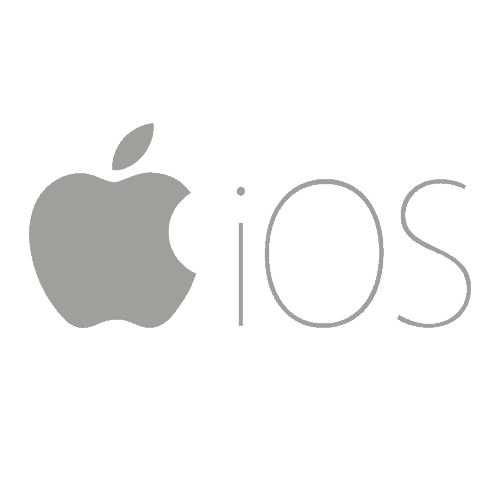

# 什么是移动开发？

> 原文：<https://simpleprogrammer.com/what-is-mobile-development/>

让我们从定义什么是移动开发开始，因为它并不像看起来那么明显。

这不仅仅是构建手机应用程序，尽管这肯定是很大一部分。

它为任何类型的移动设备做任何类型的开发。

有点夸张的定义，但是听我说。

我的意思是，这种类型的开发包括为手机、平板电脑、智能手表和所有其他运行某种移动操作系统的可穿戴设备开发应用程序。

这也不一定意味着开发纯粹的移动应用程序，因为即使是今天的 web 开发人员也必须考虑如何在移动设备上使用和访问他们的应用程序。

事实上，移动应用程序甚至可以专门为移动设备开发，但完全作为 web 应用程序。随着移动设备变得越来越强大，这甚至可能是未来的趋势，浏览器作为未来的操作系统将占据更加主导的地位。

1.  [移动开发有什么特别之处？](#whats-special-about-mobile-development)
2.  [主要移动开发平台](#major-mobile-development-platforms)
3.  [iOS](#ios)
4.  [安卓](#android)
5.  [其他一切](#everything-else)
6.  [移动开发是如何完成的](#how-mobile-development-is-done)
7.  [本地开发](#native-development)
8.  [跨平台框架&工具](#cross-platform-tools)
9.  [移动网络应用](#mobile-web-apps)
10.  [移动开发注意事项](#mobile-development-considerations)

## 移动开发有什么特别之处？

软件开发最吸引人的领域之一一直是移动开发。

为什么？

因为它为单人开发团队提供了一个非常独特的机会，让他们在相对较短的时间内构建一个实际的、可用的、有意义的端到端应用程序。

它也代表了一个创业机会，这是大多数程序员都可以获得的。

这并不是说一个雄心勃勃的软件开发人员不能自己构建一个 web 应用程序或桌面应用程序，但是这种类型的开发更容易实现，因为移动应用程序被认为是小而单一的。

即使是在游戏世界，移动应用程序也可能会倒退到 3D 图形和海量代码库出现之前的更早、更简单的时代。

8 位和 16 位时代的复古风格游戏在某种程度上是可以接受的，甚至在手机或平板电脑上受到喜爱，而在其他平台上，它们并没有被广泛接受。

然而，应用程序开发代表的不仅仅是单独开发人员构建自己项目的机会— **随着移动设备在我们生活中的比重越来越大，它可以说是开发的未来**。

至少在我写这本书的时候，[完全有可能成为一名移动应用开发者](https://simpleprogrammer.com/2014/07/17/can-professional-mobile-developer-ios-android/)，既可以独立工作，也可以为别人工作。

在这篇文章中，我们将看看什么是移动开发，浏览一些主要的移动平台，并谈论一些现有的开发技术，这样你就能很好地了解它是否适合你。

## 主要移动开发平台

纵观计算历史，实际上已经有相当多不同的移动应用程序开发平台，但是直到最近，应用程序开发还没有成为焦点，也没有主流平台存在。

随着 2007 年 iPhone 的推出，这一切都改变了。

我记得当我第一次开始做任何类型的应用程序开发时，当 Palm Pilot 第一次出现的时候。

我的第一个创业项目——也可能是第一个完全由我自己构建的应用程序——是一个用 C 为 Palm OS 编写的*Magic:The gather*Life Counter 应用程序。

从那以后，许多移动实验繁荣了一段时间，然后就销声匿迹了。

Windows CE 看起来很有前途，但他们就是做不好。

黑莓看起来像是要统治世界了，也许它确实统治了一段时间。

但是今天——至少在我写这本书的时候——**有两个主要竞争者**,然后还有其他的。

## iOS

T2】

**就主要的应用程序开发平台而言，iOS 可以说是“大狗”，**部分原因是它通过彻底改变移动设备和移动软件的理念，最终将移动开发带入了现代时代。

iOS 当然是苹果开发的，它只在苹果产品上运行。

在撰写本文时， **iOS 可以在 iPhones、iPods、iPads、Apple Watches 和 Apple TV 上运行，**但我预计未来会有更多设备运行 iOS。

iOS 的核心非常像 Unix 它基于达尔文(BSD)和 OS X。

它与 OS X 共享一些重要的框架，其用户界面基于苹果的 Cocoa UI，该 UI 用于 OS X 应用程序，但已针对触摸设备进行了修改和重新设计，并被称为 Cocoa Touch。

苹果为 iOS 开发者提供了几个原生工具和库来开发 iOS 应用，尽管你不需要使用苹果的开发工具来构建你的应用，但你必须有一台运行 OS X 的 Mac 来构建你的应用。

iOS 应用通常是利用 Objective-C 或现在更流行的平台开发语言 Swift 构建的。

## 机器人

如果不是 iOS，很可能是 Android 或者两者都是。

Android 是这一领域的另一个主导者。

Android 在这个游戏中出现的时间稍晚，于 2008 年 9 月首次发布，比 iOS 晚了近一年，但它仍然设法在移动市场获得了相当大的份额。

从技术上来说， **Android 是市场份额最大、最具统治地位的移动操作系统，**占据大约 80%的份额，相比之下，iOS 的份额为 18%。

这些数字有点欺骗性，因为 Android 是一个分散的市场，由不同制造商制造的许多不同设备组成，运行不同版本的 Android 操作系统。

这是 iOS 和 Android 的主要区别。

由谷歌支持的 Android 是开放的。

有苹果做后盾的 iOS 就不是了。

任何人都可以构建一个 Android 设备，它被设计为运行在各种不同的硬件平台和设备上，具有非常不同的外形和功能。

iOS 是为运行而设计的，并且只能在一组特定的苹果设备上运行。

Android 基于 Linux 内核，Android 的源代码由 Google 作为开源发布。

像苹果一样，谷歌为 Android 开发提供了一些原生工具，但同样，你不需要使用它们。

Android 操作系统应用的原生开发平台是 Java。

## 其他一切

其他留在移动操作系统市场的人只占很少的份额，不到整个市场的 2%。

其余的，Windows 和黑莓可能是最大的，但仍然大多无关紧要。

这两个移动平台完全消失可能只是时间问题。

由于他们的市场份额很小，我甚至不会谈论其他人，因为我不会鼓励你浪费时间投资于任何一个死亡几率极高的平台，但我要说的是，有一些开发跨平台移动应用程序的选择——我们稍后会谈到——这将允许你为这些边缘竞争对手开发，而几乎没有额外的成本。

我永远不会考虑专门为这些平台中的一个开发。

如果你打算开发一个移动应用，成为一名移动应用开发者，选择 iOS 或者 Android。

## 移动开发是如何完成的

当 iOS 和 Android 刚出来的时候，如果你想学习如何为这两个平台开发移动应用，你要学习如何使用每个供应商提供的原生工具。

对于 iOS，那是 XCode 和 Objective-C。

对于 Android，这是 Eclipse 的 Android SDK 插件，或者 Netbeans 和 Java。

天啊，事情发生了多大的变化。

今天，有更多的选择。

有无数的框架、工具、整个平台和生态系统用于开发移动应用。

几乎每一种编程语言都以这样或那样的形式得到支持，移动应用程序甚至可以被构建成专门在移动浏览器中运行。

尽管有许多选项可用，我们可以将它们分成几个更大的类别。

## 本土发展

显然，我们可以使用移动操作系统供应商为我们提供的工具来开发移动应用程序。

正如我之前提到的，对于 iOS 来说，这最初是 XCode 和 Objective-C，但[苹果创造了一种新的语言，称为 Swift](http://amzn.to/2aZPxRH) ，它现在是开发 iOS 应用程序的首选语言。

在 Android 世界里，除了谷歌推出了自己的 Android 开发工作室 IDE 之外，并没有太大的变化。Java 仍然是首选语言(虽然，如果你真的很勇敢，C/C++是官方支持的)。

当我创建我的第一个 Android 和 iOS 应用程序时，我原生构建了它们，但今天我不会再这样做了。

**原生移动开发的最大问题是，您必须为 iOS 和 Android 应用程序完全重写代码**。(如果你想支持 Windows Phone 或另一个小平台，你也必须为那个平台做同样的事情。)

这没什么大不了的，但是应用程序通常需要支持，所以试图在两个或更多完全不同的平台上支持不同版本的应用程序可能有点像维护噩梦。

此外，Android 和 iOS 开发几乎完全不同。

工具不一样，语言不一样，框架不一样，甚至开发范式也不一样。

如果你想创建一个 iOS 和 Android 版本的应用程序，你必须准备学习两个非常不同的、不断发展的平台。

本机开发确实有一些优势。

最大的一个问题是原始速度——尽管一些跨平台框架如 Xamarin 可以与之媲美，因为它们可以编译成本地代码。我们一会儿就会谈到这一点。

除了使用编译成本机代码的框架之外，成本机代码比其他任何解决方案都要快。

如果你进行本地开发，**你也将拥有更好的调试工具**，因为你将不再使用几层高抽象层。

你也更有可能**利用平台**的一些固有特性，更接近硬件水平。(尽管，这可能不是一些更好的跨平台产品的情况。)

总的来说，我认为知道如何进行原生移动开发是有用的，但我不认为这是将一个应用程序交付到多个平台的最佳解决方案。

## 跨平台框架和工具

下一个选择是[选择使用一个框架或工具](https://simpleprogrammer.com/2013/07/01/cross-platform-mobile-development/)，它被设计成允许你构建跨平台的移动应用。

有许多这样的解决方案可供选择，这取决于你在寻找什么。

其中一些解决方案实际上会生成本机代码并包装真正的本机库，因此它们只是对本机语言和工具的抽象，但它们仍然要求您了解并使用本机库和框架。

其他解决方案将构建一个混合应用程序，它具有一些本地组件和一些基于 web 或 HTML 的组件，并依赖内置的移动浏览器来创建应用程序的大部分用户界面和功能。

可供选择的选项越来越多，因此选择会很困难。

选择跨平台框架解决方案时，要考虑的主要因素有:

*   你应该使用什么编程语言。
*   无论您想采用原生方法还是混合方法。
*   您希望您的代码支持多少平台。
*   是否可以重用代码。

**编程语言**

您希望使用什么编程语言来编写您正在构建的应用程序？

大多数跨平台解决方案支持单一编程语言。

您可能不希望同时经历新框架、移动开发和新编程语言的学习过程，所以您可能希望选择一个支持您已经知道的语言的跨平台解决方案。

**本土或杂交**

有几种跨平台的解决方案可以将最终代码编译成本机操作系统的原生格式，并直接与原生库和 API 挂钩。

我最喜欢的一个是 Xamarin ，它允许你用 C#编写你的应用程序，但仍然可以获得完整的原生应用程序的所有好处和功能。

还有很多其他选项可供选择。

其他跨平台解决方案，[比如 Cordova】，采用混合方法，其中应用程序不是本地应用程序，但看起来像本地应用程序。](http://amzn.to/2aHa4Yj)

**通常情况下，原生版会更快，看起来和感觉上更像应用程序运行的移动平台，**但一些跨平台的混合解决方案与原生版非常接近，很难区分两者的区别。

**平台支持**

另一个主要考虑因素是平台支持。

几乎所有的跨平台解决方案都支持 iOS 和 Android，但一些跨平台解决方案也支持桌面操作系统，如 Mac OS X 或 Windows，还有一些支持较小的手机操作系统，甚至是树莓 Pi。

如果你需要支持 Blackberry，因为这是你的客户正在使用的，你将被迫使用支持它的跨平台解决方案。

**不过，如果你对 iOS 和 Android 之外的平台没有特定需求，我不会担心超越两大狗的跨平台支持。**

游戏是一个不同的考虑因素。

如果你正在做游戏开发，你可能想要选择一个支持尽可能多的平台的工具。

像 Unity 3D 这样的工具可以让你创作出可以在你能想到的任何平台上运行的游戏——甚至是网络。

**代码重用**

最后，您应该考虑代码重用。

仅仅因为一个框架是跨平台的，并不意味着你可以为应用程序编写一次所有的代码，然后让它在所有支持的平台上运行。

通常，提供本机支持的跨平台解决方案将很少重用代码，因为它们将与本机框架、库以及用户界面元素和范例更紧密地联系在一起。

因此，您可能必须在更加本地化和拥有您运行的移动操作系统平台的外观和设计之间做出选择，或者共享更多代码。

不过，最近像 Xamarin 这样的跨平台解决方案已经推出了一些解决方案，可以让您获得两者的一些好处。

例如， [Xamarin 使用一个名为 Xamarin Forms](http://amzn.to/2bh2Tus) 的通用 UI 库，通过在底层操作系统的原生 UI 和框架之上创建另一个抽象层，允许您在平台之间实现更大比例的代码重用。

最终，代码重用取决于您正在构建什么类型的应用程序，以及您希望该应用程序在多大程度上与您的目标平台上完全本机构建的应用程序融合在一起。

## 移动网络应用

最后，您可以决定构建一个完全基于 web 的移动应用程序。

这些年来，随着移动浏览器功能的增强和自适应网络技术的进步，这种选择变得越来越可行。

使用这个选项，您可以构建一个 web 应用程序，就像您在 web 上构建的任何其他 web 应用程序一样，但是您将专门设计它以在移动设备上工作。

许多移动操作系统浏览器甚至有挂钩来支持从 web 浏览器内部调用本机功能，因此您可以做诸如获取位置数据和访问设备上的摄像头之类的事情。

甚至有相当多的框架可以帮助您创建移动 web 应用程序，这些应用程序在特定的移动操作系统上运行时看起来就像本地应用程序。

老实说，**未来是移动网络应用**——我们只是还没到那一步。

## 移动开发注意事项

我个人认为移动开发是开始软件开发的一个很好的选择，因为它的进入门槛很低，并且是软件开发的一个领域，这个领域将会在未来几年内继续增长(T2)。

几乎任何人都可以成为移动开发者，甚至可以发布自己的移动应用——或许还能赚些钱。

此外，移动应用本质上是范围有限的，**因此一个只有一个开发人员的团队可以在相对较短的时间内开发出一个重要的应用**，它可以作为一个伟大的工作组合来帮助获得未来的工作或合同。

我经常鼓励那些难以进入这个行业的新手开发者考虑构建一些移动应用程序，并将它们部署在移动应用程序商店中。

这样做可以帮助您获得某种先决条件，证明您可以实际编写代码，并且可以生成完整的工作应用程序。

此外，正如我之前提到的，移动开发很可能在未来几年继续增长，因此移动开发者的未来前景似乎非常好。

* * *

