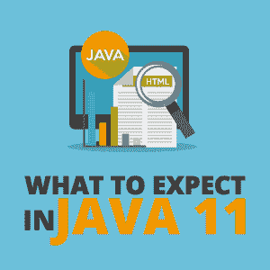

# Java 11 有什么值得期待的

> 原文：<https://simpleprogrammer.com/what-to-expect-java-11/>

The last few years have been tumultuous for the Java world, with a diverse range of features being added in quite a few releases.

开发者社区中有一种情绪正在形成，那就是 Java 发展得不够快。在最初的 20 年里，Java 平台和 Java 开发工具包(JDK)以巨大的、不规则的、有些不可预测的步伐发展。每个特性发布都是由一个或多个重要特性驱动的。因此，每个版本的时间表都被多次推迟，以适应这些特性的完成。

这种方法可以很好地交付高质量的新特性。然而，较小的功能和应用程序编程接口(API)只有在大功能准备就绪时才能交付。这在几年前是可以接受的，但现在不是了。如今，开发者可以从一系列发展更快的平台中进行选择。

在 Sun Microsystems 管理下的最后一个版本是 Java 1.6(也称为 Java 6)，它在五年内一直是最后一个主要的 Java 版本。孙很快陷入困境，最终被甲骨文收购。

Java 7 是 Oracle 领导下的第一个主要版本，随后是 Java 8。Java 平台的演变始于 Java 9。正如 Java 8 完全是关于 lambdas 及其结果(函数式编程、流和默认方法)，Java 9 主要是关于模块。

在看到 Java 11 中有哪些令人兴奋的新特性问世之前，我们先来看看 Java 9 以来新特性的逐步引入。

## Java 9 中引入的特性

几经日程延迟，Java 9 于 2017 年 9 月 21 日发布。大多数开发人员认为 Java 9 主要是模块化的。

Java 9 版本及其特性是 Java 生态系统中的一个里程碑。模块是构建和部署软件的新方法。他们帮助开发人员用更少的内存创建更好的架构软件。引入的关键特性是 Project Jigsaw、JShell 和其他几个特性改进。

Jigsaw 项目是 JDK 9 中为 Java 平台带来模块化的最大的附加项目。大型代码库通常会导致复杂、混乱的“意大利面条式代码”在系统的各个部分(Java 归档文件或 JAR 文件)之间没有明确依赖关系的情况下封装代码是很有挑战性的。

Jigsaw 项目引入了类似于 OSGi 的模块性，其中一个额外的模块描述符可以用来表达模块间的依赖关系。Jigsaw 项目是我们设想和开发大规模应用程序的一个范式转变。

Java 平台二十年的发展已经付出了代价。许多类已经纠缠在一起，而且没有简单的方法来封装 JDK 中的私有实现类。这鼓励了依赖于内部细节的外部库的扩散，同时阻碍了平台的发展。

有了 Project Jigsaw，现在 Java 9 附带了大约 90 个不同的模块，将相关的包分组。只有从模块中显式导出的包才能从其他模块中访问。这使得内部实现类的封装成为现实。

Additionally, modules can specify dependencies on other modules. Just like JDK has been modularized, applications can also use the same techniques. Rather than using a brittle classpath (which has duplicate, missing, or inconsistent JARs), you can create your own module that encapsulates packages and specifies dependencies. This will go a long way in making better-structured and more reliable applications.

Java 9 还推出了 **JShell，即交互式 Java REPL** ，是 Java Shell 的简称，也被称为**REPL(Read-Evaluate-Print Loop)**。它增加了执行不同 Java 结构的能力，如类、接口、枚举、对象和语句。JShell 的用途非常广泛，最常见的是对一些代码进行快速测试，看看它是如何工作的。不需要首先创建一个类，编译它，然后运行它。只需使用 JShell 进行快速测试。

引入了不同的功能改进，如升级的网络通信和对支持 HTTP/2.0 的 WebSockets 的支持，增强的流程 API 以简化操作系统流程的控制和管理，以及流 API 改进以创建集合上转换的声明性管道。

## Java 10 中引入的特性

Java 10 于 2018 年 3 月 20 日发布。由于它的发布周期很短，所以只引入了少数几个特性。由于这应该是一个短期版本，JDK 10 的公开更新将在六个月后结束。许多开发人员可能不会迁移到 Java 10，因为他们更愿意等待 Java 11。

类型推断是开发人员长期以来的需求，因为许多静态类型语言已经支持这一特性。

随着 **JEP 286，局部变量类型推断** (JDK 增强提案)，引入了一个新的关键字 var，它缩短了一个局部变量的声明。它指示编译器从局部变量的初始值中推断出局部变量的类型。

在 Java 10 之前，我们通常这样声明变量:

有了 Java 10，我们可以避免显式的类型声明，编写这样的代码:

关键字 var 消除了变量声明中的冗余，使 Java 变得不那么冗长。从变量使用的上下文中隐式地确定变量的类型是可能的。

随着**基于时间的发布版本化**，Java 版本号的格式已经改变，以改进对基于时间的发布模型的支持。新发布模型最显著的方面是发布的内容会发生变化。

一开始只公布发布日期。但是，如果这个新特性的开发时间比预期的长，它将从发布节奏中删除，并且不会包含在内。因此，需要一个描述时间流逝的版本号，而不是所包含的变更的性质。

**G1 的并行全 GC**是一项有趣的功能，可能会被大爆炸的功能公告淹没。事实上，很多开发者甚至可能都没有注意到。

G1 GC 是在 Java 8 中引入的，在 Java 9 中它成为了默认的垃圾收集器。通过设计，它避免了完整的垃圾收集，但它们仍然会发生。

G1 仅使用单线程标记-清除-压缩算法来执行完全收集，这可能会导致性能问题。

Java 10 已经通过使用多线程执行完全 GC 解决了这个问题。用于完全收集的线程数量与用于年轻收集和混合收集的线程数量相同。现在，G1 收集器的全 GC 性能将会有显著的提高。

## 长期发布和支持周期

Java 10 has just been released, but we are now eagerly awaiting the release of Java 11 later this year. With Oracle aiming for a faster release cycle, there are more features and abilities coming our way fast. Java 11 will be a long-term support release, unlike JDK 10, and will be a reference implementation of Java Platform, Standard Edition (Java SE) 11.

随着新版本的推出，Oracle 也改变了他们的支持模式。在新的事物方案中，短期和长期发布是有区别的。像 Java 9 和 10 这样的短期版本将会收到公共更新，直到下一个特性发布。这意味着对 Java 9 的支持将于 2018 年 3 月结束，对 Java 10 的支持将于 2018 年 9 月后结束。

Java 11 的一个独特之处是它是第一个长期版本，而且它将在更长的时间内得到支持。Java 11 将在 2023 年 9 月前获得 Oracle 的顶级支持，并在 2026 年前获得延期支持。

## Java 11 有什么新特性？

Java 11 可能会推出一些关键特性。Java 11 也可能因为移除 **CORBA** 而失去一些能力(还有人用吗？)、 **Java EE 模块**(最近改名为 Jakarta EE)、以及 **JavaFX** 。

二十多年前，CORBA 是创建分布式应用程序的流行方法，但我认为现在它只用于遗留应用程序。Java EE 和 JavaFX 不再适合 JDK 堆栈，现在有其他第三方库提供这些功能。让我们详细考虑这些方面。

### 为 Java 11 计划的新特性

此时，Java 11 将引入以下特性:

*   JEP 318: Epsilon:一个任意低开销的垃圾收集器——Epsilon 被称为“无操作”收集器，它承诺在不实现任何实际内存回收机制的情况下处理内存分配。正如[提案](http://openjdk.java.net/jeps/318)中所述，目标是“以内存占用和内存吞吐量为代价，提供一个完全被动的 GC 实现，具有有限的分配限制和尽可能低的延迟开销。”Epsilon 的具体用例包括性能测试、内存压力测试和虚拟机(VM)接口测试。它对于寿命极短的作业、最后一次丢弃的延迟改进或最后一次丢弃的吞吐量改进也很有用。
*   JEP 323:Lambda 参数的局部变量语法——局部变量类型推断是在 Java 10 中引入的，作为一种减少与编写 Java 代码相关的冗长的措施。Java 11 更进一步，允许使用 var 来声明隐式类型 lambda 表达式的形参。

目前，您需要为 lambda 表达式指定如下参数:

从 Java 11 开始，可以通过以下方式简化它:

虽然它导致了语法的统一，但也使得将修饰符应用于局部变量和 lambda 格式而不失简洁成为可能。不需要多余的语法结构，因为它们可以从上下文中推导出来。

*   JEP 309:动态类文件常量 Java 类文件格式将被扩展以支持新的常量池形式 CONSTANT_Dynamic。这将减少创建新形式的可具体化类文件常量的成本和中断。目前，链接 invokedynamic 调用点将链接委托给 bootstrap 方法。它是一个 JVM 指令，允许编译器生成代码，调用比以前更宽松的方法规范。它提供了进行动态调用的能力，JVM 不仅能够识别这种调用，而且能够以优化普通的旧静态类型调用的方式进行优化。现在，加载 CONSTANT_Dynamic 会将创建委托给 bootstrap 方法。新的常量池形式将为语言设计者和编译器实现者提供更广泛的表达能力和性能选择。

### 更快的 JDK 发布和更短的支持周期

随着 Oracle 以更快的发布周期为目标，更多的特性和能力正以更高的速度向我们走来。甲骨文去年宣布，2018 年将有两个 JDK 版本，JDK 10 已经发布。这是一个受欢迎的变化，在这个缓慢发布周期的时代，每隔几年就会在一个主要版本中引入大量的特性。

我们现在可以期待每六个月发布一个更小的特性。这有很多好处，包括加快 Java 平台的创新。更新 Java 版本的风险降低了。较小的特性集使得开发人员更容易采用。

更快的发布周期使 Java 成为一种敏捷的语言。它已经成为一种动态语言，响应市场力量和开发者社区的关注。

## 什么东西在 Java 11 中没有成功？

Although Java 11 will likely come with some new features, it will still be leaner than Java 10, primarily because a few legacy features are going to be dropped.

**JEP 320:移除 Java EE 和 CORBA 模块**旨在从 Java SE 平台和 JDK 中移除 Java EE 和 CORBA 模块。事实上，这些模块在 Java 9 中已经被弃用，并声明打算在未来的版本中删除它们。

随着 Java SE 6 在 2006 年 12 月发布，包含了一个完整的 Web 服务栈。这包括四项技术:

*   JAX-WS——用于 XML Web 服务的 Java API
*   JAXB——XML 绑定的 Java 架构
*   JAF—JavaBeans 激活框架
*   Java 的公共注释

从那时起，Java EE 版本不断发展，使得 Java SE 很难在两个 Java 版本之间包含不相关的技术和繁琐的维护。有些第三方网站提供 Java EE 技术的独立版本，因此 Oracle 不再觉得有义务将它们包含在 Java SE 或 JDK 中。

关于 CORBA 的移除，这项技术是从 20 世纪 90 年代开始的，现在几乎没有人使用它开发应用程序。由于 CORBA 维护的成本远远超过了收益，Oracle 认为在 Java SE 或 JDK 中包含它没有意义。

## 为 Java 11 做好准备

作为一名 Java 开发人员，您现在可以选择每六个月更新一次 Java 版本，也可以选择每隔几年发布一次长期版本。

Oracle 还[建议](https://www.oracle.com/java/java-se-advanced-suite.html)每个人都迁移到他们的 Java SE Advanced 产品。它将为每个长期版本提供至少五年的支持。在我看来，如果你仍然在 Java 8 或 Java 9 这样的早期版本上，你可以再等一会儿，然后直接迁移到 Java 11。

Java 11 将通过其激动人心的新特性帮助开发人员创建更好的软件，如低开销的垃圾收集器，使用更简洁的 lambda 表达式，以及为语言设计人员和编译器实现人员提供更广泛的选择。Java 世界的未来看起来令人兴奋。