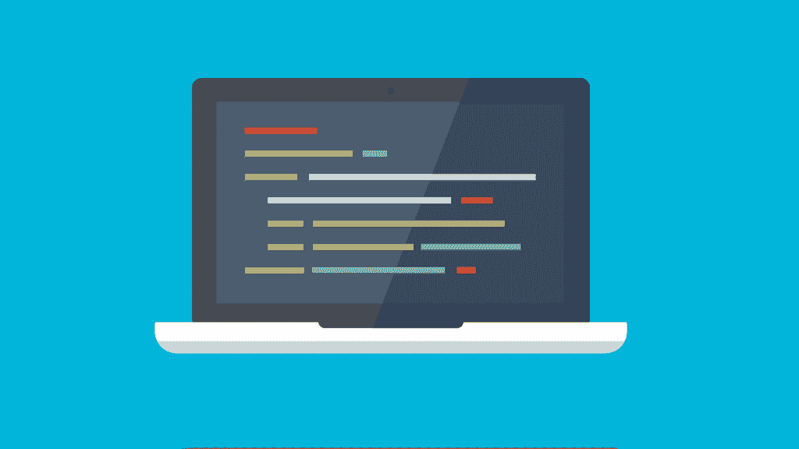

# 什么时候给不找借口的人编码

> 原文：<https://simpleprogrammer.com/when-to-code-for-people-who-dont-make-excuses/>

还有人每天都在为代码而奋斗吗？没有时间做任何事。至少感觉是这样的，不是吗？

我最近一直在为写作实施一个 [X 卡策略](http://saeedgatson.com/x-card-technique-how-to-build-any-habit/)。

基本的想法是，我试着连续七周每天写一定数量的单词。每天，我都会在自己制作的便笺上写下一个 X。最终，我会建立一个 X 链来帮助我保持继续下去的动力。

作为一名软件开发人员，我想将这一策略转化为编程，这在过去对我来说是很难做到的。我一直在找借口，说养成每天编码的习惯和养成每天写作的习惯有什么不同。

我知道这完全不合理，但我不能是唯一一个经历这种事情的人。我所说的编码是一种有意识的实践策略的一部分，而不仅仅是在朝九晚五的时候按下小部件。

所以我决定做一些研究来帮助自己。我想这对你也有帮助。

## 编码的刻意实践可能会是什么样子

佛罗里达州立大学的心理学教授安德斯·埃里克森创造了“刻意练习”一词来描述一种特殊类型的工作。他在自己的网站上发布了一个很好的概述，他将刻意练习总结为:

通常由教师设计的活动，其唯一目的是有效提高个人表现的特定方面。

好消息是，除非你是专业运动员或音乐家，否则你的同龄人很可能不会花时间刻意练习。

精通编程没有一个完美的路线图，但是在你的旅程中，你仍然可以有一个大致的方向。你不能完全跟随某人的旅程，因为每个人都是不同的和独特的。因此，在讨论何时为不找借口的人编码之前，我想先谈谈这些编码会话可能会思考的事情类型。

这里有一个有意的活跃编码会话的快速列表:

代码形是一种编程练习，通过练习和重复来帮助你磨练技能。这个术语是由《务实的程序员*一书的合著者迪夫·托马斯流行起来的。*使用“形”这个词是对日本武术中形概念的认可。虽然形是一种有效的练习形式，但是不要陷入每天都解决相同形的陷阱。这对你一点帮助都没有。相反，你需要不断增加难度。在这篇关于[为什么有些人不做代码形](https://hackhands.com/dont-code-katas/)的文章中有更多的信息。

**2:结对编程**——他们说两个脑袋比一个好。结对编程是一种两个程序员在一个工作站一起工作的技术。一个人开车，另一个人检查他们输入的内容。这是一个在拓展边界的同时解决问题的好方法。

**3:错误修复**–许多不同类型的编程错误都会在系统中产生错误。调试的过程可能非常具有挑战性，但是克服这些挑战通常会带来成长。开源项目是查找 bug 并进行修复的好地方。

**4:代码审查**——有人说学习更多编程知识的好方法是阅读代码。我觉得代码审查可以帮助你做到这一点，但是是以一种更结构化的方式，这对于有意的实践来说更好。

**5:实现新功能**——这可能是给雇主、个人项目，甚至是开源项目的代码库添加一些东西。这里的关键是，这个特性不是你一开始就知道如何添加的。

**6:代码重构**——不管是你写的代码还是别人写的代码，新的重构都是以新的方式解决问题的好方法。

编写测试——要编写一个有效的测试，你需要对你正在测试的应用程序有一个相当好的理解，这可以帮助你提高技能。

## 几个在刻意练习环境之外的编码会话选项

快速免责声明。我在这里谈论的大部分内容与编码无关，但是我发现它可以很容易地适应这些相同的会话周期。

John Sonmez 在一个关于[刻意练习](https://simpleprogrammer.com/2015/01/01/deliberate-practice-programmers/)的视频中提出的一个重要观点是，没有一种方法可以完全掌握软件开发。这个领域在不断变化，所以我们大多数人也需要改变。

John 提出的另一件有趣的事情是，软件开发的工作并不完全是技术大师。那么，除了有意识地练习技能之外，花时间在其他事情上可能是好的。

让我们把所有这些其他的东西叫做副业。兼职项目可以让你的软件开发生涯受益匪浅。他们甚至可以帮助你改善个人。事实上，副业最终会成为你的主要项目。

例如，大约四个月前，我和我的妻子开始了一个播客，叫做 *[流团队秀](http://streamteamshow.com/)。*这是一个每周一次的流行文化播客，涵盖了网飞、Hulu 和 Spotify 等平台上的内容。和软件开发完全没有关系。这显然是个副业。

播客帮助我成为一个更好的演讲者和故事讲述者。这无疑帮助我更好地展示我的想法。我已经能够删除一些我直到现在才知道的音频滴答声。我确信成为一名更好的沟通者会对我未来的职业生涯有所帮助。

## 您的“编码”会话的一些其他选项

**1:向他人传授技术技能**——这可以通过任何你想要的媒介:书面、视频、音频、通过社交媒体、面对面等。

开始你自己的副业——你的第一个副业可以是一个手机应用程序、一个视频游戏、一个新产品，或者任何其他东西。不管是什么，一定要完成它。

**3:建立网上形象**——网上形象可能是[获得新工作机会的最佳方式之一](https://simpleprogrammer.com/2016/09/12/software-development-job-without-experience/)，而不是自己去寻找。

**4:加入一个在线社区**——像 Simple Programmer 这样的社区是一个认识同龄人和交流想法的好方法。

**5:学习一项软技能**–是的，开发人员也需要软技能，是的，[有一本关于这方面的书](https://simpleprogrammer.com/softskills)。

关于如何挑选下一个兼职项目的更多信息，请参见[上的这篇文章，寻找下一个](https://simpleprogrammer.com/2015/08/07/finding-what-to-learn-next/)要学的东西。

再说一次，这是一次个人旅程，所以有些可能对你有用，而有些则不然。刻意练习的关键是你不断地鞭策自己，做更多的事情，只是多一点点遥不可及。

## 归结起来就是借口

所以回到我最初的问题。作为一名软件开发人员，为什么我没有时间来提高自己的技能？

我决定正面解决这个问题，并为那些不找借口的人提出了七个何时编码的想法。展望未来，我希望我们都能更经常地致力于编码。

**1:工作前**

我们大多数人都有朝九晚五的工作。一个好的选择是早一点起床，以便进行编码会话。如果你不是一个“早起的人”(你找到借口了吗？)，但是相信我，以不找借口和写几行代码开始一天的感觉会很好。

**2:工作期间**

你可以在工作时找一个安静的地方快速地写 15 分钟代码。如果你一年工作 200 天，那就是 50 小时。那是一个网络应用程序；这是手机游戏的一个层面。

**3:刚下班**

相信我，我明白；下班后，你最不想做的事情就是回到家，重新开始工作。即使你想做的只是回家开始看*机器人先生*，或者开始玩游戏……代码。你知道这有多重要，这表明了这一点。

星期五晚上，当你所有的朋友都出去的时候

这是一个棘手的问题。很想放下笔记本电脑，换好衣服，冲出去见见大家。但是问问你自己，“什么对我真正重要？和朋友一起喝醉，还是提高自己的手艺？”

你可能会觉得这很可悲。你可能是对的。这就是承诺。

当新一季刚刚在网飞播出，而你已经狂吃了前五集的时候

现在是凌晨两点。真的需要看第六集吗？你可能应该去睡觉了，但是我要说你现在应该编码了。但是说实话，请试着每晚至少睡六个小时。

**6:睡不着，夜深了**

有时候晚上就是睡不着。这是一个多好的起床时间，可以多写几行代码。

**7:当某事不是地狱时是**

我从 CD Baby 创始人德里克·西弗斯(Derek Sivers)那里听到的一句话是，“如果不是地狱般的肯定，那就是否定。”

很容易被拉进你并不真正想做的事情中。这是双重否定，因为你不仅在做你不想做的事情，而且还有机会成本。

我最近拒绝加入成人足球联盟第二个赛季。很难吗？是的，有时候很难拒绝，但是现在我有时间写更多的代码，这是我真正喜欢做的事情。

## 这归结为优先级

借口只不过是用更巧妙的理由包装起来的谎言。真正的原因归结为你选择什么是优先的，什么不是优先的。

你生活中优先考虑的事情是那些你不再为之找借口的事情。如果你想提高你的软件开发技能，那么这将成为你的首要任务。

编码是一种承诺。如果我们不为它腾出时间，我们很可能不会做它。

您的编码会话不需要花费很多时间。即使是每天 25 分钟的实验，累积起来也很快。

如果你享受达到目标的过程，这个过程就会成为优先事项，优先事项就会完成！