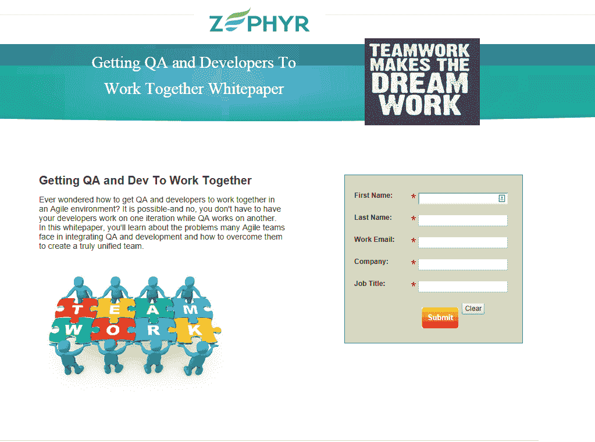

# 关于让 QA 和开发人员一起工作的白皮书和即将举行的网络研讨会

> 原文：<https://simpleprogrammer.com/whitepaper-getting-qa-developers-work-together-upcoming-webinar/>

我只想写一个简短的帖子，谈谈我为一家公司写的白皮书，这家公司是泽法博客的忠实支持者，我还想邀请你参加我下周将举办的一个网上研讨会，主题是“试图学习太多可能会伤害你，以及该如何应对。”

泽法是一家开发测试管理软件的公司，但是他们也通过创建和赞助高质量的内容来确立自己在开发和软件测试领域的思想领袖地位，所以我很乐意通过分享我的一些经验来帮助他们。

你可以在这里查看白皮书:[“让 QA 和开发者一起工作。”](http://info.getzephyr.com/Simple-Programmer-QA-and-Dev-Teams_Reg-LP.html)

你必须在他们的网站上用表格注册，但是别担心，他们不会给你发垃圾邮件。)

在论文中，我试图解决让 QA 团队和开发团队一起工作的困难，尤其是在敏捷环境中。我见过许多团队采用交错的开发方法，他们让开发团队进行一次迭代，而 QA 团队测试前一次迭代。

如果你经历过那种情况，你就知道这是行不通的。

至于网上研讨会，如果你感兴趣，你可以在这里注册:[“试图学习太多实际上可能会伤害你——以及你可以做些什么。”](http://info.getzephyr.com/John-Sonmez-Webinar-July-2014.html) 

网上研讨会将于 7 月 22 日星期二太平洋时间上午 8:00，美国东部时间上午 11:00 直播。

我将谈论为什么我认为许多开发人员过度紧张，试图随着技术的疯狂发展学习太多东西，我将谈论一些在保持理智的同时提高学习效率的方法。

这将是一个非常互动的会议，我打算现场回答许多问题。

所以，如果你对其中任何一个感兴趣，去看看吧。将来我可能会和 Zerphyr 一起做更多的工作，因为他们在软件开发方面似乎和我有很多相同的观点。