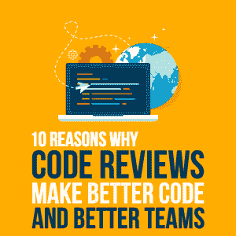
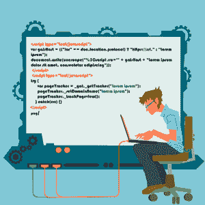
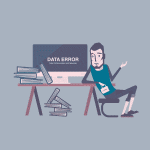

# 为什么代码评审能产生更好的代码和更好的团队的 10 个原因

> 原文：<https://simpleprogrammer.com/why-code-reviews-make-better-code-teams/>

When I started my career in programming, I wasn’t aware that something like a code review even existed, nor did I know about its benefits.

那时候，只有我和另一个开发者。我和我的同事整天都在编写代码，自己测试代码，并尽快将其投入生产环境。

没有人检查我的代码，我几乎从来没有读过我的同事写的任何新代码。我甚至不知道其他公司的开发人员会定期进行代码审查。

仅仅几年后，当我转到另一家公司和团队时，我了解了为什么以及如何执行代码评审。过了一段时间，我开始意识到它们的巨大价值。

虽然有些人可能认为代码审查是不必要的，但是根据我多年的经验，我发现有很多好处。

让我们来看看当您将代码评审作为开发过程中的一个单独步骤时，您的团队得到的 10 个最重要的好处。

## 1)再次检查是否满足要求

当你接到一个开发新功能的任务时，首先要确保你在开始编码之前理解了需求。

当你在项目中工作并设计出你的解决方案时，你关注的是新特性的实现。但是你可能会忘记一两个对于手头的任务来说似乎不太重要的需求。

当您完成任务时，您创建一个拉请求，并将任务分配给同事进行代码审查。

你的同事显然需要知道你的任务是什么；因此，她需要检查任务的需求。

由于团队使用 Scrum，她通常会记得任务的目标，因为整个团队在细化会议和/或冲刺计划会议期间讨论过它。万一她记不清了，她会在你的错误跟踪工具中检查任务的描述和[接受标准](https://www.scrum-tips.com/2016/07/31/acceptance-criteria/)。

当她意识到缺少一个需求时，她会对 pull 请求给出一个友好的评论，把它扔给你来解决。

可以说，测试人员在测试阶段也会发现缺失的需求。然而，在代码中有一些更容易验证的需求，例如，对错误的正确处理，这在测试过程中很难产生。

因此，以代码审查的形式将这四只眼原则放在适当的位置，可以防止不完整的特性进入开发过程的下一步，甚至是生产。

## 2)代码中的错误更少

On my previous team, we had a lengthy discussion about the order of the steps in our development pipeline. To ensure the quality of the code is high, should we review the code first and then do the peer testing? Or should we do the peer testing first and the code review afterwards?

我们最终决定先做评审，只有在评审通过后才进行测试。这是因为在代码评审过程中发现缺陷比在测试过程中捕捉缺陷更容易。

尽管这对我们来说效果很好，但我也认为这对于其他项目和团队来说可能是不同的，这取决于团队结构和项目复杂性，以及其他变量。

测试人员很难发现新编写的代码中引入的一些缺陷。尤其是对于异步代码，测试环境中的回调时间与生产环境中的不同。

通过在代码评审期间查看代码，这样的缺陷更容易被发现。例如，假设您审查了几行代码，它们同时对服务器执行两个异步调用。编写代码的方式假设第一个回调总是先完成。但是，如果第二个回调首先完成，代码会中断并给出错误。

在测试过程中，可能第一次回调总是最先完成，而您永远不会遇到这种错误。当您将代码部署到它的生产环境中时，它有不同的设置和不同的回调时间，您会突然遇到这个 bug。

这种竞争情况在测试过程中很难检测到。然而，一个有经验的开发人员更有可能在代码审查期间发现这样的缺陷，而不是在测试期间。

如果您的代码由初级开发人员开发，并由更有经验的开发人员审查，那么有经验的开发人员在将代码签入到主分支之前，会确保代码具有一定的质量。

初级开发人员的重点是实现给定任务的快乐流程，而更有经验的开发人员也会考虑边缘情况。

在代码审查期间，高级工程师将确保那些边缘情况也在代码中得到适当的处理。这确保了您的主存储库中永远不会有不符合一些基本质量标准的代码。

但是，即使一个高级开发人员的代码由另一个高级开发人员审查，审查人员也经常会发现缺陷，因为他从不同的角度看代码，因此能够发现编码人员自己没有想到的问题。

这里的要点是，在代码审查期间，您可以在代码中发现在测试阶段不会发现的问题。因此，进行代码评审可以减少代码库中的错误数量。

## 3)提高了代码可读性

在我的职业生涯中，我阅读了不少关于编程的书籍。如果我必须给这些书排名，那么毫无疑问，我的第一选择是著名的鲍勃大叔的*。*

*我强烈推荐这本书。当我第一次读到它的时候，我已经从事编码工作好几年了，然而这让我大开眼界。*

*我记得书中最有趣的结论是:*如果你必须记录你的代码，那么它很有可能已经是坏代码，你应该重构它。**

*你写的每一行代码都要维护。将来很有可能会有人盯着你的代码，试图理解它在做什么。*

*那个人甚至可能是十二个月后的你。*

*有些人认为只要代码能工作，代码怎么写都没关系，但这不是真的。糟糕的代码比干净的代码有更高的维护成本。*

**

*It is not only a pain to review or maintain badly-written code, it also takes longer to change since it will be more error-prone.

然而，编写干净的代码并不容易，但这是一项可以通过时间学习的技能。如果你的团队中有人能够写出漂亮干净的代码，阅读和审查这样的代码是一件令人愉快的事情。

当你被“允许”审查这样的代码时，你可以向那个人学习，随着时间的推移，你会成为一个更好的程序员。他可以通过在审查他人的代码时给出建议来教他们成为更好的程序员。人们在回顾他干净的代码时也会学到。

总之，通过执行定期的代码审查，随着时间的推移，整个团队将能够编写出更具可读性和可维护性的代码。

## 4)知识共享

在一些团队中，只有更有经验的开发人员在审查他们同事的代码，初级开发人员根本不审查任何代码。

不幸的是，那些团队认为让初级评审代码不会给拉请求增加任何价值，因为初学者发现高级错误的可能性相当低。不如让学弟把时间花在比执行代码评审更有价值的事情上。

这并没有错，因为以我的经验来看，一个大三学生对一个有经验的开发人员写的代码有任何评论的情况确实很少。然而，仍然有知识共享的部分，这在这里很重要:一个初级开发人员可以从一个好的拉请求中学到很多，即使他没有任何改进的意见。

但这不仅对初级开发人员很重要——高级开发人员也可以通过审查代码学到很多东西。尤其是当你作为一个新成员加入一个团队时，不管你在这个领域已经有多少年的经验，你总能从你有经验的同事那里学到很多。例如，您将学习:

*   关于应用程序的架构。
*   在哪个类库中放哪种类型的代码。
*   命名约定。
*   一个类中构造代码的惯例。
*   在那里你可以找到未来可能需要的逻辑。

当你是一个团队或一个项目的新手时，最后一点特别有帮助，可以加快你的启动时间。

执行定期的代码审查将快速帮助您获得项目存储库中现有代码的概述——并且，您将了解哪些部分已经存在，并且在您处理自己的任务时可以重用。

## 5)代码风格变得相似

我来自。微软定期用 C#语言开发新的框架和新的特性，尽管不像 PHP 世界那样频繁。

因此，通常有非常不同的方式来编写代码——对同一问题有不同的解决方案。

就在几天前，我正在审查我同事的一些代码，他对 C#编程还很陌生。在该特性的某个部分，他必须将一个对象列表转换为另一种类型，并将其放入一个新列表中。他采用了直接的方法:定义新列表，创建 for 循环，在 for 循环中创建新对象，将它们添加到新列表中，并在循环后返回新列表。

That's, of course, a valid way, but I showed him a new, more elegant way by introducing him to LINQ (Language INtegrated Query). LINQ allows you to solve the same problem with just a few chained statements, and therefore the produced code is shorter and more expressive.

如果没有代码审查，他仍然会使用他的老方法来解决这样的问题。这并没有错，它会工作得非常好，但是一个更有经验的开发人员会绞尽脑汁，发现这段冗长的代码是由一个不了解 C#语言特性的人编写的。

但是从现在开始，因为代码审查，我的同事将使用 LINQ 来解决这样的问题，团队中的其他人也是这样做的。

这表明代码评审有助于在您的代码库中保持相似的编码风格。

## 6)消除单点故障

想象一下，一个没有*没有*进行任何代码评审的团队。

我相信下面的事情会自然而然地发生:

某个人开发了一个新功能。几个星期后，这个特性需要扩展，得到越来越多的功能，成长为一个独立的组件。如果这个组件有新的需求，这个人将被分配任务，因为他是这个组件的专家。

这种情况会持续几个月甚至几年。

该组件已经发展，并且添加了许多新功能。这些额外的特性总是由同一个人添加的，因为他已经掌握了所有的领域知识。他也知道在哪里放置新代码，因为他构建了原始结构。

当然，那个家伙可能是最有效的，也是最快完成新功能的人。由于他自己编写了现有的代码，他不必花时间去弄清楚它在做什么。

如果你没有适当的代码审查，那么这正是团队自然会发生的事情。每个人都将拥有一个他自己编写的软件，没有人见过那个代码。

显然，这里最大的问题是专家可能不在。例如，专家休假三周，或者生病。或者他决定继续前进，在别的地方找到另一份工作。

如果专家不在，而您在应用程序中遇到了严重的 bug，会发生什么？您会遇到单点故障的问题。团队中的其他人会花相当多的时间来仔细检查以前没有人见过的代码，并找到 bug。

现在，想象一下，如果你不仅有一个这样的组件专家，而且你的整个团队都由专家组成——每个团队成员都是某个组件的专家。那么你就不是*只有*一个单点故障，而是几个。

然而，如果团队有适当的代码审查，您就消除了单点失败，因为知识在团队中传播。

当然，专家可能是修复 bug 或开发新功能需求的人。但是如果专家不在，那么团队将会弥补，因为他们已经在评审期间看到了代码，并且知道在那个组件中发生了什么。

## 7)更好的估计和更好的规划

Many teams use Scrum as their working methodology. In Scrum, you define so-called user stories to split up desired features of your software into manageable pieces of work.

Scrum 还描述了一个细化会议，在这个会议上，整个 Scrum 团队聚在一起讨论那些用户故事，并最终给出实现该特性需要多少努力的估计。

这些评估是通过 planning poker 收集的，每个团队成员可以投票决定用户故事的工作量，以故事点数量化。然后，合并的评估用于进一步计划和优先化团队将要工作的下一个特性。

这意味着对工作的评估越好，未来的规划就越好。

那么，你能做些什么来提高这些估计呢？

好吧，让我们假设团队想要评估一个新用户故事的工作量。这个新的用户故事是关于用一个新的功能扩展一个现有的软件。

如果只有一个人编写现有的软件，而团队中没有其他人看到代码，那么团队中的其他人很难给出一个好的评估。

然而，在代码评审期间看到代码片段的人越多，评估就越准确。

这就是为什么进行代码评审也增加了这些评估的准确性。估计得越好，某个特性何时完成的计划就越准确。

## 8)通过同行压力提高代码质量

我记得当我是一个不做适当的代码审查的团队的一员时。当时，我正在编写和测试我的代码，当我看到它工作时，我就把它签入。使用这种方法，许多错误可能会漏过并进入生产阶段，当客户报告这些错误时，我们必须在以后修复它们。

现在，在我创建一个拉取请求供我的同事审阅之前，我还要做一个步骤:我比较我所做的每一行修改，确保一切都干净整洁。我删除了愚蠢的注释，并重命名了变量、方法和类，以便完全清楚它的作用。我甚至删除了不必要的空行，使拉取请求更容易审查。

有时，当我偶然发现一些现有的结构不良或命名不当的代码时，我甚至会改进这些代码。

而这一切都是因为我想在别人审核我的拉取请求时，在他们面前大放异彩。一些健康的同伴压力对于产生高质量的代码来说是非常重要的。

没有人想在队友面前看起来像个傻子。如果你知道你的同事会检查你的代码，你会花额外的时间和精力来使它完美。

## 9)缺陷越早被发现，其成本就越低

不幸的是，在实践中，开发没有任何缺陷的软件是不可能的——至少如果你不想用数学模型的开销来工作，这可以证明代码是无 bug 的。

如果软件被部署在生产环境中，并且程序包含一个关键的 bug，那么通常会有多个人参与到提供修复的过程中。

As an example, let me describe the process in my previous company for such situations:
First of all, the customer will notify support about the problem. Then the support team usually will try to reproduce the issue. If that's successful, they will notify the Product Owner, who will evaluate the priority of the bug. In case of a critical issue, he will inform the development team, who will start to work on the fix.

同时，可能其他客户也会报告同样的错误。在已建立流程的公司中，支持团队会公开事件，提前通知现有客户正在发生的问题。根据公司的业务和规模，客户经理可能会直接与客户联系，也会参与到这个过程中来。

在修复 bug 的过程中，开发团队定期更新进度，在公司内部报告，并在公共通知中更新。当 bug 最终被修复并部署后，客户经理或支持团队必须通知客户。

正如您从这个例子中看到的，很多人参与到处理一个关键问题的过程中，这个问题进入了生产环境。

这导致高成本。首先，你有参与处理问题的人员的直接成本。其次，可能更重要的是间接成本:离开客户，公司声誉下降，等等。

因此，建立多道防线以尽早发现软件缺陷显然是一个好的实践。

通常这是通过不同类型的测试来完成的，比如单元测试、集成测试、回归测试或者手工测试。

但是通常，公司忽略了一点，即代码评审也是一道防线，因为在代码评审过程中，您也可以捕捉到 bug。由于代码评审是在开发管道的早期阶段完成的，因此捕捉和修复 bug 比在开发的后期阶段发现和修复它们要便宜得多。

## 10)指导初级开发人员

如果你的团队中有一个初级开发人员，你如何帮助她成长和提高？

当然，你可以介绍一项技术或一个模块。你可以主持一个研讨会，或者当她在工作中接触到一个新的主题时，你可以随时给她解释。

这些都是在一定程度上有帮助和必要的事情。但是她需要定期反馈她交付的工作，也就是她开发的代码。

代码审查是一个很好的方法。

当代码评审是团队开发管道的一部分时，整个团队帮助初级开发人员成长和提高也是很自然的。这使得它成为整个团队的责任——否则，团队通常会期望团队领导做所有培训下级的工作。

As code is reviewed for every team member, it is also perceived from the junior as less intimidating, even though she might get a lot of comments to make changes before her pull request finally is approved.

除此之外，她还必须审查其他开发人员编写的代码。阅读代码并试图理解它在做什么是提高你自己编码技能的一个很好的方法。

如果这是团队发展管道的一部分，这每天都会发生，感觉就像是你工作的一部分。

## 有什么不好的地方吗？

好了，你已经听说了代码审查的 10 个好处。现在，你可能会问:有什么不好的地方吗？

好吧，通常你会从那些看不到代码评审价值的人那里听到下面的观点:

> 代码评审延长了特性的开发时间，因为在编码完成后，另一个人必须在代码进入开发过程的下一步之前评审代码。
> 
> 此外，评审员利用有限且昂贵的工作时间进行评审，而他可以更有效率地继续编码。因此，代码审查会导致更高的开发成本。

这些观点在短期内可能是正确的，但是我相信从长期来看，代码评审肯定会有回报:你会得到更好的代码质量，团队中更好的知识共享，更少的需要修复的 bug，更好的团队合作，以及其他好处。

## 如何实现代码评审

如果您的团队还没有合适的代码评审，那么您可以通过不同的方式与您的团队一起实现代码评审。有四种类型的代码评审:

*   您可以使用[结对编程](https://simpleprogrammer.com/pair-programming-why/)进行即时代码审查。
*   您可以在编码完成后同步审核每个任务*。*
*   *您可以在编码完成后异步审查每个任务*和*。*
*   *很久以前，我甚至每个月都会和整个团队一起在一个房间里开一次代码审查会议*

*我个人更喜欢异步审查每个任务的选项，这基本上是 GitHub 上的体验:当编码完成时，编码员创建一个 pull 请求。稍后，当评审者有时间时，他将根据自己的时间表异步地执行代码评审。*

*相反，同步代码评审在编码完成后立即进行。评审员停止了他当前的工作，和程序员一起在他的办公桌前评审代码。*

*同步和异步评审方法各有利弊。*

## *开始代码评审*

*无论您认为哪种代码评审方法最适合您的团队，重要的是您将代码评审作为开发过程中不可或缺的一部分。*

*如果你还没有，那么我鼓励你和你的团队开始讨论，向他们解释你刚刚学到的代码评审的好处。*

*你不需要一下子说服整个团队。在开始的时候，只需要说服你的一个同事就足够了，你可以开始检查其他人的代码。随着时间的推移，随着您的编码技能的提高，您编写的代码更加健壮和简洁，其他团队成员会变得好奇，最终也会加入进来。*

*好了，今天就到这里。如果你的团队还没有合适的代码评审，我希望你有一些想法，你可以做些什么来开始。如果你对代码审查有任何强烈的意见，请在评论中告诉我。*

*好的，敬请关注，保重。**