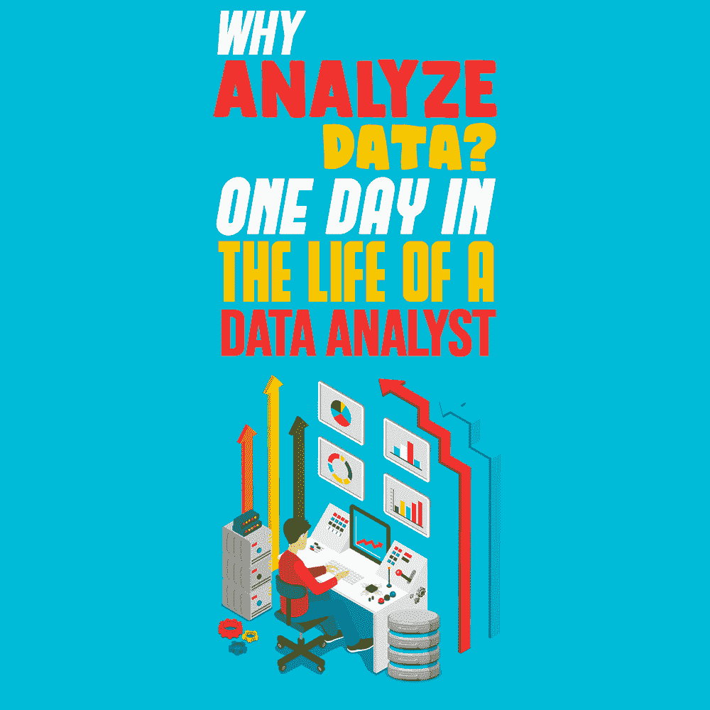
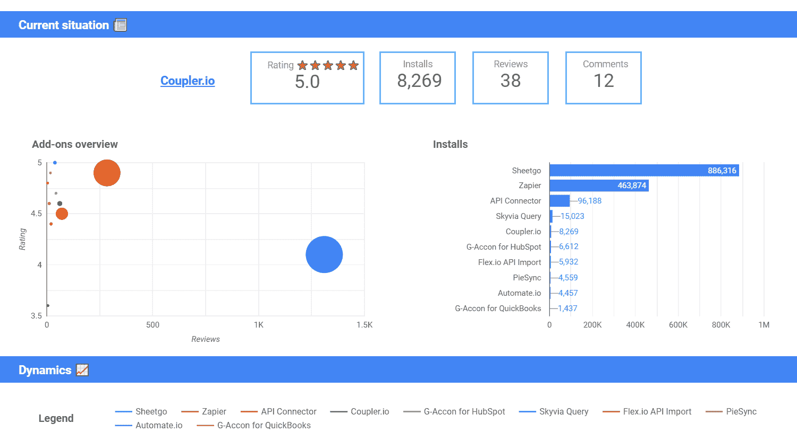
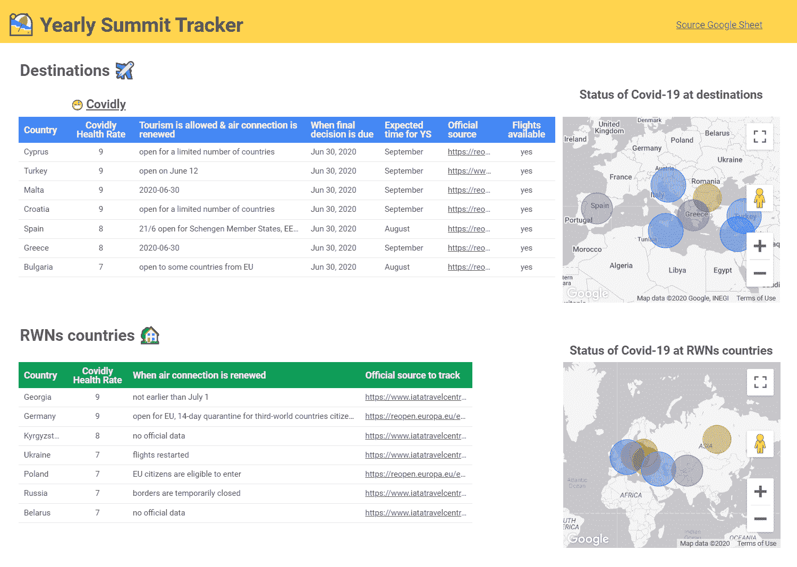
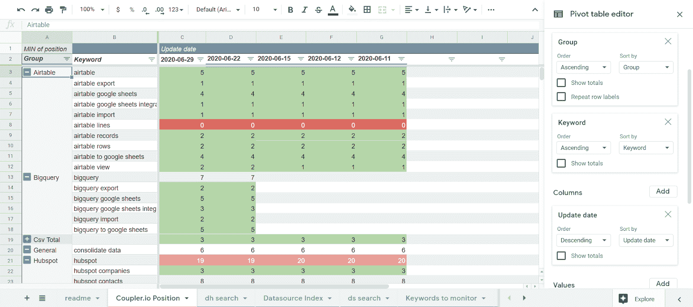

# 为什么要分析数据？–数据分析师的一天

> 原文：<https://simpleprogrammer.com/why-data-analyst/>

In 2018, the World Economic Forum released [The Future of Jobs Report](http://www3.weforum.org/docs/WEF_Future_of_Jobs_2018.pdf), which contained the following predictions for 2022:

*   85%的公司将采用大数据和数据分析技术。
*   96%的公司将拥有具备数据分析技能的专家。

这一预测正在成为现实，因为就业市场对数据分析师的需求正在飙升。于是，对这个专业的兴趣也增加了。

例如，谷歌在问题“*如何成为数据分析师”上返回 2.95 亿条搜索结果？*“同时，问题”*数据分析师是做什么的？*“更新潮，4.6 亿结果。

你也需要答案吗？也许你有兴趣成为一名数据分析师，或者一名数据专家最近加入了你的团队，但你不知道他们是做什么的，也不知道他们为什么重要。

在这篇博客文章中，你将从一位真实的数据分析师那里获得第一手见解，并了解数据分析师在项目 [Coupler.io](https://www.coupler.io/) 中的一天是怎样的。

## 数据分析的目的是什么，数据分析师是做什么的？

当您分析业务数据时，您可以跟上关键指标的变化，并能及时做出反应。这可以让你避免业务停滞，并在不同方面做得更好。

例如，假设客户流失率上升了。在数据分析之后，你明白了是什么导致了用户的离开。一旦这个缺点被修复，你可能就不用再面对这个问题了，所以用户会更高兴。

数据分析师处理和解释数据。他们的主要任务是以一种可理解的形式介绍数据，以便企业所有者或管理者可以使用它进行决策。

例如，让我们假设你的销售额下降了。第一个明显的问题是“为什么？”。

数据分析师将检查销售数据，并回答可能出现的问题。基于此，作为产品/业务所有者的你，会想出一个解决方案，要么解决问题，要么让问题变得更糟。因此，数据分析师参与决策制定，但他们不对决策负责。

### 数据分析师构建报告系统还是仪表板？

通常，商业智能(BI)分析师处理收集和结构化数据，但这主要适用于大公司。

在中小型企业中，数据分析师的任务可能包括自动化数据收集、创建报告系统、构建度量仪表板等等。

### 数据分析师、商业智能分析师和数据科学家是一回事吗？

这些是不同类型的分析师，他们有不同的研究范围。商业智能分析师或简单的商业分析师主要从事数据收集和报告自动化。他们构建仪表板，编制报告，并处理大量数据。然而，他们并不分析或解释它，这是数据分析师的工作。

反过来，数据科学家主要进行调查性数据分析，并创建机器学习模型。他们的工作范围是构建一个解决方案来满足特定的业务需求。在大多数情况下，他们基于机器学习(ML)算法创建数学模型。

## Coupler.io 数据分析师的一天

埃尔韦拉是铁路公司的数据分析师。她在哈萨克斯坦最大的邮政服务公司 Kazpost 担任商业智能分析师，开始了她的 T2 职业生涯。

她的工作记录还包括 Beeline(移动运营商)、阿尔法银行和 OLX 集团。此外，Elvira 还是 Yandex 的 IT 职业发展计划实习的导师，在那里她与新手数据爱好者分享她的经验。

在 Railsware，Elvira 参与了多个项目，包括 Coupler.io。它是一种从外部数据源(如 Airtable、吉拉、CSV 等)将数据导入 Google Sheets 的解决方案。

因此，我询问了埃尔韦拉作为产品数据分析师的角色以及她日常处理的范围。

### 你分析什么类型的产品数据？

“在 Coupler.io，我分析多种数据，包括用户活动、成本、收入、错误等。例如，以下是竞争对手分析仪表板的外观:

“除了 Coupler.io，我还参与了 Railsware 的其他项目。我们最近推出了一篇博客文章，[Post Coronavirus Destinations Dashboard](https://blog.coupler.io/coronavirus-dashboard-data-studio/)，在这里你可以看到我的范围的一个例子。”

### 您使用哪些工具来获取和分析数据？

“我根据要完成的工作使用不同的工具。总的来说，对于一名优秀的数据分析师来说，以下是一组硬技能:

*   编程和数据库语言:Python、R、SQL 等。
*   分析工具:Excel、SPSS、SAP、STATA 等。
*   可视化工具:Tableau、Power BI、Qlik Sense 等。

“例如，为了创建一个表格来显示 Coupler.io 在 G Suite Marketplace 搜索结果中的位置，我使用了以下工具:

*   谷歌云功能(作为一个环境)
*   Java Script 语言
*   Coupler.io
*   谷歌表格

“这是它的样子:”

### 数据分析师可以不编码吗？

“在一些安装了分析软件的公司里，数据分析师可能不需要为他们的任务编写代码。但是这种情况很少见，因为 Python 或 R 等编程语言的使用对分析非常有益。

“在我看来，结构化查询语言(SQL)是每个数据分析师的首要技能。在大多数项目中，数据分析师通过 SQL 请求从数据库中提取数据。关于 SQL 的更多内容，你可以在 Railsware YouTube 频道上观看面向初学者的 [SQL 教程](https://www.youtube.com/watch?v=xV9xjzlthHk&t)。

### 如何成为一名数据分析师

“嗯，成为数据分析师有两种方式:大学或者自学。两种选择各有利弊，但我更倾向于后者。自己学习数据分析，可以借助书籍、课程、工作坊等。

“你可以在主要活动(工作、旅行)之余学习，从实践专家那里汲取知识。在线教育的弊端是缺乏面对面的交流。

“然而，这应该不是一个问题，因为[新冠肺炎已经对许多行业产生了影响，包括网络开发](https://simpleprogrammer.com/web-development-covid-19/)。反正你看着办吧。”

### 数据分析师在工作中每天都会用到哪些软技能？

“我认为以下技能对于任何数据分析师都是必不可少的:

**可教性。**数据分析师在旅途中学习:新工具、技术、方法等等。所以，你应该是可教的，渴望获得新知识。

**批判性思维。**数据分析师解读数据，因此他们必须看到任何关联中的逻辑。

“例如，你可能遇到过[尼古拉斯·凯奇和溺水者](https://tylervigen.com/view_correlation?id=359)之间的虚假关联。这是一张在游泳池中淹死的人数与尼古拉斯·凯奇出演的电影数量相关联的图表。

“这两个值之间有数学上的关联，但没有逻辑。批判性思维有助于数据分析师避免这种数据陷阱。

谷歌搜索技巧。一名优秀的数据分析师必须知道如何以最有效的方式搜索数据。在你的工作范围内，并不是所有的案例都在书本或在线课程中有所涉及。所以你需要正确地查询谷歌或其他搜索引擎来得到你需要的信息。

**任务分解**。比方说，你有一个像我加入 Railsware 时一样的大任务。那是为了分析我们的一个产品——[吉拉智能清单](https://marketplace.atlassian.com/apps/1216451/smart-checklist-for-jira-enterprise?hosting=cloud&tab=overview)。

“分析需要包括销售、安装和其他数据。因为这是一项大任务，所以我把它分成几个小任务，并按优先顺序排列。它看起来像是一个[实施计划](https://simpleprogrammer.com/software-implementation-plan/)，帮助我构建了我的范围。”

### 在数据分析中，你喜欢什么，不喜欢什么？

“关于数据分析，我最喜欢的是你一直在学习和发展。

“数据分析师感觉自己就像一名正在办案的侦探，他们进行调查并寻找线索。最终，他们得出了一个能带来很多价值的判决。

“对我来说，数据分析是一种魔力，我们作为数据分析师，用它来处理数据，让利益相关者可以获得和理解数据。

“至于我**不喜欢**什么，当公司雇佣数据分析师的时候是很可怕的，因为这是由市场决定的。结果就是，你可以在这样一个没有任何分析范围的公司里度过你的时间。

“另一个缺点是缺乏对数据分析范围的了解。对于我这个数据分析师来说，当我做的一个数据分析没有实际用途的时候，这是有害的。没有人喜欢做恶作剧。

“许多数据分析师面临的另一件可怕的事情是数据造假。这在层级结构的大公司中很常见。

“数据篡改的想法是进行数据分析，显示之前定义的指标。为什么？向投资者展示一切进展顺利，或者向高层经理汇报销售增长情况；情况不同。但从数据分析师的角度来看，这是无稽之谈，与数据分析毫无关系。”

### 一个产品或业务什么时候应该有一个数据分析师？

Data analysis is an ongoing process. You analyze data to decide:

*   您的项目使用哪种技术组合。
*   需要多少开发人员。
*   未来产品的竞争对手是什么等等。

开始时，不同的主管可以参与数据分析。但是范围会扩大，最好有一个专门的专业人员来负责这个过程。这就是数据分析师应该发挥作用的时候了。

埃尔韦拉还认为，“认为必要的数据分析师数量取决于公司规模的想法是错误的。数据分析范围是您应该考虑的。

如果你有大量的数据要分析，雇佣一个数据分析师，你会看到这个范围是否可以实现。之后，你会更好地了解你的公司需要多少分析师。"

## 数据分析师可以帮助制定决策

分析数据是运营任何产品或业务的关键流程。在一些项目中，数据分析属于产品经理、营销专家或其他利益相关者的职责范围。但是不断扩大的数据范围将需要一个专门的专家来掌控分析过程。

在你的团队中有一个数据分析师意味着你倾向于做出数据驱动的决策，而不是把信心寄托在一个好机会上。然而，数据分析师不是决策者。他们提取数据并进行分析，以证明或否定某些假设。

他们的工作成果可以是一个交互式仪表盘、一份全面的报告，甚至是一个用 ML 算法构建的预测模型。基于此，利益相关者可以做出决定。

这就是数据分析师的工作:他们帮助高管选择正确的方向。