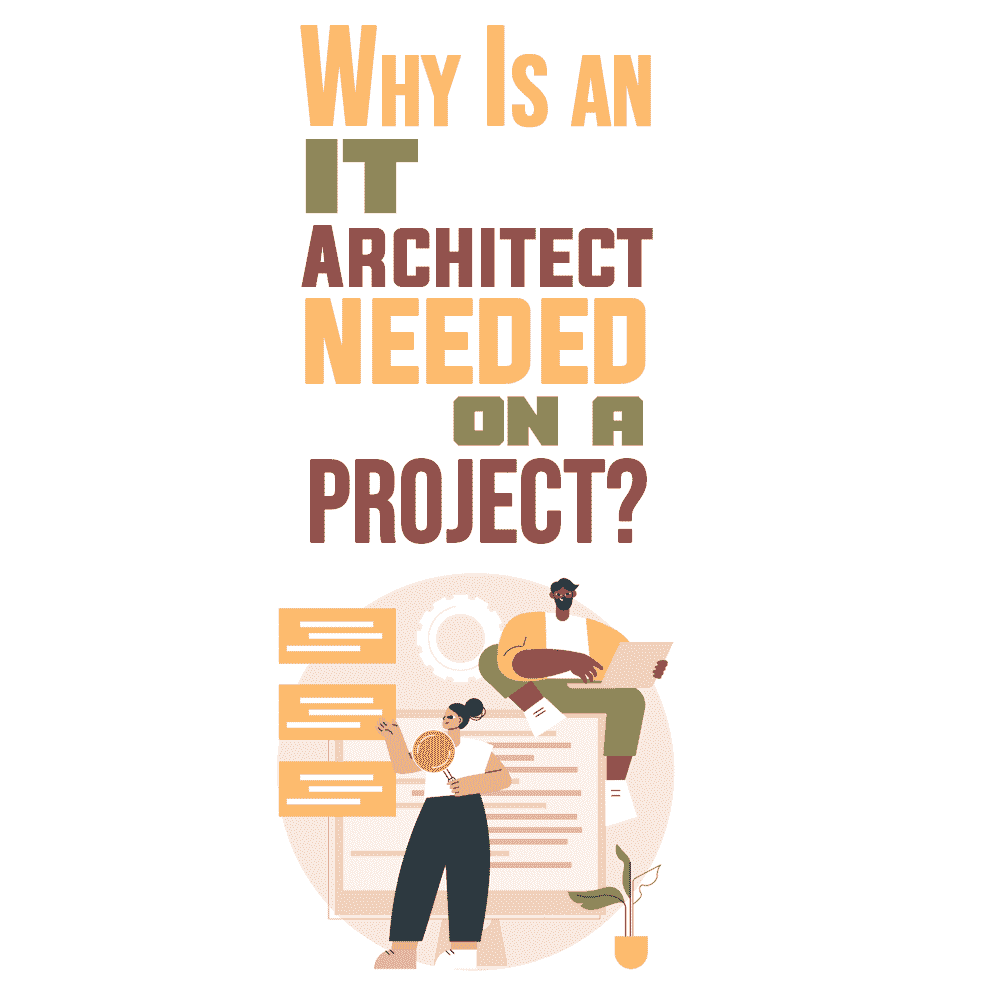
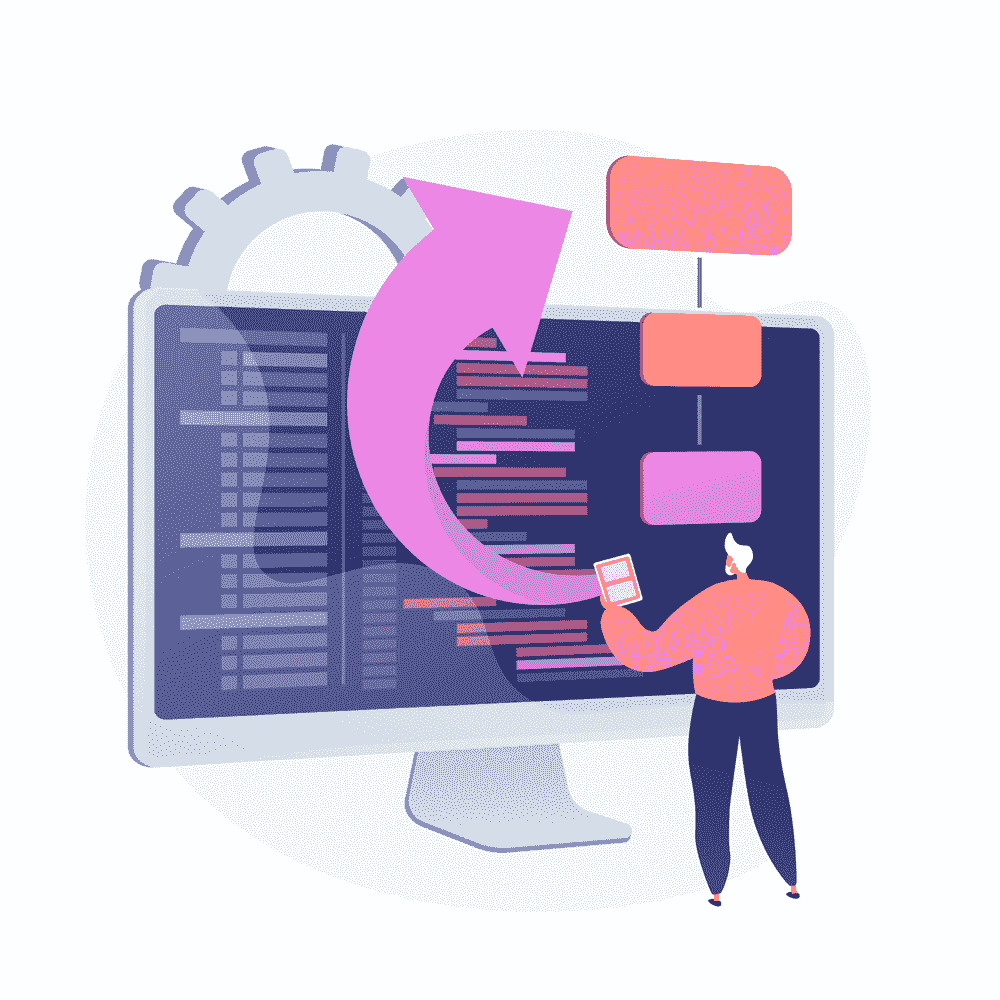

# 为什么项目需要 IT 架构师？

> 原文：<https://simpleprogrammer.com/why-it-architect-needed/>

Let’s imagine that a company launched a test version of software. The product began gaining momentum, but then the system simply stopped. One of the reasons why IT systems stop working is poorly designed IT architecture. In order to resolve the issue and make sure such things don’t happen again, you need an IT architect.

IT 架构是一个宽泛的术语。它包括企业架构、基础架构和解决方案架构:

*   **企业架构**从业务目标的角度描述公司的 IT 系统，并将人员、流程和技术结合在一起。
*   **基础架构**代表组织工作的 IT 解决方案的整个结构(数据中心、服务器、网络、定制应用程序等等)。
*   **解决方案架构**应用[为特定任务开发新软件](https://simpleprogrammer.com/software-architecture-principles/)。

在本文中，我将主要关注解决方案架构和解决方案架构师。因此，让我们来看看 IT 架构师负责什么，以及为什么您的项目中绝对需要 IT 架构师。

## 更详细的 IT 架构

对于全面的 [IT 架构](https://andersenlab.com/blueprint/software-architecture-importance?utm_source=article&utm_medium=simpleprogrammer.com)规划，一个至关重要的方面是基础的规划——平台(硬件或云提供商)、外部基础设施(服务器、网络)和内部基础设施(软件解决方案的交付、放置以及通信和交互的建立)。

例如，一家公司创建了一项服务，允许旅行者预订航班、酒店和出租车。IT 架构师的任务是分析选择什么工具、编程语言、平台和 APIs 开发需要多长时间；以及受众将如何使用该产品，即他们可以从什么设备和平台访问该产品。

如果你想了解更多关于 IT 架构师的工作如何使产品对最终用户友好和可访问，并允许所有技术准确和适当地协同工作，我推荐 Len Bass，Paul Clements 和 Rick Kazman 的 *[软件架构实践](https://www.amazon.com/dp/B009GMUL84/makithecompsi-20)* 。

## 解决方案架构的核心流程

精心设计的解决方案体系结构允许 IT 专家在预算内按时开发产品，并符合业务需求。这有助于他们避免诸如所用技术的不兼容性或无法扩展或修改软件等困难。在涉及不完善的 IT 架构的情况下，公司必须完全重新开发程序和系统。

设计良好的架构还可以更准确地计划开发和交付最终产品或其部件所需的时间。它为开发过程提供了足够的灵活性以及并行化这些过程的能力，降低了理解单个模块和服务的复杂性。

记住这一点，现在让我们仔细看看 IT 架构师遵循的流程。

### 新软件与公司环境的一致性

当 it 架构师开始他们的工作时，他们对公司环境中的系统进行预先研究，以便新程序与 IT 同步，并且系统之间不会发生冲突。

### 项目开发技术的选择

专家在创建 IT 架构时会考虑最新的软件开发技术。他们分析什么样的平台、编程语言和工具适合给定的项目。

要执行这样的分析，IT 架构师需要技术背景和编程经验。一般来说，至少需要五年的开发经验。在这段时间里，一个程序员设法从事许多不同的项目，并了解不同的软件开发技术。

### 满足非功能性需求

每个产品都有指定软件特征的非功能性需求:安全性、性能、用户友好性、可伸缩性等等。IT 架构师应该分析这些质量属性，并确保基于提议的体系结构开发的项目符合这些属性。

即使在初始阶段无法预测扩展需求，it 架构师也会为开发足够灵活的基础架构制定计划和策略，以自动管理扩展过程。

每个程序都基于支持它的架构。通常，没有必要为简单的应用程序设计和记录架构解决方案，因为软件通常是根据模板开发的。

然而，当涉及到需要在大型组织的企业系统中实现的独特、复杂的程序时，it 架构必须经过深思熟虑并准确记录。

## IT 架构师的职责

如果 it 架构是应用程序的一种框架，那么 IT 架构师就是构建它的专家。他们设计一个程序，它的主要部分和接口，这样软件就可以与外部系统互操作。这涉及几项责任，如下所列。

### 分析需求

解决方案架构师在开发过程开始之前很久就开始工作，寻找适合业务的技术。

正如我上面提到的，为了创建一个成功的产品，架构师需要关注系统的功能和非功能特性。他们评估需求的正确性和可行性，以及在合理的时间和分配的预算内满足需求的可能性。

### 创建一个原型

IT 架构师还分析技术环境和公司概况，记录需求，并创建架构解决方案的原型。

这些专家与开发人员分享项目的架构愿景，监控过程，并在产品开发阶段支持员工。他们修复技术问题，如果有的话，并参与随后的程序更新。

### 预见风险

当进行程序设计时，IT 架构师不仅要为最初想法的实现创建一个解决方案，还要预测与非功能性产品质量相关的可能的风险和限制。

例如，如果应用程序不可伸缩，分配给开发的资金很可能会被浪费。如果需求发生了变化，并且这可能会影响到最初的设计，架构师会试图阻止它们对软件性能、安全性和其他质量的负面影响。

为了完成这项大规模的工作，IT 架构师需要丰富的编程和业务分析经验，以及现代技术和敏捷方法的知识。可以说，It 架构师的职位是技术主管、团队主管或经验丰富的开发人员职业生涯的下一步。

## 什么项目需要 IT 架构师

As a rule, the need for an IT architect arises in large projects with several [technical teams](https://simpleprogrammer.com/software-architecture-decisions/) (front-end developers, back-end developers, and [DevOps engineers](https://www.amazon.com/dp/0988262509/makithecompsi-20)). This specialist is also called on when complex non-typical software is being developed. Template development projects—an online store, for example—can do without an architect.

在小规模项目或初创企业的开始阶段让架构师参与进来被错误地认为是不重要的。因此，在最小可行产品完成后，产品会经历一个完整的 beta 测试阶段，并且会出现新的大规模功能和非功能需求，因此更改系统通常会过于昂贵，甚至是不可能的。

这是由于修改的复杂性和硬依赖的存在，不良的可测试性，没有可能测试产品的单个部分，不良的监控，即内部和外部过程的控制，以及其他因素。

就全球而言，IT 架构师是设计满足业务目标的高效 IT 解决方案所必需的。否则，团队将冒着开发出无法为客户工作或无法充分扩展的产品的风险，并且必须重做。其实这些都是双重成本。IT 架构师将帮助避免项目中这些不可预见的问题。

IT 架构师考虑快速变化的技术和日益增加的系统复杂性，并能够解决战略要点，找到有益的解决方案，并向开发人员和客户展示产品的总体愿景。因此，客户知道期待什么，程序员知道如何创造产品。

对于大型复杂的项目，尤其是鲜为人知的主题领域，架构师还有一个重要的额外目标:用有限的责任范围定义项目的最基本的部分。因此，专家可以清楚地了解产品及其各个模块的开发、测试和进一步支持的所有过程。

## 要构建一个可靠的产品，你需要一个架构师

解决方案架构师的价值在于他们为未来的产品奠定了基础。这允许团队获得需求和技术解决方案之间的一致性。

随着公司努力跟上新兴技术并构建可靠的高质量应用程序，他们需要知道如何将技术知识转化为具体业务成果的专家。有了 IT 解决方案架构师，项目有更好的机会[成功启动](https://andersenlab.com?utm_source=article&utm_medium=simpleprogrammer.com)。

有没有可能不考虑 it 架构就写代码？当然是这样，但这是有风险的，因为有很多事情可能会出错。没有架构师，项目会有延迟和不可预见的成本的风险。形象地说，没有 IT 架构，规划中的摩天大楼就有变成两层楼的风险。

有一个好的建筑师，你的项目一定会成功。