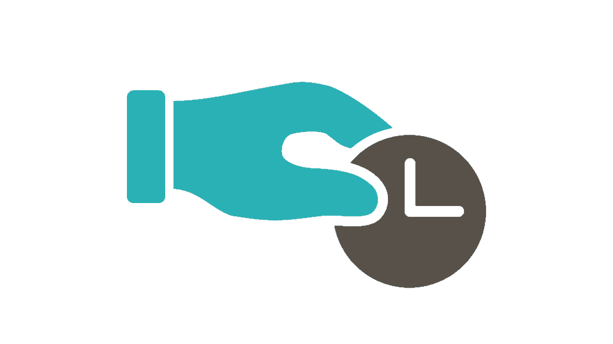
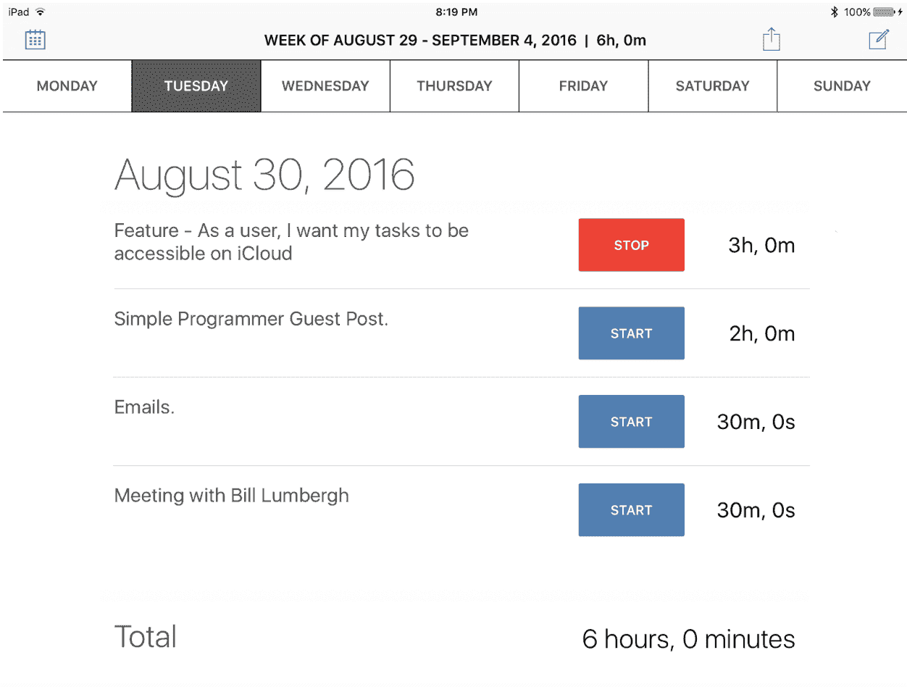
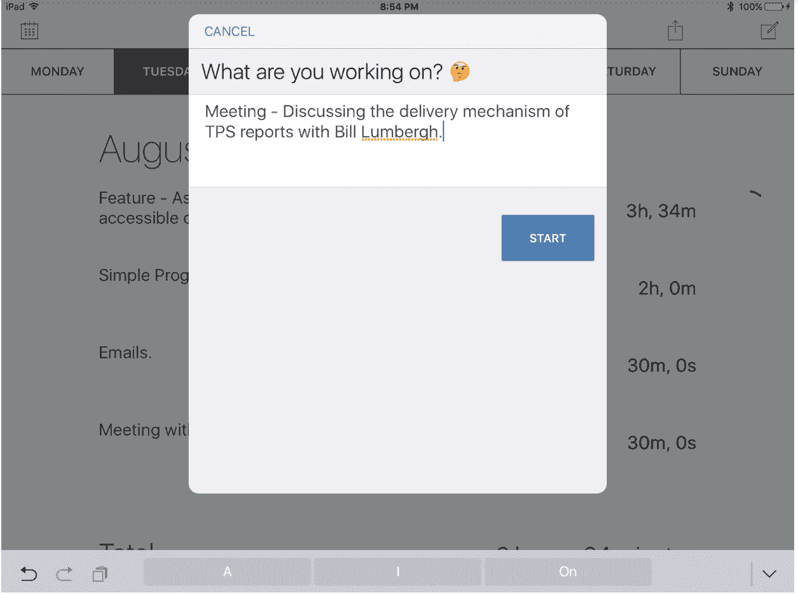
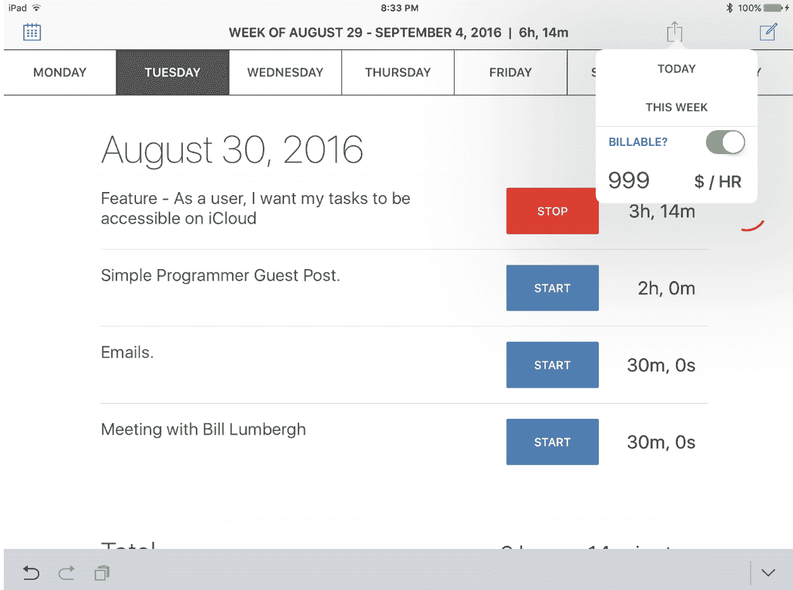
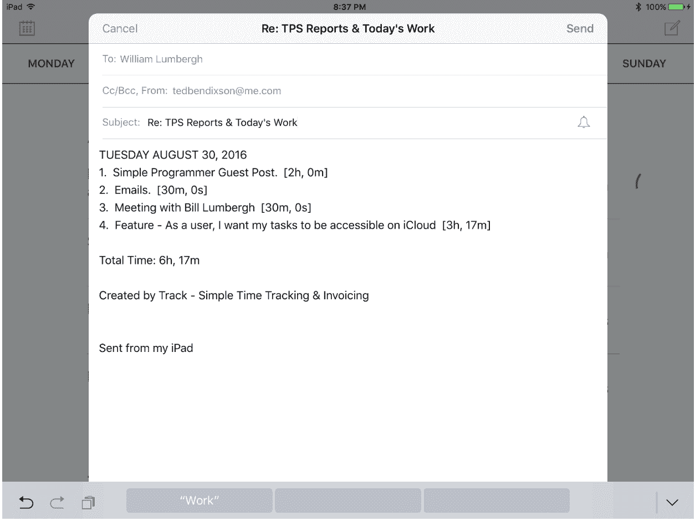
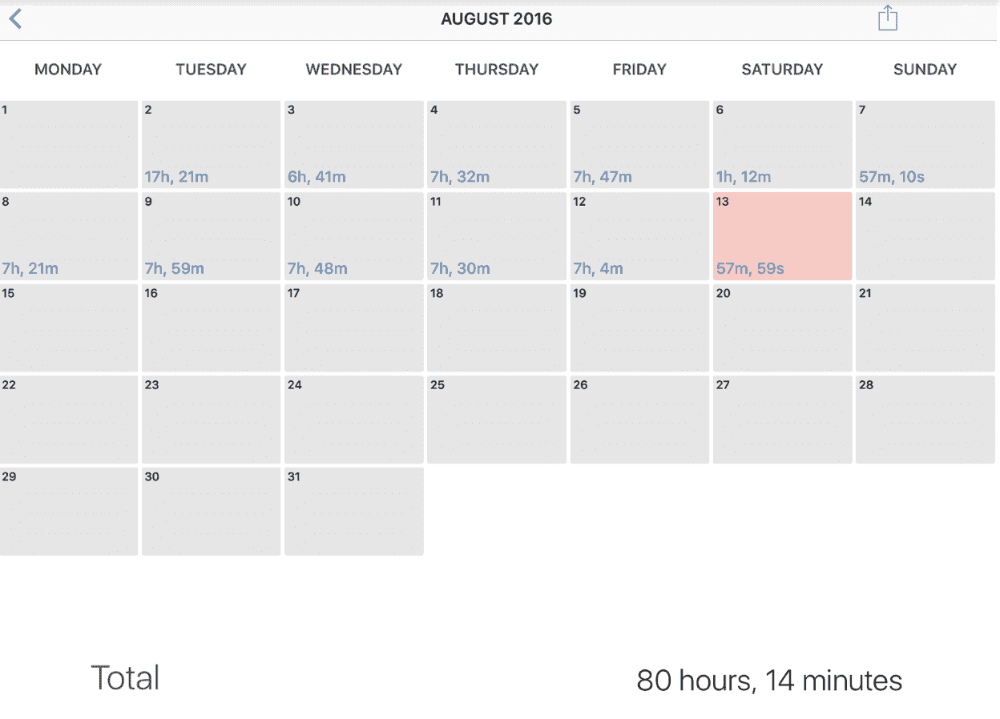

# 为什么程序员应该跟踪他们的时间(即使他们不按小时收费)

> 原文:[https://simple programmer . com/why-programmers-should-track-they-time/](https://simpleprogrammer.com/why-programmers-should-track-their-time/)

编程可能会有压力。这是我们很早就学到的一课。任何与 bug 和编译器错误搏斗过的人都会告诉你，压力只是工作的一部分。我们不断受到善意的同事和经理的推动，他们对按时发布产品有既得利益。

压力通常来自于评估未知的挑战，与快速逼近的最后期限做斗争，以及糟糕的工作/生活平衡。在这一片忙乱中，程序员经常会有一种不安的感觉，觉得有些事情他们应该去做，这种不安的感觉是他们可能没有尽自己的职责。

我已经找到了一种对抗这种压力的方法。这不是万灵药，肯定需要一些时间来适应。然而，我保证你们中训练有素的人将获得和我一样的好处——安心、专业，以及与客户和经理更好的关系。

那我该怎么办？我追踪我的时间。我跟踪每一秒、每一项任务、每一天，有很多理由说明任何一个理智的软件开发人员都应该这样做。

我们在一个未知因素比已知因素更多的行业工作。由于这个原因，程序员会发现自己与他们的经理不和。不管我们有多喜欢写代码，其他人都需要评估。时间追踪是你找出那些估计值应该是多少的唯一方法。

## 程序员应该跟踪什么？

假设你的项目管理良好，它可能会有四个主要的任务类别:**特性**、**bug**、**杂务**和**会议**。当你记录你的时间时，每项任务都应该包括对这四件事情之一的简单描述。

这个想法是让你的任务简单明了。你想避免陷入跟踪“总体发展”的陷阱，但你也想**避免过于具体。**有一个既准确又易于所有利益相关方消化的最佳点。

### 如何标记任务的示例:

1.  **功能**——作为用户，我想在地图上看到最近的口袋妖怪。
2.  Bug–在我删除一个购物清单项目后，应用程序崩溃了。
3.  作为一名开发人员，我想用 Fabric 设置崩溃报告。
4.  **会议**–每日站立。

你可以看到**这些项目中的每一个都是清晰而专注的**。如果你发现你正在做的东西覆盖了许多不同的特性或错误，那就是一个巨大的危险信号！这意味着你没有把项目分成正确的部分。试着把那个特征削减或者分割成几个独立的特征。

一般来说，你希望任务是小规模的:从几个小时到 16 个小时是一个很好的范围。

这是软件项目管理 101。假设你要向经理或其他利益相关者展示你的时间表。如果你可以选择下面的一件事来说，你会选择哪一件？

*   “我搭建了登录模块，花了 9.5 个小时。”
*   “我用登录构建了一些东西，还修复了一些帐户创建的错误，这花了几天时间。”

第一个是果断和自信。它是集中的。第二个让你看起来无处不在。良好的时间跟踪实践与扎实的项目管理技能密切相关。两者你都需要。致力于一个有助于你发展另一个。

## 掌握评估

当面对估算的任务时，大多数程序员都像被车灯照着的鹿。我们不知道我们遇到了什么。挺吓人的。

人们说我们可以在这么短的时间内完成所有这些令人惊叹的事情，而我们只是盯着远处，希望当这些期望不可避免地与现实发生冲突时，我们的脚不会被火烧着。

相信我，我知道这种感觉。我去过那里太多次了。那你是做什么的？

首先，你可以放松。现在不是辩护的时候。毕竟没必要。你有你这边的数字！

当你追踪你的时间时，你可以回顾你追踪过的类似特征，看看你花了多长时间来构建它们。

栈溢出的创造者 Joel Spolsky 提倡**跟踪你的估算的准确性**。如果你像大多数程序员一样是一个长期的低估者，你可以将它纳入你的总体项目评估中。只需将您估计的时间除以构建该特性所花费的实际时间。

每个评估都是你个人记录中的一个数据点。在短短的几周内，你将开始看到你是一个多么好(或坏)的评估者。这个习惯极其可贵。即使你的估计是错误的，你也可以用它来准确地预测项目的发货日期。

乔尔[发现](http://www.joelonsoftware.com/items/2007/10/26.html)的是，大多数开发人员实际上在评估方面并没有那么差。即使开发人员搞砸了评估，通常也有某种行为模式。他发现，大多数人要么高估，要么低估的程度大致相同。

假设迈克是一个慢性低估者，他一直在追踪他的时间。在一个项目的过程中，他投入的时间的估计/实际比率将类似于一系列分数，每个分数都小于 1。

它可能看起来像这样:

{0.4, 0.5, 0.3, 0.6, 0.5}

如果你取这些比率的平均值，你最终得到的数字是 0.46。

这个数字是什么意思？粗略地说，这意味着当 Mike 说一项编程任务需要一天时间时，他实际上花了大约两天时间。

作为一名项目经理，我不能强调知道这一点有多重要。您可以使用这些评估来准确地计划产品的开发时间表。事实上，我会说它很美，因为你甚至不需要因为迈克的错误而责骂他。他可以继续低估，只要他的估计符合相同的模式，你仍然可以预测你的产品何时发布。

如果你是像迈克一样的人，这也是个好消息。这意味着你可以通过跟踪你的时间，看看你属于这两类中的哪一类，来提高你的估算技能。你的估计是否过于乐观？积极在所有其他方面都是一个很好的品质，但是你可能想要添加一些填充来提高你未来估计的准确性。

乔尔提出的另一点是每个人都应该注意的。开发人员应该是做评估的人。我们是知道哪些编程任务需要执行的人，所以只有我们才能判断每个任务要花多少时间。

如果你没有被要求做你自己的时间估计，而估计只是从一些权威人士那里传下来的，这是一个工作环境失调的强烈信号。当您对交付日期没有发言权时，很难有动力按时交付特性。

我不能告诉你在这种情况下应该怎么做，但是你应该冷静地解释为什么对你来说拥有这个项目如此重要。好的经理会相信你会自己估算时间。奖励他们留在团队中。

## 将非技术人员拒之门外

如果你的汽车修理工告诉你，她发现你的发动机有问题，但不知道要多长时间才能修好，你会有什么感觉？当我们试图向项目经理解释代码中的问题时，他们通常会有这种感觉。

从他们的角度来看，这都是一堆技术上的官样文章。他们不关心我们将如何解决这个问题。他们想要答案，而且现在就要。

如果你只是停止回答，你会受到伤害。涉众将开始担心项目已经失去控制。他们可能会采取一些相当激烈的措施，让一切回到正轨。换句话说，你可能会被解雇。

你是开发商。你知道一切都可能会好起来，但是我劝你从你客户的角度去看这个世界。他们不知道有一两行代码，你忘了调用这个函数，它会让一切都好起来。他们害怕未知。

我曾与勇敢的领导者一起工作，他们可以自信地凝视未知，我也曾与那些一出问题就抓狂的人一起工作。你不能控制别人对周围发生的事情会有什么反应，但是你可以让利益相关者不断了解你的活动，让他们感觉更舒服。

当他们看到你的时间表和你一直在做的事情时，人们会觉得你是一个注重细节的人。这不会解决你所有的问题，但肯定会有帮助。

如果你发送的是一份每日进度报告和一份任务清单，你会显得更值得信赖和专业。也许客户关心的是一个 bug 或者一个缺失的特性。如果他们能在你的日常任务列表中看到它，他们至少会知道你正在努力。如果脾气开始爆发，这会让你获得一些加分。

## 工作/生活平衡

督促你是经理的工作。有时他们这样做是有充分理由的。他们需要让客户满意，才能支付你的薪水。有时他们的意图并不那么高尚，他们想看看是否能在不额外收费的情况下从你身上获得 10%的提升。

如果你和你的经理关系很好，这条建议真的不适合你。这是为那些属于后一类的人准备的，那些经常发现自己在工作之余额外增加体重的人。

当你需要向一位咄咄逼人的经理说明你的情况时，时间追踪至关重要。你可以向他们展示你到底花了多少时间，在哪些功能上，花了多长时间。这是证明加薪的一个好方法，或者只是在周五五点钟走出办公室，自信你已经完成了 40 个小时的工作。

时间跟踪也是识别组织膨胀的好方法。**如果你发现你在会议中比在实际软件开发中花费了更多的时间，这就需要解决了**。当你努力记录时间时，你可以让人们坐下来，解释所有这些会议是如何占用工作时间的。

泽维尔·莫雷拉很好地解释了为什么保护你的工作时间如此重要。他讨论了你一天中可能遇到的许多分心的事情，以及你如何以尊重同事的方式消除它们。

电子邮件真的会浪费你的工作时间，一旦你开始跟踪你的任务，你就会开始注意到这一点。Xavier 建议选择一天中可以回复邮件的短时间窗口。这限制了你在邮件线程中无休止的来回。

他还指出用其他方式与同事交流是多么重要。与其永远保持这种邮件联系，为什么不去他们的办公室亲自回复呢？总比无视它好。

你必须慢慢地把人们推向正确的方向。人们需要时间来适应你不能立即回应每个请求的想法。

根据我自己的经验，当你解释你需要不受打扰的时间时，大多数经理都很通情达理。他们可能会对你一开始就记录这些时间印象深刻。当人们看到他们面前的实际数字时，你几乎不需要做任何解释。你的观点将一清二楚。

## 八小时实际上是很多工作

我一直这么说，因为我一直认为这是真的。大多数人甚至没有达到每天工作八小时的标准。这不是一个判断。这是基本事实。

大部分都不在我们的控制范围内。现代办公室不是那种能进行真正高效工作的地方。有太多的分心和干扰让人们无法发挥出最佳水平。

当我在办公室工作时，我每天最大限度地工作六个小时。我发现我的大部分时间要么花在会议上，要么花在与同事的即兴讨论上。几乎没有时间进行产生大部分工作的主要是孤独的、长期的会议。

我有一个简单的挑战给你。坐下来，开始记录你的时间，真正的一天八小时。你会惊讶于你所能完成的。

你们大多数人会发现一天工作八小时是相当困难的。这需要一些严肃的纪律。我的观点不是要让你为没有真正的八小时工作制而感到内疚，而是要说明你有多少工作时间花在了与工作无关的其他活动上。

这不是坏消息。其实恰恰相反！意味着还有提升的空间。

如果你有时间的话，可能会有一些你梦想中的项目，一些你一直想做的事情。当我开始记录我的时间时，我的梦想突然变得触手可及。这只是一个每天持续投入时间的问题。

我现在可以自信地说，如果我想的话，通过一点训练，我可以一年发布六个应用。假设他们中的一些人成功了，我可以有一个稳定的收入流来维持我的生活。如果我没有开始记录我的时间，我是不会知道的。通常，你效率低下的真正原因是缺乏基本的纪律。

## 弄清楚你是否在浪费时间

当你开始记录你的时间时，你可能会发现你已经浪费了大部分时间。如果你做了，不要气馁。相反，考虑改变你的观点。

*   如果你过去和咄咄逼人的老板有过矛盾，也许很有可能是你的错。没关系。承认你的错误，并尽最大努力在未来改变你的职业道德。

*   下一次，当客户试图连续三个小时不停地打电话时，平静地陈述继续工作的必要性。大多数人都会欣赏。

*   有没有一些你每周都要做的任务，消耗了你所有的时间，却没有给你多少回报？别再做了！你未来的自己会感谢你。

我记录我的时间，因为它让我问心无愧。在一天结束的时候，当我已经工作了八个小时，**我知道拔掉电源插头和我的伴侣去散步或玩电子游戏是完全合理的。我不需要做一堆脑力体操来证明我为什么需要休息。我可以放松一下。**

编程不一定要有压力。经理和顾客总是咄咄逼人。总会有一些 bug 需要修复。哦，是的，这永远都是你的错。

没关系。深呼吸一下。数到四。意识到你正在尽你最大的努力，而一天只有这么多的时间。如果你在跟踪你的时间，并且你已经投入了整整八个小时的实际工作，那么你已经做得超过了你应得的份额。如果你愿意，你可以放松一下。

### 跟踪–简单的时间跟踪和发票

如果你对追踪你的时间感兴趣，并且你碰巧有一个 iPad，你应该下载[Track——简单时间追踪&发票](https://itunes.apple.com/us/app/track-simple-time-tracking/id1139954391?mt=8)。

我为像我们这样的开发人员创建了 Track。通过关注您的工作日和工作周，Track 可以轻松创建和共享定时任务。

每一天，你都有一个全新的开始。当您添加一个任务时，它会上升到列表的顶部，计时器开始计时。在此屏幕上，您可以看到您在此任务上的总工作时间、今天的任务以及本周的所有任务。

Track 旨在让您轻松切换任务。我注意到，在我的工作日，我总是回到相同的任务，所以我建立了 Track，给我最近的任务更高的优先级。

假设你早上正在做一个重要的专题，然后 Bill Lumbergh 闯进你的办公室，召集了一个关于 TPS 报告的会议。没问题！只需创建一个快速任务来跟踪会议时间，您的软件功能任务将直接位于它的下方。

一旦会议结束，你就不必在整个应用程序中搜索你的任务了。因为你的任务是你最近做的第二件事，所以它会排在列表的第二位。点击它启动它备份。

Track 旨在帮助您一次专注于一项任务。您不能运行多个计时器，当您轻按以开始另一个任务时，Track 会立即停止正在运行的任务。这有助于保持简单。

当您完成工作日、工作周或工作月的工作后，您可以点击分享按钮，向您的经理或客户发送任务的明细列表。

如果你想为你的任务付费，只需轻触开关，设置你的费率。然后点击其中一个选项来共享您今天或本周的任务。

您可以在电子邮件或 iMessage 中分享您的任务。其他导出选项将出现在该产品的后续版本中。

Track 还有一个日历视图，可以让你编辑本月和其他月份的所有任务。从日历中，您可以导出给定月份的所有任务。如果你想做更详细的簿记，这是方便的。

轨道的设计简约得令人愉快。你甚至不需要创建一个帐户来使用它。

如果您碰巧使用现有的 iCloud 帐户登录，Track 会自动备份您的任务。这样，如果你在另一台苹果设备上使用 Track(或者删除应用)，你就不会丢失数据。

在不太遥远的将来，Track 将可以在 iPhone 和 Mac 上使用。您的任务将在不同设备之间无缝同步，让您可以随时随地跟踪时间，而无需注册帐户或记住密码。

追踪使复杂变得简单。它消除了跟踪时间的烦恼，这样你就可以专注于创建伟大的软件。

如果您对 Track 或本文有任何反馈，我很乐意倾听。给我发一封电子邮件到 tedbendixson@me.com