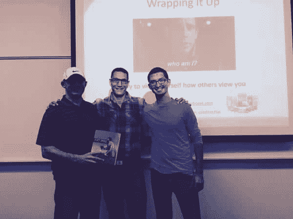
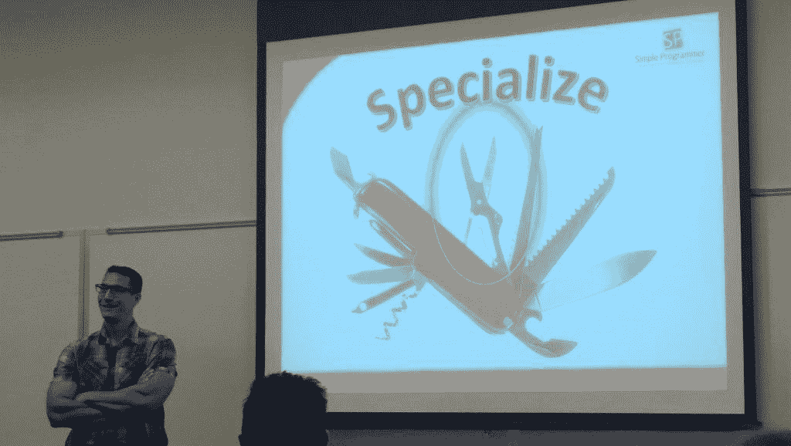
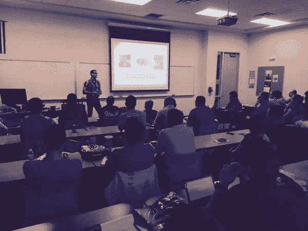

# 为什么你需要在下一次代码营演讲

> 原文:[https://simple programmer . com/why-you-need-to-speak-in-next-code-camp/](https://simpleprogrammer.com/why-you-need-to-speak-at-your-next-code-camp/)

我刚刚从奥兰多代码营回来，所以我想我应该写一篇文章，谈谈为什么在代码营演讲是一个很好的机会，以及为什么——**即使你认为你没有什么可谈的**或可教的——你也应该在你附近的代码营演讲。

现在，以防你不熟悉代码营，代码营通常是周末举行的免费活动，程序员和其他程序员聚在一起，就一系列不同的主题进行一系列的演示。

有些代码阵营很大，但大多数代码阵营相当小。

我这个周末在奥兰多参加的一个会议有大约 600 人参加。

你真的可以把代码营想象成一个小型的免费会议，任何人都可以在那里发言。

这是关键…

你，是的，你，是任何人。

## 代码营，说话和你

听着，我知道在众人面前讲话会让人害怕。

我第一次在任何观众面前讲话时，我完全崩溃了。

我很紧张，我担心我要说什么，人们会有什么反应。我害怕我会把事情搞砸，或者我会说一些愚蠢的话，人们会不同意我的观点。我不知道自己是否有什么有价值的话要说。

上台演讲很困难。

我记得当我终于连接上我的笔记本电脑，把我的幻灯片放在屏幕上时，我走上了讲台。

我记得我试图让自己同时停止流汗和颤抖——我甚至不知道这怎么可能。

我的牙齿打颤，我的声音开裂，我不能将自己停下来。

我不得不放慢速度深呼吸几次，这样我才能继续。

陈述进行得很糟糕。

嗯，不可怕，但也不顺利。

我不知道我说了多少次“嗯”，但它几乎是每隔一个词。

许多人趴在桌子上睡着了——甚至没有试图假装醒着。

我在规定时间之前就完成了，所以我很不舒服地试图把最后一张幻灯片拖得尽可能长。

当谈话最终结束时，剩下的四五个人毫不客气地走了出去。

我低头看着我的衬衫，意识到腋下湿透了。

但是，你猜怎么着？我做到了。

是的，不太顺利。

是的，我不想再做了。

不，我没有成为某个超级明星开发者，只是因为我做了一次演讲。招聘人员没有排队给我提供丰厚的工作机会。

但是，那天我完成了一件伟大的事情。

我战胜了恐惧。

我做了一些让我感到非常不舒服的事情——尽管我出来后并没有感觉舒服很多，但我已经锻炼了勇气。

看，有一个关于勇气的神话。

大多数人都有一个错误的印象，认为勇气就是没有恐惧。

勇气不是没有恐惧。

事实上，你不可能有勇气，除非你也害怕。

真正的勇气是当你不顾恐惧而行动。当你说“f%&！不管怎样，你还是做了。

## 就说 F%&！它！

说真的。

我知道你有各种各样的借口为什么你不能在夏令营或其他当地活动中发言。

如果你想列出你不能在你所在地区的下一次代码营演讲的所有理由，我相信你可以用看似有效的理由写满一整页:

*   你还不够好
*   你没有任何值得谈论的东西
*   别人已经开始谈论你所知道的了
*   有人更了解你的话题，所以你不合格
*   你害怕了
*   你不知道该说什么
*   你不知道如何准备陈述
*   你才刚开始
*   你还没准备好
*   你没有足够的时间
*   你的狗生病了

废话，废话，废话…

你知道这些都是什么吗？

这些都是借口。

借口不会让你在生活中有任何进展。

总是有借口——生活中你不能或不应该做事的理由。

但是有时候你只需要说“f%&！它！”无论如何都要做。

最坏的情况会是什么？

我是说真的。

烂又怎样？

吸的厉害又怎样？

真的会是你人生的终点吗？

第二天真的重要吗？

如果你想成长，你必须不断地将自己置于不舒服的环境中。

只有这样做，你才能真正掌握自己。

只有这样做，你才能学会开始过你的生活，而不是让你的生活过你。

忘掉所有可能发生的坏事。

忘记所有你不能上台发言的理由，选择一个话题，投入进去，然后去做。

事情是好是坏并不重要。

大概花了 5 到 6 次演讲，我才发表了一个我认为“好”的演讲以任何方式，形状或形式，但每次我站在那里，克服了我的恐惧，我变得更好了一点，更重要的是，我的内心变得更强大了一点。

第二次演讲时，我仍然汗流浃背，但已经少了一些，我也没那么在意了。

第三次演讲时，我一点也没流汗，而且我几乎可以说话而不打颤。

到了第四次，我实际上可以专注于我的演示内容，而不是我的恐惧。

## 拥抱失败

想在 code camp 上做一场精彩的演讲吗？

你应该这样做:

拿一张纸，在上面画 10 个盒子。

每次你做了一个很糟糕的演讲，就选一个。

你的目标是检查所有 10 个盒子。

搞砸 10 次。看看你能否在一天内干掉两个。

一旦你检查了所有 10 个“糟糕”演示的盒子，你就准备好做一个好的了。

事实上，你甚至可能在检查完所有 10 个盒子之前就交付了一个好的——但是不要指望它，也不要关注它。

集中精力搞砸 10 次就行了。

相信我，这是任何人都能实现的目标。

不要担心变好，除非你先学会变坏。

拥有它。

承认自己很差劲。

尽你所能，希望它很糟糕，因为它越糟糕，你就越能成长，只有当你勾选了其中一个选项时，你才会成长。

我们倾向于认为失败是一件坏事，但事实并非如此。

放弃是一件坏事。失败是一件好事。失败意味着进步。

## 在代码营演讲的好处

我本来想和你谈谈在你下一次代码营演讲的好处。

我将列出一堆积极的理由，为什么它对你有好处，你将如何接触网络和结识新朋友，演讲将如何为你打开大门和机会，你将如何通过教学学习，等等。但那是浪费时间，因为你已经知道好处了。

此外，这些好处远没有你的遭遇重要。

你成长了。

你开始变成一个不同的人。

是的，效果并不显著。这需要时间，但最终会发生。

猜猜还有什么？

你必须分享的**可能足够有价值来帮助其他人**——尤其是如果你愿意花时间擅长分享你的知识。

事实上，这是我今天仍然在代码营演讲的主要原因。

没有什么比以一种积极的方式影响他人来改善他们的生活更好的感觉了。

当然，我知道在众人面前演讲并不适合每个人。

但是你试过吗？

你给过它机会吗？

还是你让那一长串借口挡了你的路？

在我成长的过程中，我觉得害怕是不对的。

我以为害怕是软弱。

因为我害怕在某些情况下，我是一个失败者。

直到现在我才知道害怕是正常的。

害怕并没有错。

问题是什么也不做。

问题是接受它。

害怕。紧张。怀疑和不确定自己，但无论如何都要去做。

## 要查看的一些附加资源

想在你的第一个代码营演讲，还是想成为一个更好的公共演讲者？

以下是一些可能对你有所帮助的资源:

*   关于公众演讲的书:[站着说话不腰疼:如何成为一名出色的沟通者和公众演说家](http://www.amazon.com/gp/product/B0043RSJGI/ref=as_li_tl?ie=UTF8&camp=1789&creative=390957&creativeASIN=B0043RSJGI&linkCode=as2&tag=makithecompsi-20&linkId=IZQWSKS2RT53OVNX)
*   创建演示文稿:[演示禅:关于演示文稿设计和交付的简单想法](http://www.amazon.com/gp/product/B006R4H5FG/ref=as_li_tl?ie=UTF8&camp=1789&creative=390957&creativeASIN=B006R4H5FG&linkCode=as2&tag=makithecompsi-20&linkId=35DJEGJ2RLNYGFUD)
*   约翰·帕帕的多重视觉课程:[公开演讲和有效展示的艺术](https://simpleprogrammer.com/public-speaking-effective-presentations)