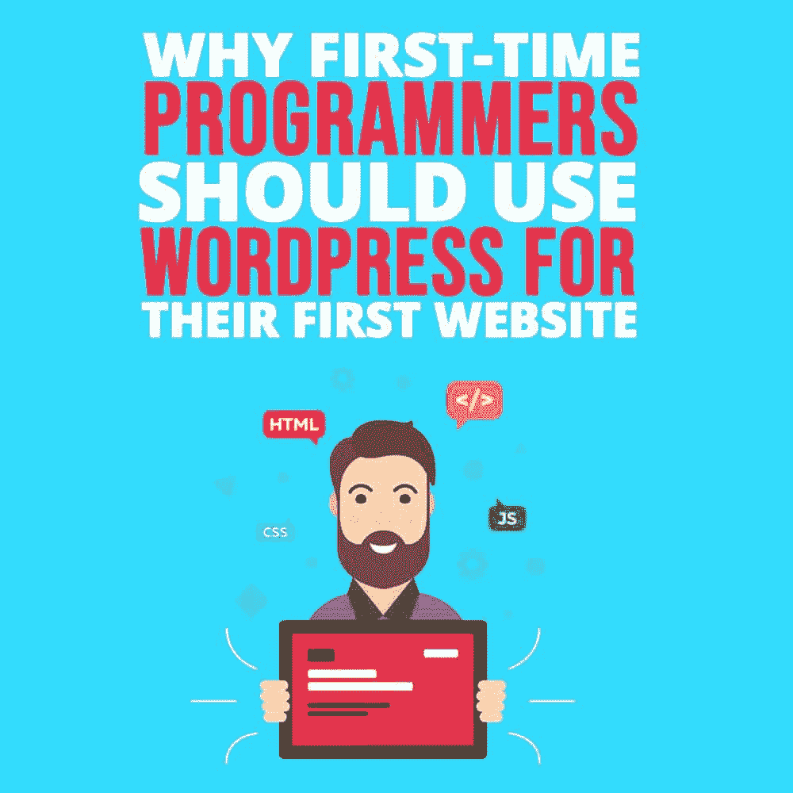

# 为什么第一次编程的人应该在他们的第一个网站上使用 WordPress

> 原文：<https://simpleprogrammer.com/wordpress-for-programmers/>

<figure class="alignright is-resized">

</figure>

创建你的第一个网站同时也是一次激动人心的经历。令人兴奋，因为你即将使用你的开发技能来创建你自己的网站。势不可挡，因为很难决定从哪里开始。这就是 WordPress 可以帮忙的地方！

WordPress 不仅仅是一个博客平台。它是最受欢迎的内容管理系统(CMS ),可高度定制，设置和维护成本低。因此，从企业家和数字营销专家到像 Mashable、Mozilla 和可口可乐这样的大品牌，每个人都使用 WordPress。

WordPress.org 的下载柜台会告诉你这个 CMS 有多受欢迎。事实上，WordPress，或 WP，占据了互联网 30%的份额，并在 CMS 市场占有高达 60%的份额。

虽然 WP 最初是一个博客工具，但今天，它是开发者可以拥有的最强大的 CMS 和网站建设平台。这个平台允许你使用各种插件和主题以及你的编码技能来创建成熟的网站。CMS 功能强大，简单易学，可以让你很快地建立一个干净的、反应灵敏的网站。

不管你喜欢哪种编码语言，在你的第一个网站上使用 WordPress 将会让你创建一个响应迅速、可靠、安全的网站，很好地服务于你的目的。深入了解为什么 WP 是程序员的最佳平台，无论是初学者还是专家。

## WordPress 让你更接近主要的编码语言

在 WP 中工作时，你可以使用本文中进一步分享的任何 web 编码语言来修改你的站点、核心行为和管理面板。

WordPress 核心是用 PHP 和 SQL 创建的。它的前端表示使用声明性和编程语言的组合，即 HTML 和 CSS、JavaScript、jQuery 和 AJAX。掌握这些语言的基础知识将有助于你使用 WordPress 开发你的网站，并为你想要的插件和主题编写代码。

### 超文本标记语言

HTML 是一种声明性的 web“标记”语言。了解语义有效的 HTML 将确保您的页面在每个浏览器中看起来都是一样的。

### 半铸钢ˌ钢性铸铁(Cast Semi-Steel)

CSS 让 HTML 好看。从字体颜色和文本到背景颜色，CSS 和媒体查询帮助您设计页面样式，并定义每个页面在不同屏幕尺寸下的行为。

### 服务器端编程语言（Professional Hypertext Preprocessor 的缩写）

PHP 让 WordPress 在 web 服务器上运行。换句话说，它是用来建立你的网页，并把它们放在一起。作为一个 WP 用户，你不需要写代码，但是对 PHP 有一个基本的了解会帮助你修改主题和创建你自己的插件。在 WordPress 上工作时，你将使用 PHP 特性，比如变量、数组、函数、条件和比较操作符。因此，对 PHP 函数的合理理解将对你有利。

### JavaScript 和 JQuery

JavaScript 和 jQuery 帮助您对 HTML 页面的行为进行编程，使它们更具响应性和用户友好性，并确保丰富的客户端交互性。例如，如果您希望在用户点击特定按钮后出现文本，您可以使用 [JavaScript](https://simpleprogrammer.com/get/javascriptgoodparts) 。JQuery 是一个流行的 JS 库，它允许你链接多个函数，确保你的代码是干净的。话虽如此，JavaScript 并不是 WordPress 的主要语言。因此，即使你不太了解这种[编程语言](https://simpleprogrammer.com/learn-any-programming-language/)，也没关系。

### MySQL 数据库

MySQL 数据库存储了你的每个 WordPress 站点页面的内容。WP 提供了一组 PHP 函数，可以安全地与这个数据库交互。

### 创建交互式、快速动态网页应用的网页开发技术

AJAX 让你不用完全重载网页就能发送或接收数据。因此，如果您想要更改页面的内容，您不需要重新加载整个页面。WordPress 在其管理控制面板中使用 AJAX。例如，当你写博客文章时，AJAX 被用来自动保存你的草稿，而你不会注意到它。

## WP 主题非常适合程序员

<figure class="wp-block-image">

<figcaption>Source: [https://wordpress.com/themes/filter/responsive-layout](https://wordpress.com/themes/filter/responsive-layout)</figcaption>

</figure>

大多数编码员和程序员都需要一个基本的(但是反应灵敏！)功能完善、设计整洁、用户体验良好的网站。WordPress 使你能够结合主题、插件和自定义代码，根据你的需求创建一个独特的网站。

主题定义了 WordPress 站点的布局和风格，确保网页和文章布局的一致性。WP 提供了干净、易于操作的响应主题，并加载了一些有用的后端功能。在[官方 WordPress 主题目录](https://wordpress.org/themes/)中有数以千计的免费主题。你也可以在热门网站上购买主题，比如 Theme Forest、StudioPress 和 WooThemes。

此外，您可以使用 HTML5、CSS3、特定的 PHP 函数和响应式设计原则创建一个响应式 WordPress 主题。

## WP 为编码人员提供了大量插件

为你的网站选择一个主题后，你将不得不为自己配备合适的插件，开始写博客并与他人分享你的代码。WordPress 提供免费和高级插件，允许你根据自己的需要进行几乎任何修改。

例如，随着你的网站越来越受欢迎，你的读者可能会对一些编码教程或电子书感兴趣。你可以使用 WP 插件来达到这个目的。WordPress 官方目录目前有[超过 5 万个插件](https://wordpress.org/plugins/)。

而且，如果你对 PHP 了如指掌，你可以定制任何你想要的插件或者[从头开始构建你自己的插件](https://simpleprogrammer.com/professional-wordpress)。

<figure class="wp-block-image">

<figcaption>来源:[https://wordpress.org/plugins/syntax-highlighter/](https://wordpress.org/plugins/syntax-highlighter/)</figcaption>

</figure>

WordPress 的[语法高亮器是编码人员最重要的工具之一。它允许您在不需要格式化的情况下向站点添加代码，确保查看者可以获得源代码。这个插件支持(X)HTML、CSS、PHP、SQL、C、C++、Ruby 和 Python 等的代码高亮显示。](https://wordpress.org/plugins/syntax-highlighter/) 

## WordPress 是安全的

因为 WordPress 是最受欢迎的 CMS，所以黑客们对它很感兴趣。然而，WP 的开发考虑到了用户的安全。

WordPress 的工作人员不断更新 CMS 和插件。当然，作为一名程序员，你需要小心谨慎，比如[将你的 WordPress 网站从 HTTP 迁移到 HTTPS](https://websitesetup.org/http-to-https-wordpress/) ，从最可信的来源下载插件(最好是在你登录 WordPress 的时候)。

此外，你会发现几个论坛在这个问题上提供在线建议、教程和支持。像 Sucuri、iThemes、WordFence 和 All In One WP Security and Firewall 这样的 WordPress 安全插件可以帮助保护你的网站免受暴力攻击和恶意软件等常见威胁。

## 交给你了！

WordPress 是全球最受欢迎的 CMS 之一，因为它提供了优秀的设计、速度、响应能力和灵活性。它简单易学，而且是开源的。因此，你可以根据自己的喜好毫不费力地编辑它，从头开始创建插件和主题，并为你的网站添加无限多的功能。

甚至在 WordPress 上创建一个演示网站对你的开发者经验和投资组合都是有价值的。所以，继续为你的处女网站使用 WordPress 吧！我相信你会喜欢这个过程。