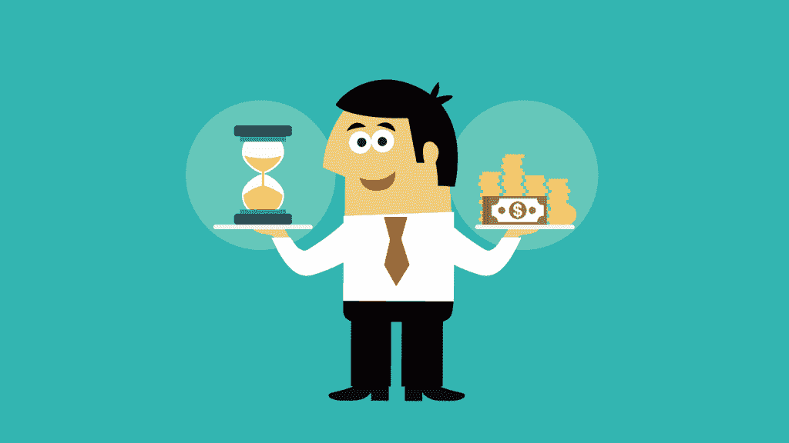
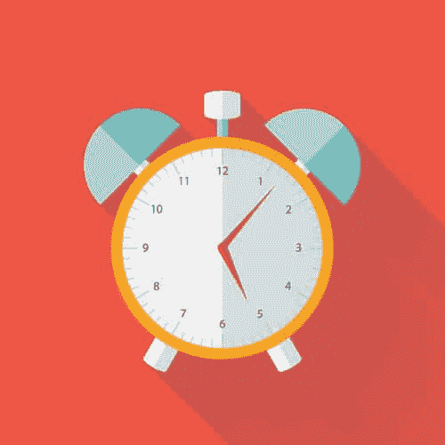
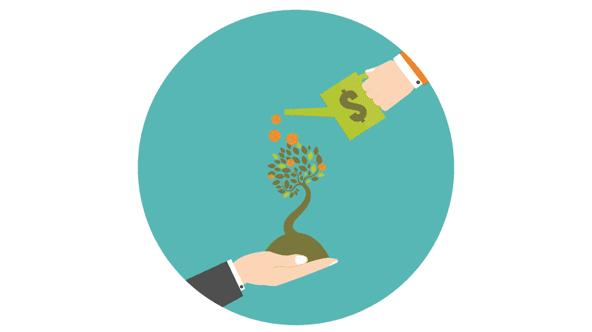

# 软件开发人员工作/生活平衡指南

> 原文：<https://simpleprogrammer.com/work-life-balance/>

我坐在飞机上，准备写下关于工作/生活平衡的一章，而我已经养成了一个我将要谴责的习惯。

我在想如何开始这一章，试图让自己打出来，我把它当成了“工作”，一个眼中钉，打断了我的“生活”。

我允许自己的思维从“我必须做这件事”转移到“我必须完成这件事，这样我才能享受剩下的日子。”

我犯了让工作变成“工作”的大罪，这就是痛苦的公式。

你看，工作/生活平衡是关于一种心态，而不是关于你应该花多少时间在办公室，花多少时间减压，花多少时间陪家人或做你想做的事情的特定公式。

实现真正的工作/生活平衡——至少我是这么认为的——就是根本不去实现它，而是模糊界限，让一切都变成“生活”

从两个严重分割的概念中微妙地转移焦点，使它们合二为一。

停止试图平衡工作和生活，转而寻求总体上平衡的生活。

在这一章中，我们将探索工作/生活平衡的神话，然后关注平衡生活的一些关键概念——过你想要 T1 过的生活，而不是你 T2 不得不 T3 过的生活。

## 工作/生活平衡是一个神话

我认识的太多软件开发人员——以及普通人——倾向于有两种不同的生活。

一种生活是他们的工作生活，他们有时享受这种生活，大多数时候容忍这种生活，但也经常害怕这种生活。

另一种生活是他们的“生活”,他们和孩子一起玩，和朋友社交，玩电子游戏，跑步，骑自行车，徒步旅行——无论他们喜欢什么——似乎永远没有足够的时间。

我认识的其他软件开发人员没有“生活”，相反，他们工作，工作，工作，并不断告诉自己，有一天他们会真正过上自己的生活。

他们实际上已经暂停了他们的生活，直到他们实现这个或那个目标，甚至直到他们退休。

那是他们想做什么就做什么的时候。

只有在那个时候，他们才能真正过上自己的生活。

可悲的是，我不得不承认，在我生命的大部分时间里，那就是我。

**[我一直有个梦想就是早点退役](https://simpleprogrammer.com/2013/09/16/secret-non-software-developer-life-ive-never-told/)** ，这样我才能真正的过好自己的生活。

提前退休的那一天确实到来了，我还在工作，还在写这本书，这一事实应该让你警惕我思维的谬误。

问题是工作/生活平衡是一个神话。

这个概念要求你划分你的生活，说这些时间是用来工作的，而这些时间或日子是属于生活的，两者不应该相遇。

让我们从实际的角度来考虑这个问题。

你和我，我们每天都有相同的时间——和其他人一样。

我们都有 24 小时，一周七天。

如果你选择一个典型的工作日，减去 8 个小时的睡眠时间，你还剩下 16 个小时。

现在去掉八个小时的工作时间，我们还会额外增加一个小时的通勤时间——哦，等等，你说什么？你工作超过八小时？

哦，好吧。那好吧。让我们现实一点，拿出 10 个小时用于工作和上下班？

现在开心了？

你不应该这样，因为你只剩下六个小时。

每天早上花六个小时准备工作，吃早餐和晚餐，看晚间新闻，和孩子们玩耍，放松，做任何你喜欢做的事情。

那不算多。

那根本算不上什么生活。

哦，等等，我忘了最重要的部分:周末。

是的，在辉煌的周末，你有整整 48 个小时——在三天的幸运周末，有 72 个小时——纯粹的天堂般的幸福。(除了你在聚会间隙要睡觉之外，我还不想完全破坏你的幻想。)

你打算这样做多少年？

也许 40 或更多？

那么，在接下来的 40 年左右的时间里，你打算每天只“活”6 个小时，周末也是如此吗？

再说一次，听起来不像是生活。

我不知道你怎么想，但我宁愿充实地度过我的一生，一直如此。

这就是为什么划分你的生活是有害的。

当你把工作和生活区分开来，爱一个又害怕另一个，你就剥夺了自己过上充满快乐、充实和目标的生活的任何机会。

事实是，你的工作和其他事情一样是你生活的一部分。

我们必须停止考虑工作/生活的平衡，开始考虑生活质量。

你想过什么样的生活？对你来说什么是重要的？

这些是你应该问自己的重要问题。

一旦你能回答这些问题，你就可以开始思考如何设计你的生活，包括工作，让它成为你想要的样子，而不是试图让你的生活适应你在工作之外剩下的时间。

## 加班很少有好处

尽管我说过工作/生活平衡是一个神话，但这并不意味着没有工作过度这种事。

我看到太多热切的软件开发人员在办公室花费了大量荒谬的时间，认为投入所有这些时间将有助于他们的职业发展。

虽然加班的确可能有助于你晋升，尤其是在一个期望加班的工作环境中，但在大多数情况下，加班对你职业生涯的影响不会像你想象的那么大。

更重要的是，这会大大降低你的生活质量。

我完全赞成努力工作，但我宁愿为自己努力工作，也不愿让别人发财。

过度加班的代价往往很高，回报却很少，所以要尽量避免这个陷阱。

我的建议是:工作 40 年，仅此而已。

唯一的例外是非常罕见的情况，那就是真的有紧急情况，额外的时间真的会有所不同。

大多数工作/生活平衡的问题都可以通过这条建议来解决。

## 但是那不是不努力工作的借口

不要误解我的意思，我不是说要放松。

事实上，远非如此。

我工作了好几个小时，而且我一直都是这样。

但当我做正式工作时，我把他的 40 英镑给了我的雇主，然后把剩下的给了我自己。

当我为别人工作时，我很努力。

我尽了最大努力。

我确信他们为我的 40 小时付出的钱是值得的。

我没有给他们我的一生。

下班的时候没有高枕无忧；我工作得更多，但我为自己工作。

有时人们会说我没有生活，因为我工作太多了。

但这并不完全正确。

整合你的生活并消除工作和生活之间的区别的一部分是认识到有时你不需要平衡，你需要的是季节。T3】

有几个季节我的生活主要是工作。

40 岁时为别人工作，其余时间为自己工作。

我每周工作 70 小时，有时是 80 小时，但这是我生命中愿意做出牺牲的一个季节，以达到我想去的地方，达到我的目标。

我不关心平衡，因为我把我的生活，无论是工作还是玩电子游戏，都视为我的生活。

我在做我想做的选择，这样我就可以一天 24 小时享受我的生活，尽管这通常是相当辛苦的工作。

重要的是知道你要付出的代价是什么，然后愿意付出这个代价。

你可以拥有生活中的任何东西——你可以拥有任何你想要的生活——只要你愿意为此付出代价。

再说一遍，那不是工作。这就是生活。

生活包括工作——有时真的很辛苦。

考虑季节而不是平衡。

哦，是的，在我的工作季节结束后，我在毛伊岛的海滩上住了几个月，在那里我根本不怎么工作。

但无论我是在冲浪还是编码，我仍然认为我的生活是一个完整的生活，我选择生活，而不是被迫生活或乞讨残羹剩饭。

## 首先支付你自己

确保你能掌控自己生活的一个方法是确保首先用你的时间来支付你自己。

再说一遍，我们中的许多人去为雇主工作，然后把剩余的时间留给自己。

当我们以这种方式生活时，我们常常会觉得我们需要更多的工作/生活平衡，因为我们没有设定我们生活的方向，也没有有效地利用我们最宝贵的资产——时间。

每天早上早起一个小时，把这段时间献给你自己。

把你最新鲜的一小时花在你自己和你的抱负上。

也许是开始副业，增强你的体质，甚至是擅长演奏一种乐器。

我想甚至可以是玩电子游戏——如果这就是你想要的生活。

但是，就像我爸爸过去对我的薪水说的那样，首先支付你自己。

当你以这种方式生活时，你就不会觉得自己被抢劫了，并在剩余的空间里过着真正的生活。

如果你需要更多的时间，那就多花点时间。

提前两个小时醒来。

如果有必要，早上 4 点起床，把一天中最有效率的时间花在自己身上。

## 把照顾好自己作为你的首要任务

这使我想到另一点。

在你照顾别人之前，在你给予之前，确保你得到了。

我知道这听起来贪婪、自私，不像你的主日学校老师教你的，但事实是你只能给予你已经拥有的。

**如果你不能照顾好自己，满足自己的需求，[如果你不能作为一个人得到成长和发展](https://www.youtube.com/watch?v=X9YSxrPdlxQ)，你将不会对你周围的人有用。**

在我的日历上，每天下午 3 点到 5 点是“锻炼”

我从没错过。

我说绝不，就是绝不。

有些日子我可能不得不重新安排，但我几乎从不这样做。

几乎每天，我要么举重，要么从 3 点到 5 点跑步。

那是我个人的身体发展时间。

我也花时间听有声读物，所以我的智力也得到了发展。

事实上，我在个人发展上花了很多时间，因为我想尽可能地发挥我的全部潜力。

这样做确保了我的生活质量每天都在提高，也让我有能力为社会和周围的人做更多的贡献。

我的“贪婪”使我比没有它时更加慷慨。

我对我的时间很自私，所以我可以给我周围的人更多宝贵的时间，我可以更有效地做我所做的一切。

当你自己缺乏时，一个确定的痛苦和怨恨的公式是给予别人。

在你帮别人戴上氧气面罩之前，先戴上你自己的。

## 仔细选择你的关系

如此多的软件开发人员和普通人在工作/生活平衡中挣扎的原因之一是他们试图维护的关系的数量。

你在生活中试图维持的关系越多，你就会觉得自己拥有的时间越少，因为维持所有这些关系需要时间和努力。

有很多朋友是好的，但有几个好朋友更好，尤其是如果他们与你的职业和个人目标一致。

仔细挑选你的关系，只保留那些对你来说最有价值和最重要的关系，可以腾出你大量的时间，让你有更多的时间和你真正想花时间在一起的人在一起。

保持更少、更牢固的关系会让你的生活质量更好，而不需要更多的社交时间。

如果你正处于人生中的某个时期，你正努力工作以在事业上取得成功，建立自己的事业，或者接受一些其他耗时的挑战，这一点尤为重要。

通过从社交生活中获得更多价值，你不仅可以获得更好的工作/生活平衡的好处，而且通过仔细选择你的朋友以及你想要维持或投资的关系，你可以更好地指导自己的生活。

吉米·罗恩有句名言:“你是你交往最多的五个人中的平均水平，我相信这是绝对正确的。”。

我们中的许多人四处闲逛，与人保持关系——有时是家庭成员——他们总是让我们沮丧，而不是让我们振作。

人生苦短，不要浪费时间和这些人在一起。

这并不意味着你必须将他们完全从你的生活中剔除，但你总是可以将他们从朋友降为熟人。

你越是提高非工作时间的质量，你就越不需要平衡工作和生活。

你的人际关系与你的职业和个人目标越接近，你的生活就越完整。

## 活在当下

我给你的关于工作/生活平衡的最后一条建议——或者说消除这种需要——是活在当下。

所以我们很多人把大部分的思想都花在了过去或者未来；我们没有意识到**生活现在是**，生活正在从我们身边流逝。

很容易让你的生活停滞不前，总是期待在未来的某个时刻“真正地生活”。

很多次我听到人们说，就像我自己说的，“一旦我实现了这些，一旦孩子们长大了，一旦我找到了一份更好的工作，达到了这个财务目标，我就会真正地过我的生活。”

嗯，生活就是现在。

生活总是现在。

你不能活在未来，就像你不能活在过去一样。

除非你改变你的想法，停止推迟你的生活，真正地生活，当那一天到来时，你会发现自己渴望下一天。

有些人终其一生都在等待生命的开始。

这不是彩排；你的生活就是现在，就在此时此刻。

所以不要再推迟“过你的生活”，现在就开始做吧。

这并不意味着你采纳了 YOLO(你只活一次)的哲学，完全为现在而活，而忽略了你的未来。

这确实意味着**你必须停止将你的日子和生活视为你通过**获得的东西，以便到达你最终可以享受自己的某个点。

你和我都有能力充分享受生活中的每一刻。

同样，这也是我认为工作/生活平衡的神话如此有害的另一个原因。

它告诉我们，我们有工作，我们只是容忍，我们有生活，我们享受。

相反，**充分利用你生活中的每一刻**，无论你是在工作，做你不特别喜欢做的事情，还是在家从事你最喜欢的爱好，或者与朋友和家人社交。

关于这个主题的一本优秀的书是艾克哈特·托尔的现在的力量。

这是一本有点奇怪的书，所以不要说我没有警告你。你不必同意作者所有的生活哲学和精神信仰，但它包含了一些伟大的智慧和一些活在当下的实用建议。

## 真正的工作/生活平衡

记住，只有当你停止努力实现工作/生活的平衡时，你才能实现真正的平衡，取而代之的是尽可能地专注于生活。

只有当你愿意花时间和精力去积极决定你想过什么样的生活，然后采取必要的行动去实现它，你才能做到。

照顾好你自己，仔细选择你的关系，尽可能地活在当下，你会发现你的生活不需要“平衡”，因为无论你在做什么，你都会找到快乐和满足。

如果你从这本书里拿走一样东西，拿走这个。

* * *

