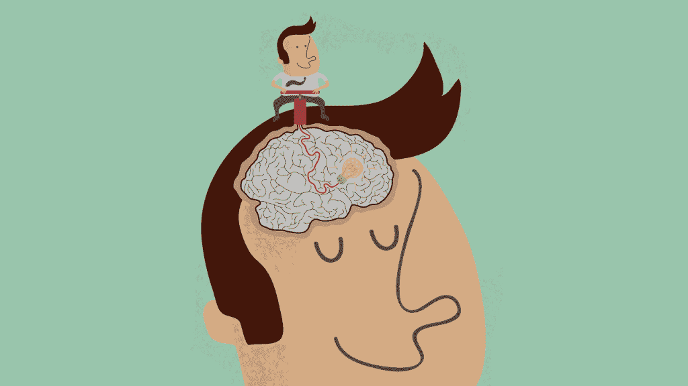
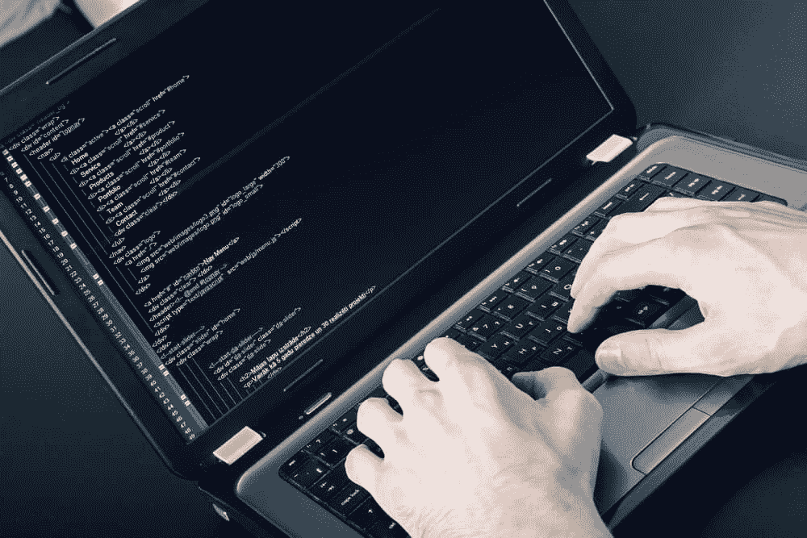

# 认真工作吧

> 原文：<https://simpleprogrammer.com/work-like-matters/>

有些读到这里的人可能已经临近最后期限了。你们中的一些人可能已经开始在你的工作电脑上阅读这篇文章了，或者在你的手机或其他设备上，但是不管怎样，当你阅读的时候，你是坐在一间办公室里，你甚至可能不是那间办公室的主人。

希望，如果你已经决定用你的几分钟时间来阅读我写的东西，当你听到老板来了，你不必隐藏它。如果你这样做了，快——按下 X 按钮，他就在你身后！(开玩笑。我希望如此。)

我有幸拥有一个完全信任我的工作场所，让我可以完全自主地将注意力集中在需要我关注的最重要的事情上。我真的觉得领导层明白这一点(大多数日子):

*“雇佣聪明人并告诉他们该做什么是没有意义的；我们雇佣聪明的人，这样他们就能告诉我们该怎么做。”–[乔布斯](http://www.amazon.com/exec/obidos/ASIN/1501127624/makithecompsi-20)T3】*

激励科学激发了博士研究、高薪高管 MBA 以及其他众多领域。让人们去工作，无论是团队合作还是单飞，肯定会得到那些关注基于价值观的领导的人的大量关注。重要的工作来之不易——否则我们都会时时刻刻热爱我们的工作。如果是你，请举手。(我的手没有举。我确实热爱我的工作。)

归根结底，这都归结为一个二元概念:内在和外在动机。

虽然我让它听起来像是不言自明的定义——要么工作重要，要么不重要——但它远不止如此。内在动机和外在动机之间的界限有太多的因素，如果我想研究并写一篇推断所有这些因素的文章，我会一直写下去。

## 那么，有什么区别呢？

这两种动机——内在的和外在的——有非常简单的定义，但是很难描述。

出于本文的目的，下面是我的简单定义:

*   内在动机:你决定去做的事情，因为你觉得自己的驱动力迫使你这样做。这些是我们*希望*做的事情，没有人需要要求我们去做。无论如何我们都会做的。我们有内在动力。
*   外在动机:你决定做的事情，因为别人(或其他事情)迫使你这样做。这些是我们不得不抱怨的事情。我们是外部驱动的。

重要的工作的简单本质是我们有内在动力去做的工作。我们不这样做是因为我们得到了报酬(尽管这肯定是一个非常好的副作用)，或者是因为我们真的没有别的选择去做。这才是重要的工作。

然而，有时区分内在动机和外在动机会变得棘手。所以才有那么多人研究。我的意思是，以几个场景的形式:

1.  你办公室的火警开始大声响起，闪烁着明亮的应急灯，并尽可能大声地哀嚎危险即将来临。你走出大楼，等待消防队发出解除警报的信号。内在的还是外在的？
    *   虽然你的动机来自不想死于严重烧伤或吸入烟雾，但这种动机仍然是外在的。很有可能，你不想处理火警的中断，但你不得不这样做(至少如果你有求生的本能和公司的政策要求的话)。
2.  有人递给你一张 100 美元的钞票，让你把一只死树鼠(见:松鼠)从他们的车道上拉出来，因为他们刚刚碾过它，但无法忍受自己处理这些恶心的东西。
    *   你受到了外在的激励。虽然我肯定至少有一两个人从清理人们车道上的马路杀手中获得了不可否认的快乐，但我还没见过任何人这样做。然而，给你 100 美元的人是有内在动机这么做的。比起刚刚递给你的 100 美元，他们更看重把午餐留在肚子里。没有人强迫他们放弃 100 美元去清除车道上的树鼠。
3.  你正盯着面前的一张空白页，试图决定作为[简单程序员](http://www.simpleprogrammer.com/write-for-us)的客座作者该写些什么。你已经阅读了约翰·桑梅兹的所有建议，关于如何[将自己推销为一名程序员](https://simpleprogrammer.com/2014/12/01/actually-means-market-software-developer/)，创建一个博客，并且知道一个定期的内容流对你获得人们注意的能力有着巨大的影响。你喜欢写作，但是你还有很多其他的事情可以做，你也会从中得到乐趣。尽管如此，你还是坐下来把文章写好了。
    *   我仍然称之为内在动机。虽然你这样做是为了应对工作场所和就业市场的外部力量，但最终你的动力来自于与人联系并有所作为的愿望。你觉得写作很重要，所以你写作。然而，有些人可能认为仅仅为了提供常规内容而写作根本不是出于你自己的愿望。我很乐意在下面的评论区和你们所有可爱的读者讨论这个问题！

## 让它变得重要

第三个例子就是为什么很难定义什么是重要的工作。

对于许多程序员来说，仅仅坐下来写代码就足够重要了，以至于他们没有内在动力去寻找新的获得或充实的途径。仅仅为了写代码而编码满足了他们的需求。

但是我也知道许多程序员渴望更高层次的东西。我们渴望干净的代码、持续的交付和许多其他仅仅写好算法是不够的事情。我们想写出好的代码。事实上，代码很棒。这不仅仅是算法设计。

[与你每天做的工作联系起来很重要](http://www.ted.com/talks/dan_pink_on_motivation?language=en)。它给了我们早上起床或者熬夜学习新事物的理由。

但我们在工作中并不总是那么幸运。有时我们会遇到外在因素远远超过内在因素的情况，我们对必须做的事情并不感到兴奋。然后呢？

## 赢得自主权

别忘了，[你得先掌握规则，才能打破规则](https://simpleprogrammer.com/2015/08/17/you-have-to-master-the-rules-before-you-can-break-the-rules/)。因此，以下是一些实用的建议，帮助我们掌握职场中最常见的规则。

请注意:这并不是建议你“坐下来，闭上嘴，把他们端出来的东西拿走。”如果是的话，他们不会让我在这个博客上写东西。

### 谈论金钱

谈钱，因为钱会说话。如果你能找到一种方法来证明你的建议比当前的任务花费更少或赚得更多，你就找到了答案。

没有什么比企业主的底线更能说明问题了。想办法证明你的工作能以最好的方式改变底线。我向你保证，如果你能证明你的工作有明显的财务投资回报，没有人会把它从你这里拿走。

不幸的是，我们作为程序员所做的工作并不总是符合“这显然影响了底线”这个简单的标准所以，继续读！

### 找到你的部落

这个概念使得工会和罢工发挥作用。注意:我并不特别支持像大多数工会那样强迫人们加入一个部落。然而，你可以依靠几个和你有着相同内心罗盘和想法的人，这种想法会让你的话更有力量，可能会让管理层采取积极的行动。

比起忽视一个人，老板们更难忽视两个人，他们更难忽视四个人。在追求过程或任务变化的过程中团结你的团队，你们也可以一起工作，把管理带到你的思维方式中。

### 在你空闲的时候做它

我不是鼓励你免费工作或者成为工作狂。保持健康的平衡让我们都保持理智。

然而，如果出于某种原因，你在一个拒绝承认你有能力做出贡献的地方工作，并不是所有的希望都破灭了。但是当你从事副业时，开始寻找新的主要收入来源可能是个好主意。

就个人而言，我对这个博客有所贡献。我最近也开始为开源项目做贡献。这两种贡献途径都让我接触到了一个更大的专业网络和我目前雇主之外的一个团体。

### 最重要的是，了解你自己

尽管释义略有不同，但这段关于刘易斯·卡罗尔的《爱丽丝梦游仙境》中爱丽丝和柴郡猫之间对话的梗概证明了一个很好的观点:

如果你不知道你要去哪里，任何一条路都会把你带到那里

如果没有其他原因，只是为了了解你自己的职业方向，你真的需要起草一些东西，比如针对你的目标的使命宣言，这样你就知道自己想做什么。你必须知道你的定位和你的目标，这样你才能帮助其他人确保你的使命得以实现。

我的使命是:

> 通过仆人式领导，我将把我接触的所有专业人员提升到更高的质量和生产率标准。

虽然它不是一成不变的，但它确实为我所有其他计划的开始提供了一个基础。它简短而具体，这使得它很强大。以下是每次我读给自己听时，它带给我的重量:

**通过仆人式领导，我将提升**

*   我坚信任何团队的力量都取决于其最弱的成员。所以，要想把团队提升到新的高度，每个人都得变强。整个“水涨船高”的想法。

**我接触的所有专业人士**

*   我接触的每个人对公司都很重要。我不在乎那个人是为了薪水去打扫厕所，还是在一个投资组合中经营多家公司，并且可以买下一个小岛。我们所有的同事都应该在工作中得到专业的尊重。这里有一个很好的例子。

**质量**

*   自动化测试在我的世界里至高无上。然而，质量不仅仅意味着代码。意思是用户故事。它意味着过程。质量属于公司的每一个角落，我以帮助每个人定义质量为荣。

**生产率**

*   这与质量相当。我们如何尽可能有效地交付最有价值(最高质量)的特性？

## 这是一个重要的问题

我们都可以为我们的团队增加价值。年轻的程序员会带来创新的观点，而有经验的程序员会带来成熟的观点。

归根结底，当涉及到编写代码时，我们都需要对最终结果有发言权。我们的代码解决问题。这些问题很重要，因为要写的代码比写代码的人多。

所以，认真工作吧。我们的代码依赖于它。

* * *

1 在撰写本文时，没有真正的松鼠受到伤害。但是每年他们都取笑我，向我扔核桃。愚蠢的树鼠。松鼠是混蛋。至少在我住的地方。