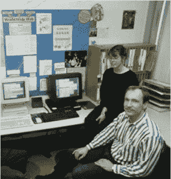
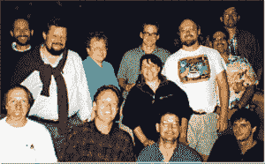
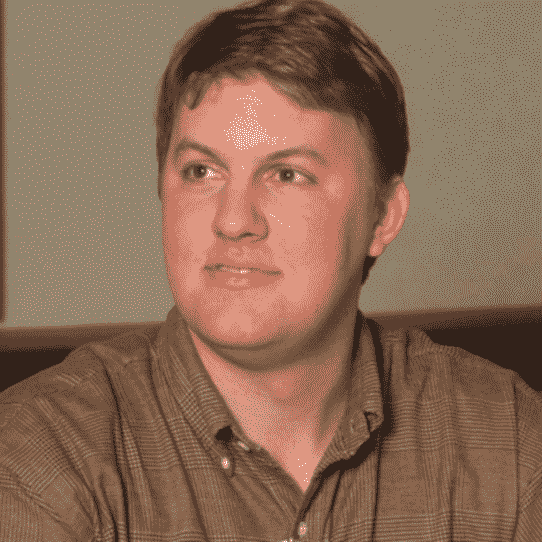
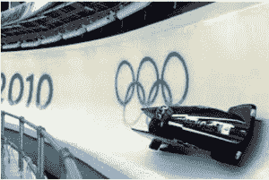

# 互联网的历史:第二部分-万维网早期

> 原文：<https://simpleprogrammer.com/world-wide-web-early-years/>

欢迎来到我们穿越时间之旅的第二部分，了解互联网是如何发展的，并记住它对我们生活的影响。

在第一部分，我们看到了互联网在美国的诞生。我们学习了一些对互联网运作至关重要的协议。

到 1989 年，互联网已经跨越多个国家，包括澳大利亚、墨西哥、日本和许多欧洲国家。

这为互联网历史上最大的革命创造了条件，这个革命有着非常卑微的开端和滚雪球般的好处:万维网。

但是首先有另一个故事要讲:蒂莫西·伯纳斯·李爵士的背景故事。

蒂姆·伯纳斯·李生于 1955 年，是两位数学家玛丽·李·伍兹和 T2·康威·伯纳斯·李的儿子。他的父母是世界上第一台商用存储程序计算机曼彻斯特大学" [Mark 1](https://en.wikipedia.org/wiki/Ferranti_Mark_1) 的编程团队成员

他很幸运，在这样一个环境中长大，他可以学习什么是计算机，并且从小就了解计算机是如何工作的。

他意识到，如果有一种方法可以对计算机进行编程，将原本互不相关的信息连接起来，计算机会变得更加强大。在牛津大学学习物理的那些年里，这个想法一直伴随着他。

1980 年，他加入了位于日内瓦的欧洲粒子物理实验室 CERN。最初，他几乎被信息淹没了:这里有 10，000 名员工，还有这么多不同的计算机和项目。

为了管理所有这些关系并帮助自己记住它们，他在业余时间开始了一个实验项目:用 Pascal 写一个小程序。

他称他的项目为[询问](https://en.wikipedia.org/wiki/ENQUIRE)，这个名字的灵感来自维多利亚时代的书 *[询问一切](https://en.wikipedia.org/wiki/Enquire_Within_Upon_Everything)。*

这本书提供了许多不同主题的百科全书式的信息。这本书涵盖了诸如[礼仪](https://en.wikipedia.org/wiki/Etiquette)、[室内游戏](https://en.wikipedia.org/wiki/Parlour_games)、[蛋糕](https://en.wikipedia.org/wiki/Cake)食谱、[洗衣](https://en.wikipedia.org/wiki/Laundry)小贴士、[急救](https://en.wikipedia.org/wiki/First_aid)等主题，打破了一本书应有的模式，成为当时的畅销书。

蒂姆小时候读过这本书，觉得这是“通向信息世界的门户”

Tim 对 Enquire 的结果感到满意，并开始考虑更大的目标。大很多！“假设所有储存在各地电脑上的信息都被连接起来，”他沉思道。

他还指出，从电脑中检索信息比它需要的更具挑战性。

每台计算机都有自己的一套信息。CERN 的员工不仅需要登录许多不同的计算机，而且还经常需要学习如何为他们希望从中检索信息的每台计算机使用不同的程序。

他看到许多开发人员来到 CERN，试图向研究人员出售文档系统。但是他们受到了敌意的接待，因为他们试图出售的所有系统都要求研究人员重新组织和约束他们的工作，以适应这些系统的局限性。

通过目睹这些对话，Tim 了解到任何包含适用于所有人的通用规则的系统都意味着几乎没有任何规则！

在接下来的几年里，他对超文本的概念有了更多的了解，这是泰德·尼尔森在他的书《T2》《T3》《文学机器 T4》《T5》中提出的。他开始相信这个想法有可能永远改变计算机。

蒂姆认为，系统完全去中心化也是必要的。1988 年，他和他的老板迈克·森道尔谈论他的想法，并被要求写一份提案。

## One thousand nine hundred and eighty-nine

Tim 写了一份名为“[信息管理:提案](https://www.w3.org/History/1989/proposal.html)”的文件报告讨论了他所发现的信息访问问题，并提出了用链接的信息系统取代当前系统的想法。

蒂姆把它发给了迈克·森道尔和迈克的老板。在等待他们的反馈时，他将想法告诉了其他几个同事，但得到的回应却是“平淡无奇”。

他的提议没有得到官方的回应，但是 Tim 在互联网上做的实验越多，他就越确信他的想法的重要性。

## One thousand nine hundred and ninety

蒂姆决定将这个项目命名为万维网。他重新编排了建议书的格式，在建议书上添加了新的日期 1990 年 5 月，然后重新提交。

今年晚些时候，他向 Mike Sendall 寻求对 NeXT 电脑的投资。迈克同意并说，“一旦你有了机器，为什么不试着在上面编写你的超文本呢？”

在开始这个新项目时，他面临着许多批评者，但一位同事的支持使他受到鼓舞:[罗伯特·卡里奥](https://en.wikipedia.org/wiki/Robert_Cailliau)，一位比利时出生的工程师，热爱优雅的解决方案。

据蒂姆说，罗伯特可能会“被电源插头的不兼容性逼疯”。罗伯特立即看到了这个项目的潜力，即让计算机系统远离日常生活中大量相互冲突的协议。

九月，蒂姆和罗伯特前往欧洲超文本技术会议推销这个想法，希望能找到一家可以购买解决方案的公司。

他们发现许多与会者不能完全理解这个想法是怎么回事。Tim 听说更好的设计是拥有一个中央链接数据库；否则，系统会有断开的链接。

到家后不久，Tim 意识到他需要自己建立网站，并于 10 月份开始着手这项工作。到 12 月份，它正在使用一种新的超文本标记语言(HTML)，一种标准通用标记语言(SGML)的简化版本。

然而，它只能在一个平台上工作:NeXT。来自英国的数学系本科生尼古拉·佩洛被雇来帮忙。

Tim 添加了使用文件传输协议所需的编程。突然间，互联网上的新闻组和文章可以以网页的形式出现，使得互联网上的大量信息也可以在网上获得。

## One thousand nine hundred and ninety-one

尽管 Tim 希望让 Web 在 IBM 兼容的 PC 上运行，但由于资源有限，他决定暂时坚持使用下一个系统。三月份，万维网浏览器被安装到他的一些同事的 NeXT 电脑上。

因为这个项目是由欧洲粒子物理研究所资助的，所以第一个加入网络的数据库是欧洲粒子物理研究所的电话簿。

CERN 之外的第一台网络服务器在帕洛阿尔托的斯坦福线性加速器(SLAC)建立。

为了消除对这项新技术的误解，并解释它为什么不同，蒂姆将它描述为像一个市场经济:任何人都可以与任何人进行交易，他们不需要去市场广场进行交易。他们所需要的只是一些大家都必须同意的规则，比如使用的货币和公平交易的规则。

网络要想成功，人们必须共享数据。蒂姆发现，现有的互联网协议并不能让任何人自由共享数据。

他编写了超文本传输协议(HTTP ),将它设计得足够快，可以在大约十分之一秒内获取资源。这比文件传输协议(FTP)快得多，但是由于大量的信息已经可以通过 FTP 获得，所以它也支持这个协议。

关键组件是[通用资源标识符](https://en.wikipedia.org/wiki/Uniform_Resource_Identifier) (URI)，它告诉浏览器去哪里寻找任何资源。URI 地址的前几个字母指定了要使用的协议，Tim 将其设计为同时支持 HTTP 和 FTP。另外两个协议， [Gopher](https://en.wikipedia.org/wiki/Gopher_(protocol)) 和 [WAIS](https://en.wikipedia.org/wiki/Wide_area_information_server) ，被证明比 HTTP 更受欢迎，所以 Tim 决定也支持它们。

尼古拉·佩洛和蒂姆·伯纳斯·李演示万维网

为了在欧洲粒子物理研究所获得万维网的持续资助，罗伯特和蒂姆决定将其作为一种扩展用户现有文档系统的方式进行营销，认为它有助于人们发送和访问信息。

他们写了一篇题为“欧洲粒子物理研究所的超文本”的论文，但它根本没有引起人们的兴趣。

6 月，首届 INET 大会在哥本哈根举行，来自 58 个国家的 385 名与会者出席了会议。

在闭幕会议上，[温顿·瑟夫](https://en.wikipedia.org/wiki/Vint_Cerf)宣布互联网协会成立，在此基础上，[签署了一份文件](http://www.internetsociety.org/history-timeline/first-inet-conference-held-copenhagen)，[签署了一份文件](https://en.wikipedia.org/wiki/Bob_Kahn)，而[签署了一份文件](http://govinfo.library.unt.edu/acoas/nominations/chapinresume.htm)。该文件指出，该协会将“向参与互联网使用、运营和发展的团体和组织提供援助和支持。”

8 月，Tim 发布了 NeXT 的万维网浏览器，Nicola 编写的[线模式浏览器](http://info.cern.ch/hypertext/WWW/LineMode/Browser.html)，以及 CERN 之外的 HTTP 服务器。

不断有 bug 报告和特性请求出现。然后，Tim 开始收到来自其他国家的赞扬甚至源代码贡献的消息！欧洲核子研究中心网站的页面点击率达到每天 100 次左右。

尼古拉·佩洛离开了这个项目，在八月份完成她的学业。九月，[江泽龙·格罗夫](https://www.linkedin.com/in/jfgroff)到达，他发现蒂姆正在将他的 Objective-C 代码改写成更易移植的 C 语言。其结果是图书馆万维网的简称[。](https://en.wikipedia.org/wiki/Libwww)

12 月，罗伯特和蒂姆带着他们的下一台计算机和调制解调器飞往圣安东尼奥，参加超文本 91 会议。他们发现自己是唯一参与互联网相关活动的人。

在加利福尼亚州门洛帕克，太阳微系统公司的工程师[帕特里克·诺顿](https://en.wikipedia.org/wiki/Patrick_Naughton)与[詹姆斯·高斯林](https://en.wikipedia.org/wiki/James_Gosling)和[迈克·谢里丹](https://en.wikibooks.org/wiki/Java_Programming/History#cite_note-CITEREFEarlyYearsSun1-1)一起加入一个新项目。这被命名为“绿色项目”，其目的是“预测和规划计算机领域的‘下一波’浪潮。”

“绿色团队”的 12 名成员，包括诺顿、高斯林和谢里登在一次烧烤聚会上。

也是在这个月，高性能计算法案，也被称为戈尔法案，获得通过。

## One thousand nine hundred and ninety-two

Robert 和 Tim 知道需要更多的开发人员来创建一个更好的网络浏览器，而 CERN 没有这样的开发人员。

Robert 飞往赫尔辛基大学，会见对他们的联合硕士项目开发网页浏览器感兴趣的学生。由于他们部门的首字母是 OTH，他们称浏览器为“er wise ”( T1 ),因此拼写为“otherwise”它在四月发行。

下个月，加州大学柏克莱分校的佩-魏源将发布他的 T2 ViolaWWW 浏览器的测试版，以展示 Viola 编程语言的强大功能。Unix 用户第一次可以访问网络。

6 月，Tim 会见了互联网工程任务组(IETF)的成员，讨论如何标准化编址方案、HTTP 和 HTML。蒂姆主张命名为通用文档标识符，但是这个名称在 IETF 中不受欢迎，所以他在 URI:统一资源标识符上妥协，于是成立了 URI 工作组。

同样是在今年夏天，太阳微系统公司的“绿色团队”带着一个工作演示从他们的办公室出来:一个交互式、手持、家庭娱乐设备控制器，带有动画触摸屏用户界面。这使用了詹姆斯·高斯林创造的一种新的编程语言叫做 [Oak](https://en.wikipedia.org/wiki/Oak_(programming_language)) ，以他办公室窗外的橡树命名。

## One thousand nine hundred and ninety-three

  

马克·安德森

国家超级计算应用中心(NCSA)的学生马克·安德森和工作人员[埃里克·比纳](https://en.wikipedia.org/wiki/Eric_Bina)一起在[马赛克](https://en.wikipedia.org/wiki/Mosaic_(web_browser))浏览器上工作。这是由高性能计算法案资助的。

Marc 在一月份宣布了这个项目，并在二月份在网上发布了第一个预览版本。即使在这个非常早期的阶段，它也很容易安装和使用，并提供指向和点击访问网络。

与此同时，堪萨斯大学的学生 Lou Montulli 拿出了 Lynx 超文本浏览器的第一个版本，并将其移植到网络上。三月份，他发布了 Lynx 2.0。

同样在这个月，明尼苏达大学宣布对使用其 gopher 服务器软件的公司收取许可费。IETF 成员问 Tim，CERN 是否也可以引入许可费。他们告诉他，如果发生这种情况，他们会建议不要使用网络。

4 月，CERN 同意 Tim 的请求，将网络协议免费开放给公众。

与此同时，微软网络操作系统部门的初级项目经理 j·阿拉德(J. Allard)越来越感到沮丧，因为他未能成功说服高级管理层相信互联网的重要性，也未能看到其他公司走在前面。

在他自己的倡议下，他开始了一个未经批准的项目，开发微软的第一个互联网服务器，将公司与其他互联网网站连接起来。这很快成为互联网上使用最多的网站之一。

NCSA Mosaic 1.0 Windows 版将于 11 月发布。

12 月，媒体发表关于欧洲联盟第一个基于网络的项目 [Webcore](https://cordis.europa.eu/esprit/src/9801.htm) 的重要新闻文章，该项目用于在前苏联集团国家传播技术信息。

也是在这一年，数字用户线(DSL)成为美国的标准，为更快的互联网连接铺平了道路。

## One thousand nine hundred and ninety-four

### 微软计划进入该市场；马赛克通信公司成立

今年 1 月，J. Allard 仍然强烈地感觉到微软不了解互联网的重要性。他给微软的领导们写了备忘录 [Windows:互联网上的下一个黑仔应用](http://www.microsoft.com/about/companyinformation/timeline/timeline/docs/di_killerapp_internetmemo.rtf)。

本文档详细介绍了 1994 年初可用的各种互联网技术，以及它们在此之前的流行程度。万维网与 Archie 和 WAIS 一起列在“信息发现和检索(第二代工具)”一节中，并显示自从 NCSA Mosaic 发布以来，万维网服务器的数量迅速增加。

阿拉德说，尽管 Mosaic 浏览器可以在 Windows 上使用，但“目前的实现比它的 Unix 版本要弱得多。”他推荐了参与互联网发展的三阶段方法:拥抱、扩展和创新。最终目标是让 Windows 成为“全球信息结构浏览器”

这份备忘录的收件人名单中包括比尔·盖茨的技术助理史蒂文·辛诺夫斯基。

吉姆·克拉克

二月，史蒂文在参观康奈尔大学时看到了互联网和电子邮件在学生中的普及。辛诺夫斯基对互联网的可能性印象深刻，他给盖茨和他的技术人员写了一份热情的备忘录，说:“康奈尔是有线的。”

与此同时，马克·安德森已经毕业，正在加州生活，这时他收到了一封来自吉姆·克拉克的电子邮件。Jim 是一名商人，他创建了 Silicon Graphics，但最近已经离开。吉姆提议他们一起创办一家新公司。

吉姆此前曾与任天堂首席执行官山内宏(Hiroshi Yamauchi)合作，并与任天堂共同宣布了“Project Reality”。他相信他们可以向任天堂出售他们的网络技术。他们为即将推出的任天堂 64 游戏机的在线游戏网络功能写了一份 20 页的概念说明。

他们还聘请了来自 NCSA 的核心马赛克开发团队 Lou Montulli 和来自 Silicon Graphics 的几名开发人员。

4 月 4 日，马赛克通信公司成立，由于与任天堂的交易尚未达成一致，他们决定进军浏览器市场。

就在这家新公司成立两天后，j .阿拉德、史蒂文·辛诺夫斯基和其他 18 名微软员工参加了为期一天的务虚会，讨论互联网对计算机软件业务的未来影响。

辛诺夫斯基向与会者分发了一份 300 页的互联网简报文件。

Russell Siegelman 正在那里领导一个代号为“漫威”的在线服务项目阿拉德认为漫威应该基于开放的网络标准。

拉塞尔专注于击败美国在线，后者正在提供专有的消费者在线服务。他不同意，说这项技术应该是专有的。

不过，大家都同意的是，代号为“芝加哥”的下一个版本的 Windows 应该包括某种访问网络的软件。

不久之后，微软会见了 Spyglass 公司，讨论在 Windows 中使用 Spyglass 浏览器的许可问题。

### 第一届国际万维网会议

五月，第一次万维网国际会议在日内瓦的欧洲粒子物理研究所举行，被记者们称为“网络的伍德斯托克”在闭幕词中，Tim 说网络开发者，像科学家一样，需要从伦理和道德上意识到他们的行为。

### 太阳微系统公司瞄准万维网

为了避免商标侵权，Oak 编程语言被重新命名为 Java，与有线电视公司的一项交易也告吹。六月，该团队决定重新定位网络平台。Patrick Naughton 编写了 WebRunner 浏览器，以电影*银翼杀手*命名。

### 万维网路联盟(World Wide Web Consortiumˌ简称 W3C)

10 月，蒂姆·伯纳斯·李与欧洲粒子物理研究所合作，在麻省理工学院成立了万维网联盟(W3C)。50000 美元就可以成为正式的年度会员，如果公司年收入低于 5000 万美元，5000 美元也可以享受同样的优惠。

Mosaic Communication Corp .坚持全额支付 50，000 美元，尽管它有资格获得较低的费率，因为它认为自己是一家大公司。他们发布了马赛克网景 0.9。它正在开发一种叫做安全套接字层的新协议，并计划在未来版本的浏览器中加入这种协议。

11 月，微软和 Mosaic Communications Corp .都参加了 Comdex 贸易展来推广他们的产品。微软宣布微软网络(MSN)。

吉姆·克拉克宣布他们的公司名称将改为网景通信公司。这是由于 NCSA 起诉该公司以他们的马赛克软件命名。

12 月，第一次 W3C 会议召开，会上讨论了标准化 HTML 的必要性。为了加速这个过程，与会者同意 W3C 将寻求提供建议而不是精确的标准。

第二天，Netscape Navigator 1.0 发布，适用于微软视窗系统、Unix 上的 X 视窗系统和苹果麦金塔电脑。

与商店里出售的其他商业产品不同，Netscape Navigator 采用了其他网络软件的模式，并通过互联网免费提供。商业计划是首先占领市场，然后通过网景网站上的广告和付费的高级版软件赚钱。

第二天，欧洲核子研究中心宣布，为了资助大型强子对撞机的建设，它不再支持 W3C。

## 回顾的

在这个故事的开始，网络只不过是一个大梦想。蒂姆·伯纳斯·李不知道他的项目会成功还是会以失败告终。他只是尽力而为。

“一群拥有共同梦想的人在远处一起工作，带来了巨大的变化。”—蒂姆·伯纳斯·李，*织网*T3】

无论你是开始一个小项目还是创建自己的公司，你都可以从蒂莫西爵士和他的雪橇比喻中获得灵感。当你第一次开始时，要想有任何动作都需要付出巨大的努力。

但是一旦这项工作完成了，它就开始变得容易了。事物开始自己移动，并且移动得非常快。此时，你不需要继续推动；你只需要进入并控制方向。

“互联网的人们以真正草根的方式建立了网络。”———蒂姆·伯纳斯·李，*织网*T3】

但这不仅仅是一个人的故事。许多其他人也参与了万维网的成功——本文提到了一些人，我向许多没有被提到的人道歉。不胜枚举，但你知道你是谁。

历史上充满了微小的、易被遗忘的事件，这些事件在未来的岁月里会产生巨大的影响。这方面的一个例子是 J. Allard，他今天因在 XBox 上的工作而更加出名，他在决定谁赢得浏览器市场的最大份额方面发挥了作用。

就像我们在《第一集》中看到的雷·汤姆林森一样，年轻的 j·阿拉德明白，将聪明的想法与完全主动行动的冒险策略结合起来，实际上可能会为他自己和他的雇主带来良好的回报。

在网络的早期，许多进步是由学生和业余爱好者相互试验和学习取得的。

但是当我们结束这一幕的时候，网络已经变成了一个大生意。Netscape Communications、Sun Microsystems 和微软将在这个舞台上一决雌雄。

加入我的第三部分第一次浏览器战争。