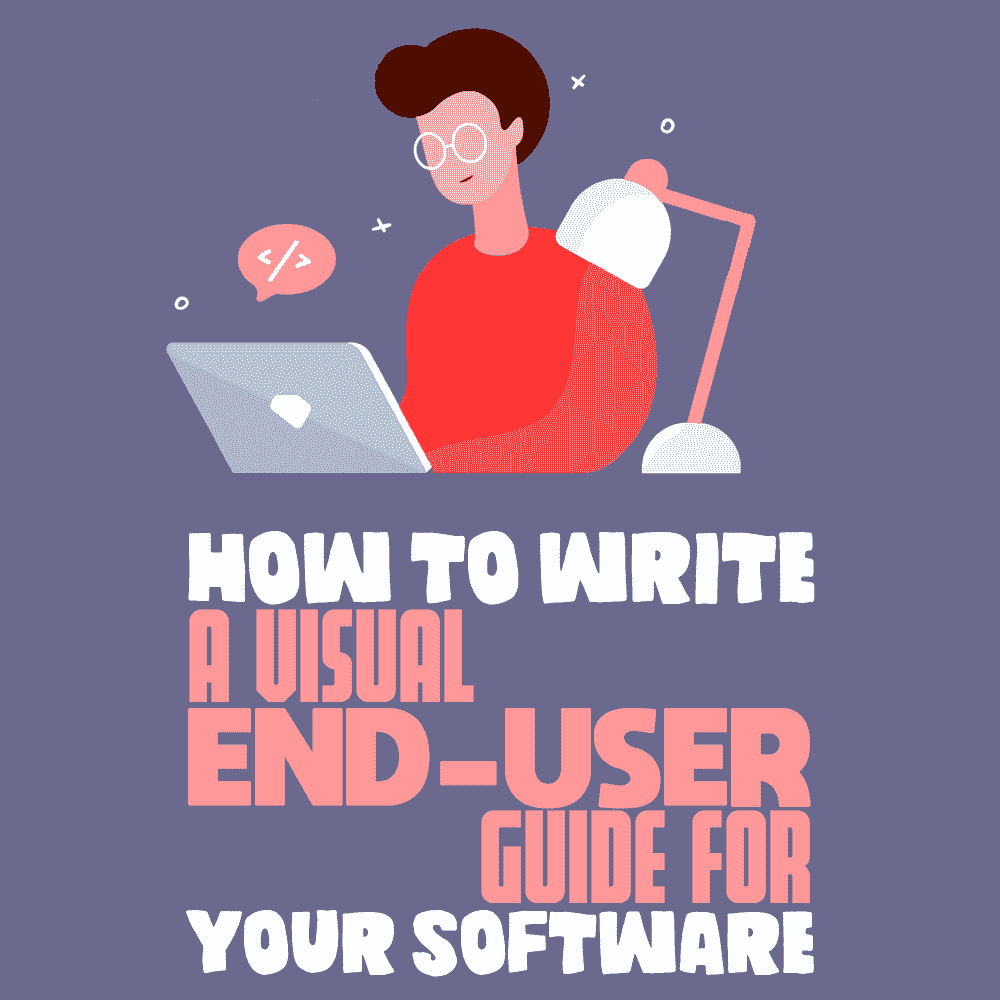
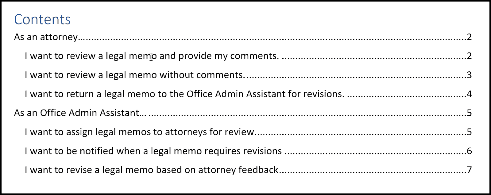
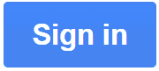
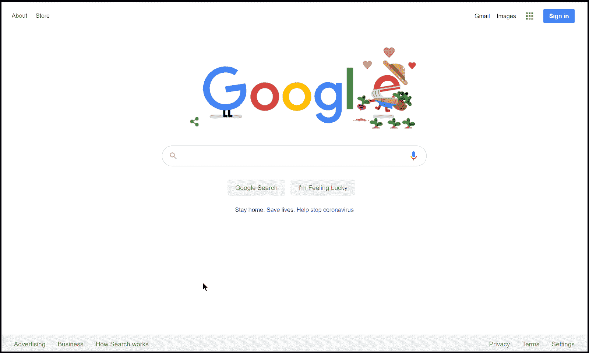
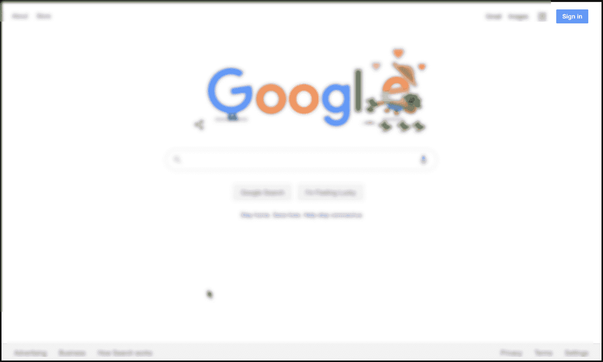
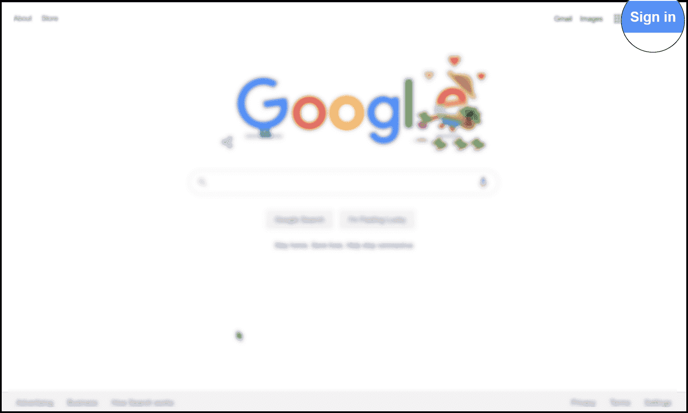

# 如何为你的软件写一个可视化的最终用户指南

> 原文：<https://simpleprogrammer.com/write-visual-end-user-guide/>

**

*“写作很容易。你只要把错字划掉就行了。”—马克·吐温*

讽刺的是，这是一本关于如何编写可视化最终用户指南的长篇文本指南。我最初考虑把它作为一个可视文档而不是一篇博文来提供，但事实是一些想法最好通过文本来传达。

这些年来，我看到了太多糟糕的最终用户文档，我修复了许多为内部用户编写的软件的最终用户指南。

我听到用户抱怨说，有问题的软件或解决方案对用户不友好。虽然这篇文章不是关于好的 UI/UX 设计，但是很多时候写最终用户指南的技术作者会让最终用户感到紧张。

这些技术作者可能不是开发软件的人，所以他们可能不会参与 UI/UX 设计。尽管如此，他们可以通过编写像样的视觉指南来减轻一些最终用户的负担。

近年来，企业防火墙后的软件和工具激增，我看到的一些指南相当令人生厌。这些年来我见过的一些“宝石”包括:

*   点击显示“点击此处”的地方
*   屏幕正在完成加载，请稍候
*   “如何找到这份文件”(如果我正在阅读，我不是已经找到了吗？)
*   不要点击“取消”

在这篇文章中，我将向你展示如何编写一个可视化的最终用户指南，它易于阅读，并使用图像和图表来指导用户如何使用你的软件。我知道软件开发人员不喜欢写非代码。然而，如果你想让你的软件被人喜欢，写一份好的最终用户指南是一项基本技能，即使你所做的只是帮助技术作者。

在我真正开始之前，让我强调一下，好的技术写作不是让人们阅读你的文档，而是跳过你的文档。你不希望任何人必须阅读你的文档的任何部分，如果他们没有绝对必要的话，所以在写你的指南时记住这个基本原则，这篇文章的其余部分将会更有意义。

## 写标题页

指南中的第一个视觉元素是标题页。这是你淘汰过程的起点。你的第一个淘汰过程是剔除那些不需要阅读文档的人，吸引那些需要的人。

因此，你需要在标题页上注明出版日期。这将有助于读者确定该出版物对于他们试图研究的软件领域来说是太旧还是太新。

用户应该能够阅读标题和出版日期，并决定是否要阅读该文件。

记住，你的文档会通过电子邮件发送，发布在公司的内部网上，并通过软件链接。

因此，在你的软件中加入一个徽标，作为对文档感兴趣的人的视觉标记。还包括一个描述性的标题，这样如果有人要阅读，他们就可以决定是否应该继续阅读。

**一些不好的样本标题包括:**

*   最终用户指南(什么软件的最终用户指南？)
*   操作指南
*   用户发行说明

**好的标题包括:**

*   法律部门最终用户指南(如何审查法律备忘录)
*   如何在法律文件审查系统中对备忘录进行法律审查
*   在文件审查系统中对客户备忘录进行法律审查的用户指南

请注意，每个标题都告诉用户，如果你不在法律部门，就不需要阅读本书。如果您不是在执行法律审查，则不需要阅读本指南；如果您没有参与客户备忘录的法律审查，则不会发现本指南有用。

还记得淘汰的过程吗？你应该从标题页中去掉不感兴趣的用户。

## 目录

我喜欢先写目录，然后再写文档的其余部分。大多数现代文字处理软件会为你创建一个目录，但是你自己提前写一个有很多好处。它给你一个你应该写什么的路线图，并帮助你组织你的想法。

目录也是指南的第二个视觉元素。我知道它主要由文本组成，但是文本、缩进、分组和字体在美学方面都很重要。

在编写一个好的目录时，[所讨论的软件的故事](http://www.amazon.com/exec/obidos/ASIN/B0054KOL74/makithecompsi-20)应该是你的指南。

**像开始[一个用户故事](https://www.mountaingoatsoftware.com/agile/user-stories)一样编写每个部分。**

以这个开场白为例，“作为一名律师，我想…”

这告诉用户，如果他们不是律师，他们应该跳过这一部分，因为这对他们没有什么好处。

此外，各部分的顺序也很重要。你应该按照用户数量的顺序来写故事。例如，如果有更多的律师将使用这个软件，你应该首先写律师部分，然后是最重要的用户群，等等。

对于每一小节，像你在故事中一样写下这句话，类似于用户想要完成的事情。

因为你的部分以“作为一名律师，我愿意……”开始，所以每一小节都应该提到律师愿意做什么，例如“审阅我队列中的文档”或“将我队列中的文档返回给办公室管理员以供进一步编辑”，等等。

同样，每个子部分应该按照用户最有可能执行任务的顺序排列。如果一个律师最有可能执行任务 A，那么他应该是第一个，然后是任务 B，依此类推。

目录应该限制在两页以内。如果你有超过两页的目录，也许你应该考虑把指南分开。例如，为三个独立的角色/用户提供三个独立的指南。这样，你仍然能够以一种容易理解的方式讨论你的软件的所有方面。

[如果你熟悉敏捷，你就会熟悉用户故事和史诗](https://en.wikipedia.org/wiki/Agile_software_development)。使用你在[你的故事](https://simpleprogrammer.com/how-to-hang-a-picture-agile-user-stories/)中开发的人物角色和每个人物角色想要完成的目标作为撰写章节标题的指南。

使用排除法。穿上用户的鞋子。阅读你的指南不是他们的工作；他们只需要执行一项任务，然后回到他们的常规工作，所以他们应该很容易找到他们需要的东西。

目录中提供的视觉提示有:

*   由单个角色完成的任务的清晰分组
*   按部门划分人物角色
*   清晰的任务层次结构(最频繁的放在最前面)

图表目录(TOF)是另一个重要的视觉元素，是的，它是视觉元素的可视化表示。

并不是你文档中的每个截图都值得在图表目录中引用。在 TOF 中只包括那些特别重要的截图。可能是工艺流程或零件示意图。

## 部分

每个部分和小节都应该写成:“作为一个角色，我想完成我的目标。”

因为每一小节的标题都应该是这个人想要完成的目标，所以在每一小节中写下用户为了完成这个目标必须采取的步骤。

永远不要假设用户知道一些事情或者已经做了一些事情。假设用户从未使用过该系统，并假设用户什么也没做。

如果有执行任务的预备步骤，请提供指向执行这些预备步骤的部分的链接。比如如何登录系统。如果您没有登录，如何请求访问系统。永远不要假设用户已经完成了这些步骤。告诉他们在哪里可以找到这些信息。

始终提供文档中的所有信息，每一分钟的细节。例如，包括系统的 URL，并且不要假设用户知道它。

请记住，这是一个视觉指南。甚至你分解步骤的方式也必须是给读者的视觉提示。

以步骤开始每一小节。每一步都应该包括两个互补的部分，文本和截图。文字是截图的视觉补充，而截图是文字的视觉补充。

## 文本

每个步骤的文本应包含编号为 1、2、3 等的步骤。并包含如何完成任务的文本说明。这将有助于读者跟踪每一步，当他们停下来的时候，给他们一个参考号。

我总是喜欢在写作的时候做正在讨论的任务，所以我不会跳过任何步骤。

*   点击以下网址导航到网站主页:
    [http://www.google.com](http://www.google.com)

记住永远不要假设。用户可能不知道谷歌的网址(是的，真的)。

如果你在文本中包含小的截图，会加分。

这段文字很好:

*   点击“登录”按钮。

这更好:

*   Click the 

    

      button.

这为读者提供了一个内嵌的视觉提示，让他们确切地看到他们要找的东西。

## 截屏

每个截图都应该有边框。用户必须能够直观地分辨出你的截图在哪里结束，文档在哪里开始，*尤其是*如果截图和文档有相同的背景颜色。

你看过截图和页面颜色一样的文档吗？我读得太多了，这实在是对眼睛的一种攻击。所以善待你的读者，让他们可以直观地知道一切的开始和结束。

截屏应该给用户上下文和视觉提示，告诉他们需要关注的地方。你把截图包括进来还不够好；现在，您必须关注用户。有多种策略可以做到这一点。我最喜欢的截屏工具是 SnagIt。您可以:

*   Blur the rest of the image.

    

*   Magnify the section the user must focus on in that step.

    

*   Provide an arrow to the area.

    

、或它们的组合。请记住，你需要提供尽可能多的视觉提示，以方便用户使用。然而，谨慎地使用效果，并使用你的最佳判断。我的经验是三种效果应该足以吸引用户的注意力。再多只会分散截图的注意力。

每个步骤及其相关的截图应该缩进到相同的级别。如果有子步骤，子步骤的截图应该缩进到子步骤。

因为本指南是关于视觉化的，你应该有足够的截图，这样如果文档中的所有文本都不在那里，用户应该能够通过查看截图来完成任务。

您希望用户能够准确理解他们需要做什么，而不必阅读任何文本。你应该有那么多截图，需要多少就有多少。在编辑阶段的一个技巧是将文本变白，看看在没有任何文本帮助的情况下，你是否还能按照截图完成任务。

与此相关的是，文本也应该在不考虑截图的情况下编写。把截图删了，看看能不能按照说明，只用文字完成任务。

这两者都应该易于遵循，以便任何技能范围的任何人都可以完成任务。如果你不确定文章的难度，你可以让朋友帮你读一遍，最好是不理解文章内容的人，看看他们是否能理解文章内容。如果他们能理解，那你就是好样的！

## 保持简单，傻瓜

总之，编写软件指南要有一个可视化的标题页，一个很好的描述，一个目录，和清晰的章节。

以人物角色的形式编写目录，这样如果用户不是那个人物角色，他们可以跳过那个部分，只关注他们需要阅读的部分来完成他们的任务。

在每一部分，包括用户完成任务所需的所有文本和截屏，理想情况下，在编写指南的同时完成任务，这样你就不会错过任何东西。

通过这样做，您可能会减轻最终用户的一些负担，他们会为此感谢您。