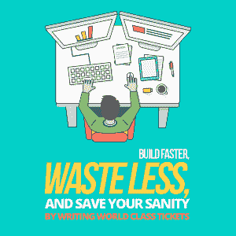

# 通过购买世界级门票，加快建设速度，减少浪费，保持头脑清醒

> 原文:[https://simple programmer . com/writing-world-class-software-tickets/](https://simpleprogrammer.com/writing-world-class-software-tickets/)

 As programmers, we have a lot on our plates. Understanding the newest technology, the business, navigating politics in the business and in our teams, and all of the tools, languages, and everything else that comes with the territory. It is overwhelming.

当谈到改进时，我们很容易倾向于自己的个人发展而不是团队发展。选择专注于获得个人技能，而不是提高团队或企业的产出。毕竟，这些改进是经理的责任，对吗？可能吧。但是[如果我们不小心的话，这种想法会适得其反。](https://thedevcoach.co.uk/why-learning-a-new-framework-could-damage-your-career/)

为什么？因为，最终，[我们为我们的业务提供](https://simpleprogrammer.com/become-valuable-software-developer/)的价值，从而获得报酬。因此，如果我们想要更高的薪酬、更多的认可，并最终获得更好的职业生涯，关注企业想要和需要什么是有意义的，而不仅仅是我们自己的个人发展。这就是我们如何支付我们的支票，我们如何保持我们头上的屋顶。

这种类型的思考看起来有些违反直觉，甚至可能是可怕的，因为我们把注意力集中在感觉不受我们控制的领域。

我们如何处理不稳定的情绪？

通过专注于培养对我们团队有重大影响的[技能](https://simpleprogrammer.com/working-on-a-team/)。当我们在团队中建立正确的技能时，我们就控制了过程。

大多数团队可以改进的方法之一是[帮助他们写出更好的入场券](https://simpleprogrammer.com/how-to-hang-a-picture-agile-user-stories/)。是的，你没看错。我几乎可以从这里听到全世界程序员的联合呻吟。我知道，没有什么比妨碍编程更经常地成为我们生存的祸根了。

但是——写罚单是一门值得掌握的艺术，为了你自己和你的团队的理智。在本文中，我们将讨论团队在软件票证方面面临的一些问题和常见的陷阱。在此之后，我们将介绍四个不同的部分，您可以将它们添加到您的软件票证清单中，使它们真正成为世界一流。

我们开始吧。

## 危险在于我们无意识的无能

大多数程序员嘲笑他们需要更好的票的想法。毕竟，开罚单似乎被认为是一件简单的事情。在一个[敏捷环境](https://thedevcoach.co.uk/the-truth-about-successful-agile-the-secret-is-the-technology/)中工作的程序员通常对文档有一种消极的态度——列举了许多瀑布项目，这些项目因为过于专注于文档而不是工作而失败。但是，通常情况下:真相正好在中间。

历史已经向我展示了一个基本的事实，那就是通过与许多不同的企业——大的、小的、初创企业或政府——的合作:

令人遗憾的是，大多数公司都没有能力开出好的罚单。

但这不是我们的错。我工作过的许多团队都热情、聪明，并且希望他们的产品和业务最好。但是，如果我们与热情和聪明的人一起工作，我们怎么会犯这样的错误呢？好吧，让我们来看看…

正如塞内卡在《斯多葛派的来信》中所说，“没有统治者来反对你，你就不会把弯曲的东西变直。”这些团队如何以这种方式结束的答案是:无意识的无能。

如果没有目标或基准，我们永远不会知道我们的工作是好是坏。这就是我们今天要做的。我们将看看一个模板，一个要达到的基准。

## 我们票的问题是

Before we take a look at our ticket template, we should look at some of the common pitfalls we face when writing tickets.

**1)它们是为一个观众而不是整个团队而写的** —门票是一种独特的东西，因为它们是企业的文件，也是发展的工具。历史上，这两个政党讲两种不同的语言。我的意思是——实际上是两种不同的语言。这不可避免地会导致交流中断。通常，入场券是为开发团队或业务而写的。不是两者都是——这是应该的。

缺乏一致性——一致的模式有助于信息检索。想想当超市决定要重组平面图时，找到自己喜欢的商品有多难。突然，你发现自己在过道里跑了几圈，到处寻找那盒“嘎吱船长”牌的饼干。不过，最终你会进入一个最佳状态，慢慢地发现事情变得更容易。我们在软件票上也有同样的问题；它们需要保持一致，这样我们才能更快地找到我们需要的东西。

缺乏信息——花很多时间去完善门票感觉是在浪费时间。坐下来花几个小时塑造、雕刻和改进我们的软件，在生产力上似乎比他妈的直接做(或简称为 JFDI)的务实方法要逊色。但 JFDI 方法的问题在于，我们在短期内帮助了自己，但从长期来看却搬起石头砸了自己的脚。我们需要驯服自己想要超前的倾向，花时间做好我们的尽职调查。

如您所见，如果我们使用一致的方法:模板，上述所有问题都可以解决。

现在，希望你很兴奋地看到你自己的票是否合格。我们将讨论定义良好的票证的四个部分以及每个部分的细微差别。我们开始吧。

## 第 1 部分:用户故事

***作为一个**管理员用户**我希望**做布拉**以便**的东西。*

用户故事帮助我们交流业务和开发团队都能理解的想法。

用户故事的重点是关注商业价值。所有的技术任务应该存在于其他地方——在子任务或清单中，而不是在用户故事标签中。用户故事票是关于对用户的价值，而不是技术实现。

一个用户故事往往会创造一张好票的方向。但这是一个看似简单的工具。

**细微差别 1——让用户回到用户故事中。**

一个好的用户故事的细微差别之一是用户部分(这并不奇怪)。这是你写“作为我想要的[用户]”的第一部分……在我们匆忙中，很容易跳过这一步，直接写“作为用户”。我的意思是，他们毕竟是一个用户，对不对？

这种方法的问题在于，用户故事的第一部分是与我们的角色联系起来。

此时你可能会想:哇哦！等一下——什么是人物角色，我们还没有讨论过呢？你说得对，我们没有。所以让我们现在快速地做那件事。

人物角色是一种常见的[以用户为中心的方法](https://simpleprogrammer.com/improve-ui-ux-application/)，通过定义可能使用你的产品的非常具体的个人来与你的用户建立共鸣。为了让他们活起来，你给他们起名字，谈论他们喜欢什么，不喜欢什么，喜欢什么，不喜欢什么。通过使用人物角色，我们可以开始将我们的用户视为真实的人，而不仅仅是我们谷歌分析账户上的指标或统计数据。

这就是为什么不要异想天开地跳过用户故事的第一步，花时间定义一些用户角色，然后在我们的用户故事标签中使用它们是很重要的。

**细微差别 2——足够小的故事**

It's easy to define stories that are too big to fit in our [agile workflow](https://simpleprogrammer.com/three-insights-make-agile-work/). Because user stories can be quite high level and abstract, it's easy to forget about all the technical work that goes into building our user story. Our stories can quickly add up to more than the time that we've allotted for delivering our next release. For agile teams, this time box is called a Sprint and is usually only two to four weeks.

因此，为了避免臃肿的故事，我们希望通过将功能分解为最小的合理部分，确保我们的票证在单个 sprint 中非常合适。

把分解一个故事想象成制造一辆汽车会有所帮助。我们不应该制造底盘、车轴，然后最终制造汽车，而是应该制造滑板、踏板车，然后最终制造汽车。

**细微差别 3——不提供真正价值的故事**

如果我们的故事太大，就很容易开始思考如何在所谓的水平切片中交付故事。

水平分割的用户故事是指我们一次构建一个水平部分的功能。水平方法可能是这样工作的:

第一个冲刺可能是数据库特性，第二个冲刺是我们的 API 特性，第三个也是最后一个冲刺是我们的界面。

这里的问题是，故事只在最后冲刺阶段传递价值。那么，解决办法是什么？垂直切片。

垂直切片意味着我们做一点数据库工作，一点 API 工作，一点前端工作，最终在一个 sprint 中交付一个完整的特性。如果你很难想象垂直切片在实践中是什么样子，那就想象一个蛋糕。一块美味的蛋糕上有糖霜、海绵和果酱。不仅仅是一整块糖霜、果酱或海绵！

## 第 2 部分:业务环境

用户故事不会凭空出现；它们有背景、来源和意图。

考虑这个例子:

向求职者个人资料中添加历史记录部分将允许个人查看对其帐户采取了哪些措施。

此功能源于 Jenny 所做的用户反馈，其结果可在[此处]和[此处]的文档中找到。

提供这一功能符合我们的季度业务目标 KPI，即:增加候选人注册。

优秀的领导者能够清晰地表达愿景，这样他们的追随者就可以和他们一起工作来实现它。

当我们在不了解业务环境的情况下创建票证时，很容易迷失方向，交付对我们的用户没有真正意义的功能，或者交付对业务没有价值的功能。

给出商业背景就像在句子中使用标点符号。没有它，我们的交流可能会不清楚和误解。这就是我们吃奶奶的区别！奶奶，我们吃饭吧！

**细微差别 1——从为什么开始。**

“People don't buy what you do, they buy why you do it” is the phrase repeated over and over by Simon Sinek in his extremely popular TED talk [“How Great Leaders Inspire Action](https://www.ted.com/talks/simon_sinek_how_great_leaders_inspire_action).

它有助于谈论特性起源于何处，以便开发团队理解变化的驱动因素。传达愿景有助于开发团队了解该特性，并对它所交付的价值感到兴奋。

**细微差别 2——将特征与其原点联系起来**

每个交付的特性都应该反映用户行为的变化。

我们用这样的短语来证明我们的工作是正当的:因为 CEO 爱丽丝想要它。但是当我们以这种方式构建产品时，我们最终会得到一个为利益相关者而不是用户构建的[弗兰肯斯坦](http://www.amazon.com/exec/obidos/ASIN/0143131842/makithecompsi-20)怪物。

为了确保我们为用户构建，我们可以将我们工作的来源与我们对用户所做的研究联系起来。或者至少陈述我们所做的假设，例如:我们假设通过交付 X 特性，我们将以 Y 方式修改用户行为。

**细微差别 3 —数据驱动**

软件的许多方面都是猜测。我们需要用数据尽可能地将我们的工作具体化。使用标签的这一部分来讨论将要测试该功能是否实际实现了您想要的行为改变的指标。

如果我们正在构建的功能将增加收入或用户注册，我们希望陈述这一事实，以在商业价值和交付的功能之间建立明确的因果联系。

## 第 3 部分:验收标准

我经常听到的是，“验收标准是什么？”但是[对于每个人来说，接受标准的概念意味着和看起来是不同的](https://simpleprogrammer.com/getting-up-to-bat-adding-bats-to-your-acceptance-criteria/)。然而，它可能看起来像…

**鉴于**，我不是管理员用户。

**当**导航到页面/管理。

然后我看到一个警告框，上面写着:“您无权访问此页面。”

验收标准是允许程序员说工作真正完成的标准。这是一份清单。当定义的所有行为都实现时，票据就可以标记为完成。

如果没有这种类型的验收标准，我们就有一次又一次在完成和开放之间跳票的风险。这种来回不仅让所有相关人员感到沮丧和沮丧，也是一种可悲的浪费。我们没有修复和构建漂亮的新功能，而是忙于修补相同的功能，不清楚什么时候标签实际上已经完成。

验收标准可以写成这样的格式:给定，何时，然后。

**细微差别 1 —在定义验收标准时输入不足**

验收标准的一个缺陷是它是在没有整个团队参与的情况下编写的。

为了最大限度地利用您的验收标准，召集所有参与项目工作的人员，创建一份良好的清单。您需要考虑性能、架构、设计等等。

记住，从长远来看，现在投入的时间会有巨大的回报。您将拥有连贯且易于遵循的步骤，确保开发团队以平稳一致的方式完成工作。

**细微差别 2 —将验收标准与您的签署联系起来**

当你有了验收标准，你也可以在你的自动化测试框架中使用它。这意味着当一个标签完成时，你可以说:我已经手工测试了定义的所有十个场景，它们都通过了。其中三个现在是自动化的，是我们构建管道的一部分。

## 第 4 部分:线框

Last but not least, the most common area of tickets is the wireframes or mock-ups.

验收标准有助于定义行为，但不能定义视觉观感。我们知道应该有一个错误框，但我们不知道它应该是什么样子。这就是为什么我们要附上一个什么样的功能看起来像线框。

## 齐心协力

唷——那可能有太多东西要消化。创建一个优秀的软件票证需要很多因素。但是希望这些想法能给你一个好的开始。

这张票现在整体看起来是什么样的？类似于…

**用户故事**

**作为一名**管理员用户**，我希望**查看历史**，这样**我就可以看到我的账户上发生了什么。

**业务背景**

向候选人个人资料添加历史记录部分将允许个人查看对其帐户采取了哪些操作。

这个特性源于 Jenny 的用户反馈——其结果可以在[此处]和[此处]的文档中找到。

提供这一功能符合我们的季度业务目标 KPI，即:增加候选人注册。

**验收标准**

**鉴于**，我不是管理员用户。

**当**导航到页面/管理。

然后我看到一个警告框，上面写着:“您无权访问此页面。”

就是这样。

有了这些信息，你应该能够[将你的团队和你的业务](https://thedevcoach.co.uk/category/leadership-and-team-working/)推向一个新的水平——这应该帮助你和你的团队更快地建设，更少地浪费，并通过写真正世界级的门票来拯救你的理智。