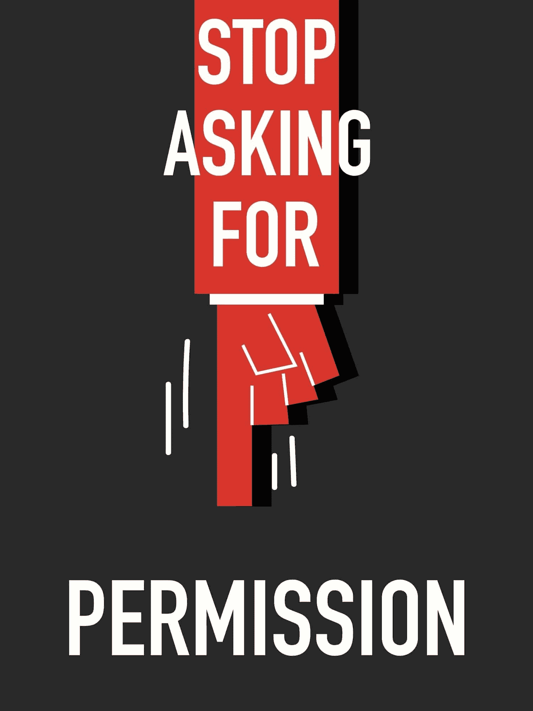
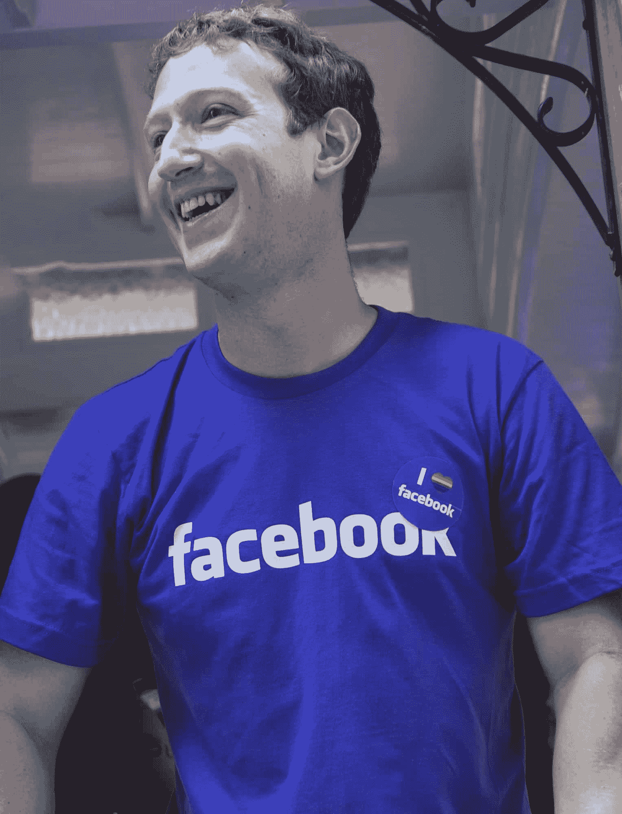

# 你不需要请求许可

> 原文：<https://simpleprogrammer.com/you-dont-have-to-ask-permission/>

很长一段时间，阻碍我生活的一个主要因素就是认为我需要得到许可才能做某事或成为某人。

我生活在一种允许别人限制和定义我的潜力的心态中。

我允许别人告诉我我是谁，我有什么价值，我能做什么或不能做什么。

当我今天辅导几十个年轻的软件开发人员时，我经常在他们身上看到同样的心态。

许多程序员告诉我，他们对自己没有信心，觉得自己不配得到那份高级开发人员的工作，创建自己的博客，甚至创办自己的公司。

# 他们在等待许可

They are waiting for someone to tell them they are worthy of their undertaking.

他们在等着有人允许他们说出自己的想法或者往上爬。

但是，事情是这样的: [**幸运偏爱勇敢的**](https://www.youtube.com/watch?v=Pp-C4iMEJRg) **。**T6。med rectangle-4-multi-110 { border:none！重要；显示:屏蔽！重要；浮动:无！重要；行高:0；边距-底部:15px！重要；左边距:0！重要；右边距:0！重要；margin-top:15px！重要；最大宽度:100%！重要；最小高度:250px 最小宽度:250 像素；填充:0；文本对齐:居中！重要}

如果你想在事业上成功，你不能等着别人给你许可去成为你想成为的人或做你想做的事；你只需要去做。

当然，这有风险。任何严肃的事业都有风险，但是浪费你的潜力并且永远看不到它实现的风险要大得多。

我知道，作为一个经验不足的开发人员，你似乎没有什么可以提供的。

在你看来，你没有权利也没有理由把自己和已经在这个领域工作了几十年、做了这么多伟大的事情、有这么多经验的人联系在一起。

你可能会觉得你不能写博客，因为你不可能有什么有价值的东西要说。

你甚至可能会觉得你没有权利这么说——你没有赢得这个权利——但这完全不是事实。

# 没人需要给你许可

不需要赚取任何权利或特权。

言语不言自明。

智慧和愚蠢都来自有经验的人和没有经验的人。

希望随着你经验的增长，你的智慧也会增长，但情况并非总是如此。事实上，有时候经验会蒙蔽我们。

有时傲慢会让我们看不到非常重要的基础。

有时，初学者需要用全新的眼光看待这个世界，并与同事和上级分享这一愿景，才能真正产生影响并推动我们前进。

# 不要忘记，有史以来一些最成功的软件开发人员并没有请求许可

I’m pretty sure [Mark Zuckerberg didn’t really know what the hell he was doing when he first starting creating Facebook](http://www.amazon.com/exec/obidos/ASIN/1439102120/makithecompsi-20).

我很确定他也没有征得同意。

我认为没有人告诉他这是一个好主意，或者给了他自我激励，以帮助他觉得有资格继续他的计划。

我想他只是决定放手一搏。

你会发现苹果公司也有类似的故事。

我很确定史蒂夫·乔布斯和史蒂夫·沃兹尼亚克也没有征得同意。

事实上，如果我没记错的话，当两个史蒂夫承诺为一台他们甚至还没造出来的机器完成个人电脑订单时，他们都有点头脑发热。

他们两人都没有资格改革个人电脑行业。

然而他们做了…而且都是未经许可的。

我大概能说出十几个我们行业和许多其他行业的先驱，他们采取了大胆的措施，没有先征求许可。

我相信你也可以。

# 当我的生活改变时

在我自己的生活中，直到我意识到我不需要许可这个简单的事实，事情才真正开始改变。

当我第一次开始创建 [Pluralsight 课程](https://simpleprogrammer.com/pluralsight)时，其他作者——他们中的许多人都很有名——可能会想，“这个叫约翰·桑梅兹的家伙到底是谁，他认为他在做什么？”

但是，我没有征求他们的同意。我一直在创建课程，直到**我成为平台上发表文章最多的作者，拥有** [**55 门课程**](https://simpleprogrammer.com/pluralsight) **。**

当我第一次开始写这个博客时，我的许多同事都被我试图向世界传授一些东西的行为逗乐了。他们想知道我在给谁写信，谁会看我的博客，但是现在每个月有超过 10 万人看 。

当我开始录制 YouTube 视频时，我没有任何权限这样做。有些人甚至觉得这是个玩笑，或者我被蒙蔽了，但我并不在乎。

当我写我的书 [*《软技能:软件开发人员的生活手册*](https://simpleprogrammer.com/softskills) 时，不止一个人发声说我没有权利或权威写一本关于职业、健身、金融和其他主题的书，但是你认为我会因此而停止吗？

号码

我的观点是，在所有这些事情中，我可以等待别人给我许可。

我本可以等着有人向我点头说，“嘿，John，你看起来对软件开发和生活了解很多。你应该把它写下来或者录视频。”

但很可能我会等很久，因为没有人会站出来给你封爵。

你必须给自己洗礼。

# 你可以成为任何你想成为的人

你可以做任何你想做的事情。

我不会轻易说出这些话。

我一生中开始做的每一件事，我都完成了，**不管我的愿望有多大胆。**

如果我没有抓住这个机会，我永远也不会相信这是可能的。

如果我等着别人给我许可，我根本不会发现它。

我开这个博客的一个主要原因——老实说，也是我坚持下去的一个主要原因——是为了对抗“我比你强”的态度，这种态度在我们的领域中似乎被很多有经验的开发人员所投射。

这种轻蔑的态度往往会让许多开发人员觉得他们不值得。好像他们的观点和经历没有价值。好像他们没什么可贡献的。

事实上，我把这个博客命名为*化繁为简*,因为我想把这些“自命不凡”的开发者们正在变得复杂的所有东西拿出来，向所有人展示它们实际上有多简单。

# 我们所有人的潜力

It’s amazing the potential that each of us has—regardless of our experience or lack thereof.

你不需要许可就可以走出去做实验。

创建你自己的博客和分享你的想法不需要许可。

如果你愿意，你可以成为一个著名的博主。没有理由不能是你。

你可以成为一名作家。是的，你可以写一本书。

你可能会成为编程语言或技术方面的知名专家。

你会成为一名著名的演说家。

你可以为谷歌或微软工作，甚至成为自己软件公司的首席执行官。

我知道这看起来很牵强，但所有这些事情都是可能的..

…如果你能学会不征求别人的同意就好了。

特别感谢赞助这篇文章的[泽法](http://zephyragile.com/)。泽法是敏捷开发和软件测试领域的思想领袖，也是 Simple 程序员的长期合作伙伴。如果你正在寻找一个[棒的测试管理解决方案](http://zephyragile.com/)，我强烈推荐他们。