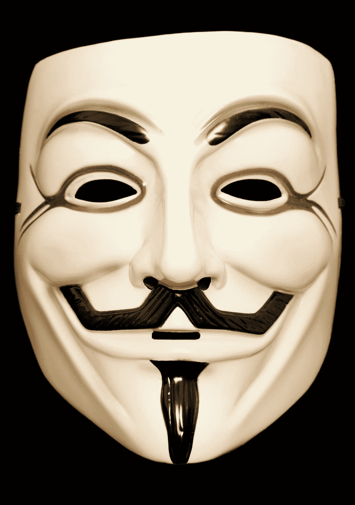

# 在你打破规则之前，你必须掌握规则

> 原文：<https://simpleprogrammer.com/you-have-to-master-the-rules-before-you-can-break-the-rules/>

我的大部分建议最终被误解了。

我完全赞成成为一个规则破坏者。

总的来说，我蔑视权威。

我对守门人竖起大拇指。

我真的相信上学，取得好成绩，然后下半辈子做一份朝九晚五的工作，希望有一天你的 401k 足以度过你的黄金岁月，这是一种扯淡的生活方式。

但是，尽管我制定了自己的规则，我可以在别人的规则和价值观的世界里生活和成长。

事实上，我坚信任何一个“叛逆者”所拥有的最强的特质之一就是矛盾的顺从。

只有当你能掌握别人强加给你的规则时——当你能在他们的游戏中击败他们时——你才能获得打破束缚你的规则并创造你自己的规则的力量。

## 约瑟夫，规则的追随者？

我可以从历史中摘取许多故事来说明这一点，但有一个故事特别引起了我的注意，因为它被认为是不公正的，而且它在内部迅速上升到荣耀。

不管你是否相信《圣经》,你不得不承认约瑟夫的故事相当有趣。

这是一个牧童，他本质上是一个规则的破坏者和内心的反叛者。

他做了一个梦，梦见自己统治着他的兄弟，甚至他的父亲，因为他们向他鞠躬——至少是象征性的。

我敢肯定，这种幻觉让一个小男孩产生了一些伟大的幻想，可能是如此之大，以至于他的兄弟们同意杀了他，但最终决定把他扔进一个坑里，然后把他卖为奴隶。

现在，在这一点上，约瑟夫有一些很好的理由生气。

他被他的兄弟出卖，被卖为奴隶，被带到外国，在那里他被剥夺了自由，被迫为一个他不一定尊重的主人服务。

但是，约瑟夫造反了吗？

约瑟夫是抱怨不公平，拒绝现实，还是选择表达他的不满或开始起义？

他只是决定去工作，比任何人都更努力地为他的主人服务。

记住，他不属于这个系统。

这不是他的国家。他不认同强加给他的价值观和信仰。

他可能仍然有伟大的抱负，但他认识到，这不仅仅是他的信仰，上帝会拯救他。他认识到，为了最终打破规则，他不仅要学会遵守规则，还要比任何人都更好地掌握规则。

作为对他勤奋的奖励，他被提升为主人全家的监工。也就是说，直到他的主人的妻子提出要求，他再次采取了性格而不是妥协的立场。

这次他的奖励是因被指控强奸未遂而入狱。

但是，即使被不公正地监禁，他仍然没有反抗。相反，他发现了一套需要遵循和掌握的新规则。一旦他掌握了这些规则，他再次被邀请超越这些规则，成为其他囚犯的管家。

我在这里把故事缩短了一点，但是机会来了，他能够通过解释他的梦来获得影响力和埃及法老的职位。

至此，约瑟夫从字面上**成为埃及**最有权力的人，并且能够执行自己的规则。

我的观点是什么？

好吧，让我们这么想。

如果约瑟夫拒绝遵守为他设定的规则，会发生什么？如果他反叛并选择走自己的路，会发生什么？

他没有被安排管理他的第一个主人的家，而是被提升到其他囚犯的管家的位置，并最终成为法老的得力助手，我想他可能会经常感觉到鞭子的噼啪声。

约瑟夫很聪明。他耐心等待时机。他没有试图强求机会。

约瑟夫学会了按照交给他的规则来玩，然后掌握这些规则，直到他最终被任命到一个他可以制定自己的规则的位置。

## **年少无知**

我和许多年轻的程序员交谈过，他们认为自己已经想通了一切。

他们认为所有时代的智慧都是胡说八道，他们比在他们之前的所有人都更快、更聪明、更有能力。

他们认为他们不必打领带去工作——没有人能强迫他们。

他们中的一些人似乎甚至不认为他们必须遵守物理定律。

这些程序员中的许多人最终创建了新的框架来解决已经解决的问题，而且是以更糟糕的方式——但是我不想在这里跑题。

有趣的是，我同意这些“小阿飞”的大部分观点。

福& *#那个人！F &* #当权派！好极了。

然而，问题是，这些“革命者”中有许多人不能拥有固定的工作。很多都不符合现有的结构和规则。

他们说他们不想，而且这不适合他们。

我说他们做不到。

我要说一次，然后我要再说一次，因为这太他妈的重要了。

如果你想要合法性，你必须付出代价。

如果你想要合法性，你必须付出代价！

我不在乎你有多聪明。如果你连我能做的都做不到，你就不能告诉我我错了。

但是你猜怎么着？

如果你能做我能做的——事实上，如果你能比我做的好两倍或更快——然后你告诉我我做错了，我必须听

不管你是年轻、年老、白人、黑人、男性、女性还是有纹身——如果你能在我的游戏中打败我，我就得听你的。你有信誉。

如此多的人试图通过宣称别人都是错的来征服世界。

光有一个好主意是不够的。光有坚定的信念是不够的。你必须能够挖掘战壕。如果你想赢得尊重，你就必须挖好战壕。

现在，不要误会我的意思而摇摆相反的方向。

我并不是说支付你的会费意味着你必须做 30 年朝九晚五的工作，和*然后*有机会做一些不同的事情。

你甚至不需要在你生命中的任何一年做一份朝九晚五的工作，但是你必须有能力这样做。

如果你想把“工作的男人”(或女人)称为傻瓜，你必须能够做工作的男人能做的事情，而且做得比他更好，但是拒绝它，因为你有更好的方法，而不是因为你固执、[懒惰](https://simpleprogrammer.com/2014/05/29/beat-laziness/)或无能。

这似乎是一个很小的区别，也许是一件小事，但我们都知道那些只会说空话的人和那些真正会做的人之间的区别。欺诈是最容易识别的。

## **老顽固**

我的意思并不仅仅是针对那些年轻的程序员，他们似乎被老一代人的愤怒所激怒，不断地对他们大喊“滚出我的草坪”

在老一代程序员身上可以看到一套不同的属性——但同样具有高度破坏性——他们可能倾向于被单一的一套规则所定义，以至于他们无法打破这些规则。

当许多年轻的程序员不断地想打破规则，无视传统、经验和时代的智慧时，**许多年长的程序员想把这些东西抓得太紧******。****

**这些程序员陷入了一个窠臼，他们非常擅长遵循某一套规则，他们看不到这些规则之外的东西，甚至看不到这些规则的原因。**

**这些程序员，当被抛入一个新的环境，或者面对我们这个千变万化的职业不可避免的变化时，他们固执己见，咬紧牙关。**

**其中一些程序员甚至没有学会掌握他们现有游戏的规则。他们只是达到了熟练程度，并就此止步。**

**对他们来说，规则似乎是一成不变的，不能被打破。**

**这些好心人给我发电子邮件，宣称我说的话很疯狂。他们告诉我为什么我正在做或建议的事情不会也不可能奏效，尽管有明显的相反证据。**

**他们试图把我和其他人拉回到持续但平庸的一致性世界。**

**他们不明白，如果他们多付出一点努力，学会适应不断变化的规则，并最终掌握它们，他们也可以自由。他们可以打开新的大门，发明新的框架，并彻底改变我们开发软件的方式，因为他们已经非常接近他们的目标了。**

## ****成为你需要的两倍****

**我正在听 TechZing 的一集，播客的主持人之一杰森·罗伯茨讲述了他的儿子参加少年棒球联盟并受到教练不公平对待的故事。**

**Jason 讨论了教练让自己的儿子比 Jason 的儿子更频繁地参加比赛是很自然的事情，即使 Jason 的儿子更有技术。**

**但是当杰森重复他给儿子的建议时，事情变得非常有趣:**

**“你得比教练的儿子强一倍。”**

****好一倍。****

**他的逻辑是，如果他的儿子比他好一倍，教练就不可能让自己明显不如他的儿子上场。**

**在你打破规则之前，这和遵守并掌握规则有什么关系？**

**简单。有一套规则来管理棒球小联盟和运动员的选择。是的，规则是不公平的。基于裙带关系而不是纯粹的天赋来挑选教练的儿子而不是其他球员显然是不公平的。但是，不管公平与否，这就是现实。**

**解决这个问题的关键不是直接打破规则，而是在他们自己的游戏中击败他们。通过遵守规则并学习掌握棒球运动，Jason 能够让他的儿子最终打破规则。**

**一致性导致合法性，合法性最终导致变革。**

**就这种裙带关系与教练直接对抗，充其量可能导致一个虚假的承诺或理由；最坏的情况是，一场拳击赛。**

**事情是这样的:生活中有许多不公平的潜规则。**

**我不会假装没有特权和歧视这种东西。这些东西当然是存在的——不管是不是有意的。**

**我甚至不是说我们不应该和他们战斗。我们应该，但是我们应该站在一个强大的立场上与他们战斗，而不是站在一个弱小的立场上。**

**不管怎样，大多数程序员——仅仅是*人*——最好明白，如果你能比其他人好很多——甚至两倍——那么**你就有能力克服生活中存在的许多不公平。****

***(顺便说一句，有时候缺点其实也是优点。我还没见过像《大卫和歌利亚》**这样雄辩的阐述，这是一本我终于抽出时间读的伟大的书。)***

**报道援引史蒂夫·马丁的话说，“表现得好一点，让他们无法忽视你。”**

**卡尔·纽波特写了一本同名的书，我强烈推荐你阅读。**

## ****一个潜在的原则****

****

**我已经走了很多不同的方向，但那是因为我相信**有一个潜在的原则在起作用，将所有这些统一在一起。**

正是这种想法，你必须随波逐流，你不能不断地与当前斗争，并期望取得进展。

就像柔道一样，你必须用对手自己的力量来对抗他们，而不是试图直接对抗。

这个想法是，如果你想超越别人，你必须把自己放在别人的下面，而不是上面。

这种观点认为，真正的力量不是来自于让别人屈从于你的意志，而是来自于有这样做的能力和不这样做的自制力。

所以，是的，我说了很多关于[不征求许可](https://simpleprogrammer.com/2015/07/27/you-dont-have-to-ask-permission/)或[违反规则](https://simpleprogrammer.com/2015/05/11/sometimes-its-ok-to-break-the-rules/)的话，但是因为你不能遵守规则或因为你缺乏遵守规则的自律和决心而违反规则与因为你已经掌握了规则并知道如何在规则制定者的游戏中击败他们而违反规则*是非常不同的。*

如果你想要合法性，你必须付出代价。**