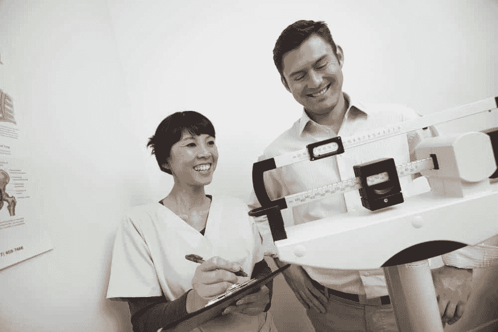
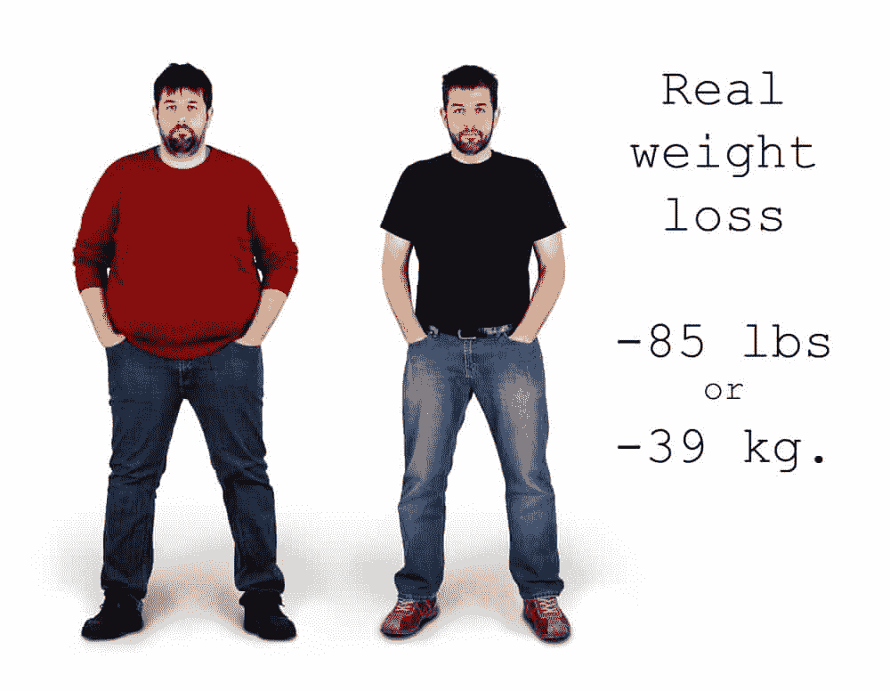
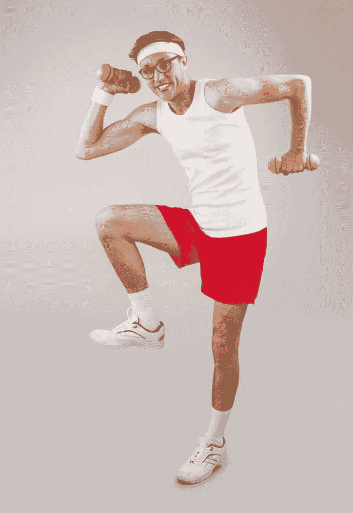
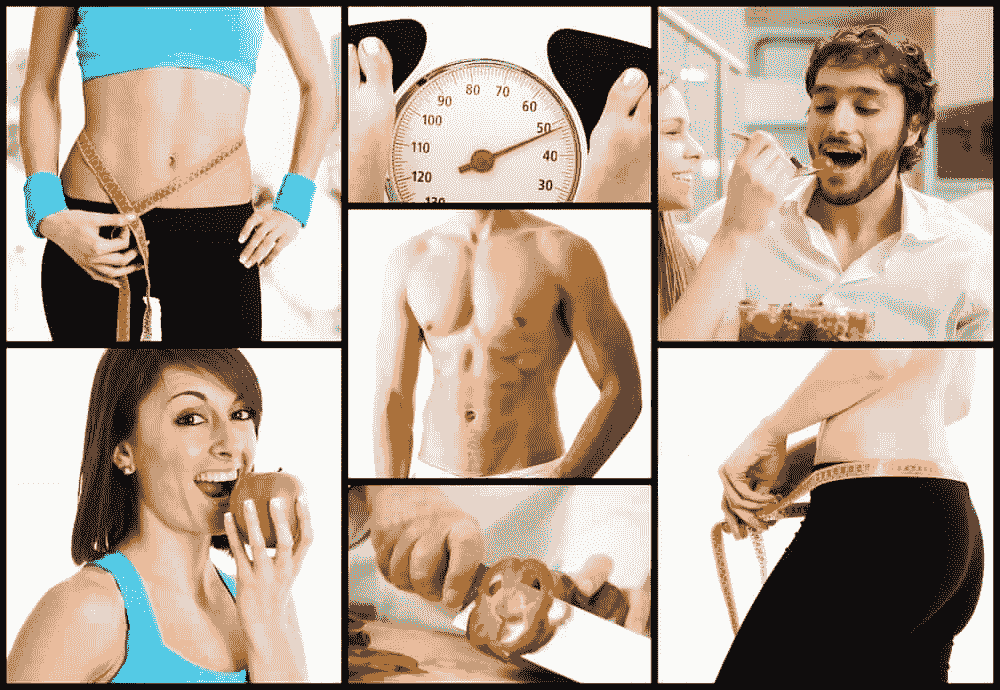

# 你的健身目标都是错的

> 原文：<https://simpleprogrammer.com/your-fitness-goals-are-all-wrong/>

对所有人来说，照顾好自己是很重要的。通常，我们会有一种困扰的感觉，认为我们应该为自己做得更好:定期锻炼，吃“正确的”东西，避免有害的食物和活动。

有人认真对待他们的健身，他们甚至鼓吹健身。这是影响每个人的事情。

然而，在关于健康的谈话中，人们往往忽略了对健康意味着什么的理解。那些对健身感兴趣的人经常忘记阐明它为什么重要。

## 什么是健身？

当用于人、动物、植物或其他物体时，术语“适合”意味着该物体适合于满足某种需要。作为一个人“健康”意味着你能够完成一些任务。

这就指出了询问某人是否合适的一个明显缺陷。问题漏了一部分。

事实上，对“你健康吗？”是另一个问题:

“我适合什么？”

健身目标通常以减轻一定量的体重或达到一定的身体组成(通过体脂百分比测量)来表示。

然而，这些事情并不是目标；它们是衡量标准。毫无疑问，度量标准是有用的，但是要使它们成为目标，它们需要与你在生活中想要的东西相关联。你浴室磅秤上的数字只能是一个目标，只有在适当的背景下才显得重要。

## 度量的效用

体重非常容易测量，它能告诉你一些关于你身体状况的信息。然而，它给你的信息是不完整的。它没有说你真正想从你的身体里得到什么。

用你的体重来决定你的身体状况，就像用你的银行账户余额来告诉你你的幸福状况。它将提供一条有用的信息来衡量一些重要的东西，但是它没有给出必要的上下文来确定任何具体的东西。

我喜欢考虑测量你的身体状况，就像敏捷人员喜欢考虑团队可以分配给迭代的工作量一样。

在软件项目中使用像[速度](http://guide.agilealliance.org/guide/velocity.html)这样的度量是一个有用的练习。它告诉您关于项目的一些事情，以及如何估计工作项目来为 sprint 做计划。

然而，这并不能说明团队是否适合他们所面临的任务。Doc Norton 使用术语[“滞后指标”来描述速度](https://vimeo.com/97505655)及其在管理项目时的效用。他说得很清楚，“速度不是目标。”

速度只能告诉你你去过哪里，做过什么。它并不预测未来，但在规划未来时是有用的，因为它是过去业绩的指标。

就像在编程和团队管理中一样，背景是王道，为了知道你的身体是否处于最佳状态，是否适合你努力从事的活动，你需要考虑这些活动。你需要考虑你的历史，以及你的欲望。

## 你的健身需要与你的目标一致

## 

T2】

看着某人搓衣板般的腹肌，很容易说，“对，就是这样。那就是健身。”但是是吗？

腹部撕裂会让你更接近你想要完成的目标吗？也许是的。如果你想成为内衣模特，几乎可以肯定。对于大多数简单程序员博客的读者来说，我想他们的目标和大多数内衣模特的目标有点不同。

如果你的目标是具体的、可衡量的、可实现的、及时的，那么你已经上路了。尽管如此，他们离 SMART 标准还有一步之遥。目标需要与你想要的相关。如果你想在身体脂肪百分比的测量中达到某个数字，你需要有一个你为什么想要那个数字的理由。没有上下文，就没有意义。

## 为什么健康对程序员很重要？

有人说，程序员是把咖啡因变成代码的装置。我们在日常生活中使用的技术设备，尤其是那些我们作为软件专业人员使用的设备，是由硬件和软件组成的复杂机器。

你是一个装置。你是由硬件和软件组成的。你身体的各个部分和你的精神结合在一起，形成了你这个机器。

为了使这台机器正常运行，它需要处于良好的运行状态。为了使其最佳运行，它需要处于最佳运行状态。你想成为合格的还是最佳的(希望你不想成为不合格的)？

为了过你的生活并从中获得你需要和渴望的东西，你需要一个身体来支撑你从生活中想要的东西。

如果编写软件是你的主要活动之一，那意味着你的思维是最重要的。头脑是运行在被称为大脑的硬件上的软件。大脑负责处理、存储(长期和短期)，以及控制其他硬件和软件。你身体的其他部分通过提供诸如电力、维护材料、流动性、加热和冷却以及保护免受自然环境、碰撞或其他创伤等服务，为大脑的运作提供支持(以及其他支持)。

然而，你不仅仅是一台创造软件的机器。你是一个有其他功能的通用设备。在对我们重要的其他功能中，我们每个人都有不同的优先级。可能是和孩子一起玩对你来说很重要。可能跑步是一件给你很大快乐的事情。这两项活动都需要一个适合参与的机构。

对每项活动和每个人来说，健康意味着什么是不同的。因此，你的健身目标需要根据你想要健身的活动量身定制。

如果你已经想通了，你已经决定看起来像杂志封面模特是让你的生活变得更好的事情，值得你的奉献和努力，对你来说是优先事项，那么采取行动支持这个目标对你来说是正确的。

即使这对你有价值，你仍然需要问自己为什么。也许你相信你的外表会吸引一个理想的伴侣。也许你认为这将为软件之外的职业开辟新的道路。想要看起来漂亮是有正当理由的。

不过，要小心。好看真的能支持你想要的生活吗？获得某种特定的外观真的值得为之付出努力吗？更重要的是，值得为之付出时间吗？

我不认为长得好看有什么不好，但我认为，被认为对潜在伴侣或约会对象或你所追求的任何事物有吸引力的外表，更多的是机器在最佳运行状态下的副作用，而不是它本身就是目的。作为程序员，你更关心功能而不是形式。

## 什么是好的目标？

我不能代表所有人。我可以做出一些适用于许多软件开发人员的概括性结论，但可能不适用于所有人。我可以分享我的价值观和目标。也许他们会引起你的共鸣。最重要的是，我希望你在思考你为什么要做这些事情。对我来说，为了一个不明确的健身目标而进行的无意识锻炼不是一个优化程序员的行为。

我想分享我的优先事项，以便给你一个在决定你需要什么时可以考虑的例子。

我的第一要务是在可预见的未来长寿，与家人分享人生经历。这包括对我的孩子的供给、保护和教育。帮助他们成为最棒的成年人是最重要的工作。

除此之外，为了支持这一点，我的目标包括向人们传递价值，并获得回报。对我来说，这需要建立软件和团队，以文字和音频播客的形式创造内容。

除此之外，我最重要的优先事项是，我珍惜从参与体育运动中获得的快乐，无论是辅导我的孩子还是自己玩耍。我特别喜欢打篮球。

此外，锻炼健康的性行为是一个优先事项。我认为这对大多数人来说比他们公开说的更重要。生活中很少有像这样令人愉快的事情。应该由一个有能力定期开展此类活动的机构来体验。

我最重要的优先事项意味着我需要一个支持长寿、生存和最佳使用我的大脑的身体。幸运的是，这些担忧是一致的。我发现，男性保持 12-16%的体脂范围，女性保持 20-25%的体脂范围，能以我渴望的方式产生最佳的平衡表现，并能维持和享受我的生活。

不过，这些数字并不重要；它们只是路标。重要的是你感觉良好，并且能够参与你渴望的生活。

一个脂肪比预期多的身体会导致生活不舒服，身体很少感觉良好，衣服不合身，缺乏活力。

一个比我期望的脂肪少的身体会缩短寿命，有性功能障碍的风险，需要太多的社会参与牺牲，需要太多的时间奉献。如果你想要一个苗条的身材，并希望身体脂肪含量低于男性的 12%或女性的 20%，请仔细考虑这一愿望的原因。可能有很好的理由驱使你去追求:它可能来自虚荣心，甚至可能是精神/饮食失调。请有意识地生活，知道自己的动机。

## 一个软件极客对身体的方法

如果你的目标和我的相当接近，你想要的是让你的身体进入最佳工作状态，而不需要花费太多时间。这意味着使用策略，利用你已经在做的活动，找到最佳的方法来训练你的身体和改善你的状况。

照顾好你自己最重要的部分是你如何喂养你这个机器。程序员敏锐地意识到，用垃圾作为输入，输出必然是垃圾。出于这个原因，一个优化的程序员为了性能而吃饭。这里要考虑的最重要的事情是，你的大脑需要足够的脂肪来正常运转，微量营养素至关重要。

你必须吃蔬菜，大量的蔬菜。你还需要大量的ω-3 脂肪酸。完整的饮食需要的远不止这些，但这些是一个人用他们的头脑工作的最重要的组成部分。

众所周知，活动的身体比久坐的身体健康。你需要活跃起来。然而，把你宝贵的时间花在仅仅是为了变得活跃的活动上，并不是一个最佳的方法。生活有太多的乐趣和回报，你不能把时间花在跑步机上或者只是为了跑步而跑步(除非你喜欢为了跑步而跑步)。

如果你打算花时间和你的孩子在一起，那就积极地和他们一起玩。要知道[和孩子一起玩身体对他们有好处](http://www.amazon.com/exec/obidos/ASIN/1594744874/makithecompsi-20)，这对男女都适用。你需要娱乐，所以也可以考虑参加一项运动，徒步旅行，或者做一些你喜欢的运动。

我经常打篮球和壁球。知道活动对我的身体很重要是为什么因素的一部分，但它是一个小因素。更重要的是，这是我享受自己的时间，经历一些健康的竞争，并培养与家人以外的人的关系。除了做这些事情的许多其他好处之外，我积极的事实是一个受欢迎的补充。

我也举重。这是我推荐的一项增强你身体状况的活动。在某种程度上，这也是令人愉快的，但我不会仅仅因为这个原因就去做这件事。事实上，这是除了你的饮食之外，照顾你身体的最好方法。举重对男女老少都适用。你应该去举重。

考虑到举重是一项典型的旨在增强你身体状况的活动，以最有效的方式进行是最理想的。我的日常生活是仿照约翰·利特尔和道格·麦戈夫博士在一本名为《科学的身体:T3》的伟大著作中的建议。这是对肌肉纤维和神经如何工作的深入探讨，阻力训练如何有所帮助，以及每周在举重房中 12 分钟(难以置信的紧张)内取得良好效果的计划。

## 你的目标是什么？

## 

T2】

请就你对自己身体的期望和改善身体状况的最佳方式发表你的看法。

如果你认为好看很重要，请说出来，并说明原因。

仅仅因为我认为这只是一个副作用而不是目的，并不意味着你必须同意。想听听大家的想法。