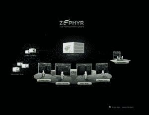
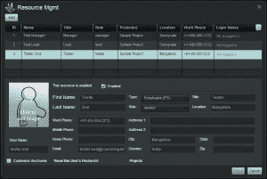
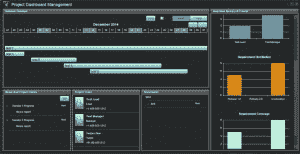
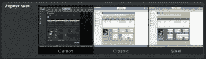
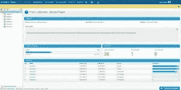
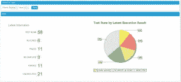
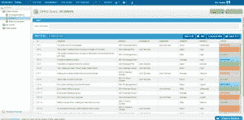

# 泽法 vs. qTest

> 原文：<https://simpleprogrammer.com/zephyr-vs-qtest/>

经常有人问我关于测试管理软件的问题。具体来说，哪个方案最好，我推荐哪个。

因此，我想我会做一个比较泽法和 qTest 的小帖子，因为他们有相当相似的产品。

公平地说，我想提供一个完整的信息，让你知道泽法赞助了这篇文章。但是…如你所知，如果你关注这个博客，我不会支持任何我不支持的东西。我与泽法合作的原因之一是因为我不仅相信他们的产品，而且相信他们推广产品的方式，以及他们对软件开发和 QA 世界的普遍帮助。他们非常注重提供价值和思想领导力，并且知道这样做人们会发现他们的产品。在我看来，这是处理事情的正确方法。

不过，你会注意到这篇文章对两种解决方案都是公平的。泽法没有得到任何特殊的优势。

有各种各样的测试用例管理工具可用，当选择哪一个最适合您的开发团队时，这可能不是一个简单的决定。找到一个既能提供您所需的所有功能，又能满足您的预算的解决方案非常重要。在本帖中，我们将比较两个著名的解决方案:泽法和 qTest。

* * *

**【泽法】**
正如他们优雅的网站所暗示的，泽法是下一代实时测试管理。针对较小的开发团队，泽法提供了一个为用户设计的流线型用户界面。

定价:社区版是免费的，但泽法也提供企业版，价格为每用户每月 96 美元。同样，对于使用 JIRA 的团队，还有一个泽法附加服务，每个用户每月花费 10 美元。

**特性:**

*   测试桌面
*   项目和部门仪表板
*   项目和资源管理
*   测试用例管理
*   需求管理
*   执行调度
*   缺陷跟踪
*   监控指标
*   实时更新和报告
*   与其他工具的集成
*   主题(及更多)

我和泽法的经历很棒。在收到带有下载说明的电子邮件后，我能够在不到十分钟的时间内启动并运行。泽法的要求非常简单，需要 4gb 的内存和至少 5gb 的空闲磁盘空间。设置完成后，您可以访问泽法桌面，在这里用户可以根据他们在系统中的角色进行访问。

测试经理，通常是系统的管理员，可以轻松地管理团队成员并快速访问他们需要的信息。团队成员可以通过他们的网络浏览器登录到泽法服务器。项目或部门的所有成员都可以直接从他们的浏览器访问实时交互式仪表板，而不需要登录凭据。泽法使管理您的团队和必要时更新资源变得如此简单。

泽法的一个主要卖点是交互式仪表盘。它们为所有团队成员提供了对有用信息的快速访问。该系统在显示实时更新方面反应非常迅速。一般来说，用户界面是光滑的，直观的，易于导航。和泽法在一起，一切都很顺利。

定制环境外观的能力也是一个不错的选择。泽法有三种主题可供选择，默认主题是碳元素(颜色较深的主题很好看)。

总的来说，泽法给我留下了深刻的印象。有了免费版本和升级的能力，泽法当然值得你的时间和考虑。泽法提供 30 天的试用期，所以今天就开始吧！[www.getzephyr.com](http://www.getzephyr.com/)

* * *

**qTest**
由 QASymphony 开发，qTest 是基于云的测试用例管理解决方案。qTest 既可以实现为按需托管的解决方案，也可以实现为本地部署的本地应用程序，具体取决于客户端的需求。qTest 旨在帮助您计划测试、组织团队、维护和跟踪测试文档，以及查看项目进度的实时更新。

**定价:** qTest 提供了一系列的定价选项。您可以联系 QASymphony 代表了解更多信息。

**特性:**

*   测试用例管理
*   需求管理
*   测试计划
*   测试执行
*   任务委托
*   缺陷跟踪
*   追溯矩阵
*   实时交互式报告
*   与其他工具的集成

由于 qTest 在云中，我可以马上开始，不需要下载。成功登录后，我看到了 qTest 仪表板。在这个屏幕上，用户可以做以下任何事情:管理用户和项目，创建测试计划，管理需求，设计测试用例，执行测试，提交缺陷，或者创建和查看报告。

用户界面相当不错。左侧面板上熟悉的树结构使导航变得很容易，仪表板顶部的导航窗格也是如此。内置的报告提供了关于测试成功、已识别缺陷等等的详细信息。这些报告允许您按各种标准对结果进行排序，包括:优先级、严重性、状态等。

您可以选择使用 qTest 的内置缺陷跟踪系统，或者您可以从一系列第三方缺陷跟踪系统中进行选择，例如:JIRA、BugZilla、FogBugz、Raly 或 VersionOne。qTest 的高级查询使得提取所有对象变得容易，比如需求、缺陷和测试用例。qTest 还利用了颜色编码的多个字段，比如缺陷的状态，这使得可视化地关联哪些缺陷需要被解决变得非常容易。

总之，qTest 可以让你更快地测试，更好地交流，从而能够提供高质量的软件。qTest 还提供免费试用，这是一个很好的方式，让你自己看看这个工具是否适合你。在 qTest 中开始测试，自己看吧。[www.qasymphony.com/](http://www.qasymphony.com/)T2。large-mobile-banner-1-multi-119 { border:无！重要；显示:屏蔽！重要；浮动:无！重要；行高:0；边距-底部:15px！重要；左边距:0！重要；右边距:0！重要；margin-top:15px！重要；最大宽度:100%！重要；最小高度:250px 最小宽度:250 像素；填充:0；文本对齐:居中！重要}

* * *

这场斗争没有明显的赢家。最终，它归结为你的团队的特定需求。我建议两者都试试(我的意思是，为什么不呢？他们都有免费试用版)，并从您的团队成员那里收集反馈。我确信，无论你选择哪个，你都会被它的整体性能和直观性所打动。